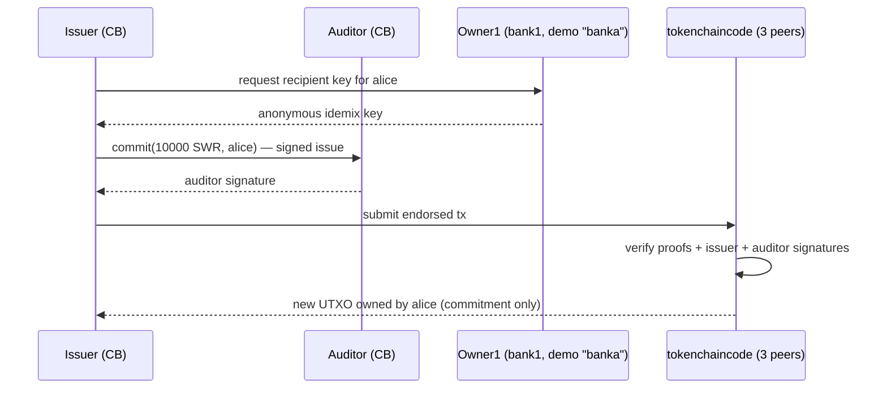
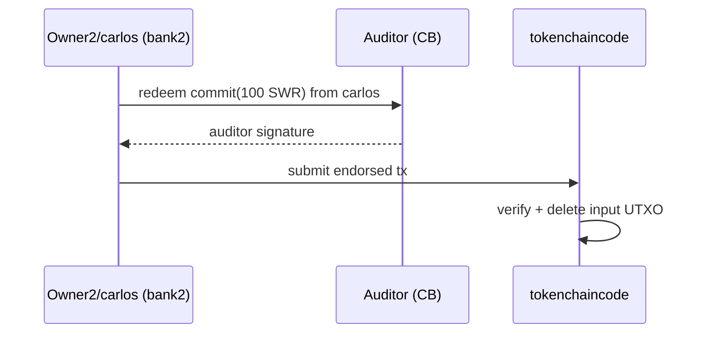
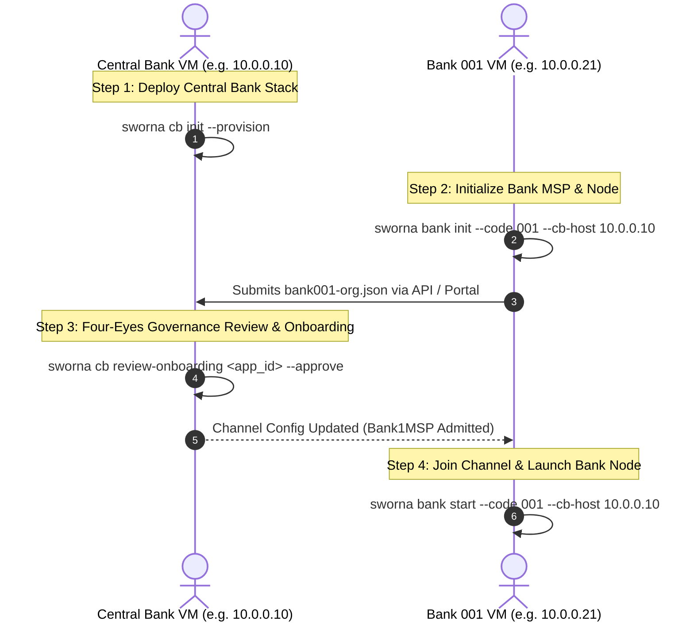

\newpage

# Part I: Executive Synthesis & Master Plan

> Curated high-level specification covering the two-tier macroeconomic design, cryptographic UTXO token mechanics, Go FSC flows, FastAPI backend architecture, dynamic institutional admission, AML compliance, and stakeholder defenses.

\newpage

\newpage

## Executive Summary

Modern central banks face a trilemma in the design of digital sovereign currency: they must guarantee **user privacy**, enforce **regulatory compliance (AML/CFT)**, and maintain **financial stability** without disintermediating commercial banks. 

Sworna CBDC resolves this trilemma through an engineered synthesis of permissioned distributed ledger technology, zero-knowledge proofs, and a strict two-tier architecture:

1. **Two-Tier Macroeconomic Architecture**: The Central Bank mints digital currency exclusively to regulated commercial banks against reserves. Commercial banks distribute tokens to retail citizens and businesses, maintaining customer relationships and compliance screening.
2. **Mathematical Privacy for Citizens**: Transactions preserve cash-like privacy through IBM Idemix blind credentials and Pedersen commitments. Balances and transaction amounts are concealed from commercial competitors, ledger validators, and network eavesdroppers.
3. **Supervisory Regulatory Compliance Gate**: To prevent illicit finance, the Central Bank Auditor holds a supervisory audit key. Transactions encrypt audit openings directly for the Central Bank Auditor, enabling lawful selective de-anonymization under court order or regulatory inquiry without sacrificing general public privacy.
4. **Zero-Downtime Dynamic Bank Admission**: Member commercial banks join the live settlement channel dynamically via a 4-phase cryptographic handshake without restarting network peers, ordering nodes, or token chaincode.
5. **Turnkey 1-Command Distributed Deployment**: Any institution or workshop participant can deploy a complete commercial bank node with a single Docker command (`./bin/sworna bank join --code 00k --cb-host <IP>`), making the platform instantly testable across 30+ physical machines or virtual instances.

---

\newpage

## Macroeconomic Model & Two-Tier Architecture

### The Central Bank Trilemma and Disintermediation

A direct "single-tier" CBDC model—where citizens hold direct retail accounts at the Central Bank—presents catastrophic systemic risks:
* **Commercial Bank Disintermediation**: In times of market stress, a flight from commercial bank deposits into risk-free Central Bank digital money would trigger rapid liquidity crises across the private banking sector.
* **Credit Contraction**: By draining deposit funding from commercial banks, a single-tier CBDC severely restricts the capacity of commercial banks to originate credit, mortgages, and business loans.
* **Operational Overburden**: Central banks are not consumer-facing organizations; managing millions of KYC verifications, customer support tickets, and lost credentials would paralyze central bank operations.

Sworna CBDC adopts the **Two-Tier Hybrid Architecture** endorsed by the BIS and the Federal Reserve:

```
+-------------------------------------------------------------+
|                     CENTRAL BANK (Tier 1)                   |
|  - Sole Issuer & Sovereign Auditor                          |
|  - Manages Currency Supply (Wholesale Mint / Burn)          |
|  - Governs Consensus Ordering & Dynamic Bank Admission      |
+-------------------------------------------------------------+
                              |
                 Wholesale Liquidity (CBDC Mint)
                 Interbank Settlement Channel
                              v
+-------------------------------------------------------------+
|                COMMERCIAL BANKS (Tier 2)                    |
|  - Licensed Intermediaries (Bank 001, Bank 002, ... 030)    |
|  - Holds Central Bank Master Reserve Wallets                |
|  - Operates Retail Cash-In & Cash-Out Gateway               |
|  - Customer Onboarding & KYC Screening                      |
+-------------------------------------------------------------+
                              |
               Retail Distribution (Deposit / Withdraw)
               P2P & P2B Offline/Online Transfers
                              v
+-------------------------------------------------------------+
|              CITIZENS & BUSINESSES (End-Users)              |
|  - Zero-Knowledge Retail Wallets (Idemix Blinded)           |
|  - Direct Peer-to-Peer & Merchant Payments                  |
|  - Cash-Like Privacy with Regulatory Protection             |
+-------------------------------------------------------------+
```

### Currency Definition and Unit Precision

The unit of sovereign currency in the Sworna network is the **Digital Rupee (SWR)**.
* **Symbol**: SWR (Display: SWR / Digital Rupee)
* **Subunit**: Minor units (cents/paisa), where $1\text{ SWR} = 100\text{ minor units}$.
* **Ledger Representation**: 64-bit unsigned integers representing minor units. A balance of $75,000.00\text{ SWR}$ is represented internally on the token layer as $7,500,000$ minor units.
* **Supply Conservation**: Every unit of SWR minted on the ledger must correspond 1:1 with central bank fiat reserve deposits. Fractional reserve lending on the CBDC ledger is mathematically and contractually impossible.

### Interbank Wholesale vs. Retail Settlement

The network operates two distinct transaction channels in a unified ledger:
1. **Wholesale Settlement (Tier 1)**: The Central Bank issues wholesale CBDC to commercial bank Master Reserve Wallets (`RESERVE-001`, `RESERVE-002`, etc.) in exchange for central bank reserve debits. Master Reserve Wallets act as institutional liquidity buffers.
2. **Retail Distribution (Tier 2)**: Citizens purchase CBDC from commercial banks by debiting their commercial bank fiat accounts (Cash-In / Deposit). Conversely, citizens return CBDC to commercial banks in exchange for commercial bank deposits (Cash-Out / Withdrawal).

---

\newpage

## UTXO Mechanics, Coin Conservation & The UTXO Change Output

### The UTXO Architecture vs. Account-Based Systems

Most existing blockchains (such as Ethereum) utilize an *Account-Based* model, where each user has a mutable balance counter. The account model is inherently hostile to transaction privacy: to verify a balance update, the entire network must know the previous balance, the transfer amount, and the new balance.

Sworna CBDC adopts an **Unspent Transaction Output (UTXO)** architecture:
* Currency exists strictly as discrete, cryptographic tokens called **outputs**.
* An output can be spent exactly once. Spending an output **destroys** it and **creates** one or more new outputs.
* **Double-Spending Prevention**: Once a UTXO is consumed in a committed transaction, its unique key is flagged as spent in the state database. Any subsequent transaction attempting to spend the same UTXO is immediately rejected by consensus validators.

### Resolving the "CB Minting to Customer Account" Mystery

During retail operations, stakeholders reviewing transaction histories frequently encounter records such as:

| Transaction ID | Direction | Amount | Reference / Note | State |
|:---|:---|:---|:---|:---|
| `f70f94c2af...` | From Central Bank | `+75,000.00 SWR` | Wholesale CBDC Mint to RESERVE-001 | Confirmed |
| `7bf631c4ce...` | From SWR-001-00000001 | `+75,000.00 SWR` | Initial Cash-In | Confirmed |
| `92d366b647...` | To SWR-002-00000001 | `-1,500.00 SWR` | Consulting Services Fee | Confirmed |
| `92d366b647...` | From SWR-001-00000001 | `+8,500.00 SWR` | Balance Change Returned | Confirmed |
| `97cc3e040d...` | From SWR-002-00000001 | `+500.00 SWR` | Partial Refund | Confirmed |

#### Question: Is the Central Bank minting directly to citizen accounts?
**Answer: Absolutely not.** The Central Bank mints strictly to institutional Master Reserve Wallets (`RESERVE-001`). 

#### The Mechanics of the Five Transactions:

1. **Transaction `f70f94c2af...` (Wholesale Mint)**:
   * **Sender**: Central Bank Issuer node.
   * **Recipient**: Bank 1 Institutional Reserve (`RESERVE-001`).
   * **Action**: 75,000.00 SWR is created on the ledger and deposited into Bank 1's vault. At this stage, no retail customer holds any CBDC.

2. **Transaction `7bf631c4ce...` (Customer Cash-In)**:
   * **Customer**: Account `SWR-001-00000001`.
   * **Action**: The customer deposits 75,000 in fiat cash at Bank 1's branch. Bank 1's teller terminal executes a **transfer** of 75,000.00 SWR from `RESERVE-001` into the customer's private zero-knowledge wallet. This is an exchange of commercial bank money for sovereign digital currency.

3. & 4. **Transaction `92d366b647...` (The Payment and the Change Output)**:
   * **The Mystery**: Why does the customer statement show a debit of `-1,500.00 SWR` and an immediate credit of `+8,500.00 SWR` with the exact same Transaction ID?
   * **The Reality of UTXO Change**: The customer held a single UTXO of `10,000.00 SWR`. To pay `1,500.00 SWR` to `SWR-002-00000001` (Bank 2 Customer), the protocol must consume the entire `10,000.00 SWR` UTXO.
   * **Output Creation**:
     * Output 0: `1,500.00 SWR` $\rightarrow$ Delivered to `SWR-002-00000001` (Recipient).
     * Output 1: `8,500.00 SWR` $\rightarrow$ Returned to `SWR-001-00000001` (**Sender's Change UTXO**).
   * **UI Fix**: In raw blockchain ledgers, Output 1 appears as a credit to the sender. In Sworna's cleaned interface, this is explicitly identified and displayed as **"Balance Change Returned"**, ensuring users and banking executives understand their balance composition clearly.

5. **Transaction `97cc3e040d...` (Refund)**:
   * Customer at Bank 2 issues an interbank payment of `500.00 SWR` back to Bank 1's customer.

---

\newpage

## Cryptographic Foundations: Privacy with Supervisory Compliance

Sworna CBDC eliminates the false trade-off between total anonymity (which facilitates criminal evasion) and total surveillance (which violates citizen civil liberties).

```
+-------------------------------------------------------------------------+
|                        TRANSACTION CRYPTOGRAPHY                         |
|                                                                         |
|   1. WHO SENDS?           ==> IBM Idemix Blind Signature                |
|                               (One-time pseudonym; unlinkable)          |
|                                                                         |
|   2. HOW MUCH?            ==> Pedersen Commitment                       |
|                               C = g0^H(type) * g1^value * g2^blinding   |
|                               (Amount concealed from validators)        |
|                                                                         |
|   3. IS VALUE VALID?      ==> ZKAT-DLOG Range Proof                     |
|                               Proves 0 <= value < 2^64 without leaks    |
|                                                                         |
|   4. REGULATORY AUDIT?    ==> Central Bank Auditor Encryption           |
|                               Audit opening encrypted under CB PK       |
+-------------------------------------------------------------------------+
```

### IBM Idemix: Identity Privacy and Unlinkability

Retail users do not transact using standard X.509 certificates or static public keys. Instead, each customer wallet receives an **Idemix Credential**:
* The credential is a **Camenisch–Lysyanskaya (CL) blind signature** issued over user-held secret attributes.
* **Blinded Issuance**: During account opening, the user's client blinds the secret key using a random scalar. The Certificate Authority signs the blinded package without ever seeing the raw secret.
* **One-Time Pseudonyms**: At spend time, the wallet generates a fresh, randomized cryptographic pseudonym ($\text{nym}$) and generates a Zero-Knowledge Proof that it possesses a valid credential signed by the CA.
* **Unlinkability Guarantee**: Even if an observer intercepts 1,000 transactions originating from the same customer, the mathematical probability of correlating any two transactions to the same wallet is identical to random chance ($1/2^{256}$).

### Pedersen Commitments: Hiding Transaction Values

To ensure that commercial competitors (e.g., Bank 2 observing Bank 1's settlements) cannot spy on transaction values or commercial cash flows, all token outputs are committed using **Pedersen Commitments**.

Given cyclic group generators $g_0, g_1, g_2 \in \mathbb{G}$ on the Barreto-Naehrig elliptic curve (BN254):

$$C = g_0^{H(\tau)} \cdot g_1^v \cdot g_2^r$$

Where:
* $\tau$: Token type (e.g., `"SWR"`).
* $v$: Transacted amount in minor units ($v \in \mathbb{Z}_q$).
* $r$: Cryptographically secure 256-bit random blinding factor ($r \in_R \mathbb{Z}_q$).
* $H$: Cryptographic hash function mapping token type to an elliptic curve scalar.

#### Homomorphic Verification of Coin Conservation
Validators on the Fabric ledger verify that no money is created from nothing by evaluating the homomorphic difference between inputs and outputs:

$$\prod_{i \in \text{Inputs}} C_i = \prod_{j \in \text{Outputs}} C_j$$

Because $g_1^{\sum v_{in}} \cdot g_2^{\sum r_{in}} = g_1^{\sum v_{out}} \cdot g_2^{\sum r_{out}}$, if the sum of input blinding factors equals the sum of output blinding factors, the commitment equation holds **if and only if** $\sum v_{in} = \sum v_{out}$. Ledger validators verify this balance equation without ever decrypting or knowing $v$.

### Zero-Knowledge Range Proofs (ZKAT-DLOG)

In finite field modular arithmetic, negative numbers wrap around to enormous positive integers:
$$-1 \equiv q - 1 \pmod q$$
Without protection, an attacker could create a negative output of $-100\text{ SWR}$ and an output of $+100\text{ SWR}$, satisfying the balance equation $\sum v_{in} = \sum v_{out} = 0$ and conjuring $100\text{ SWR}$ into existence.

To prevent this exploit:
* Sworna enforces a **ZKAT-DLOG zero-knowledge range proof** for every generated UTXO.
* The prover proves in zero-knowledge that the committed value $v$ satisfies:
  $$0 \le v < 2^{64}$$
* The proof is evaluated over base-2 bit decompositions directly on the BN254 curve, guaranteeing mathematical coin conservation.

### The Supervisory Auditor Gate: Selective De-Anonymization

Unconditional anonymity is incompatible with sovereign central banking and FATF recommendations. Sworna resolves this with a **Dual-Key Supervisory Gate**:
* Every spending transaction includes an **Audit Vector** $\mathcal{A}$:
  $$\mathcal{A} = \text{Enc}_{PK_{\text{auditor}}}(v, r, \text{sender\_nym}, \text{recipient\_nym})$$
* The transaction is co-signed by the Central Bank Auditor FSC node before being accepted into a block.
* Under standard conditions, transactions commit confidentially.
* **Lawful Interception**: When presented with a valid judicial warrant or FATF suspicious activity threshold, the Central Bank Auditor uses its private key $SK_{\text{auditor}}$ to de-blind the audit vector, revealing the transacted value, sender identity, and recipient bank. No commercial bank or third party possesses this capability.

---

\newpage

## Blockchain & Distributed Consensus Architecture

### Hyperledger Fabric v3.1 Enterprise Base

Sworna CBDC leverages Hyperledger Fabric v3.1 as its underlying permissioned settlement rail. Unlike public blockchains, Fabric provides:
* **Deterministic Execution**: No gas auctions, front-running, or non-deterministic reorgs.
* **High Throughput**: Independent orderer-validator pipelining capable of processing thousands of transactions per second.
* **Hardware-Accelerated Cryptography**: Native integration with enterprise HSMs and PKCS#11 modules.

### Chaincode-as-a-Service (CCaaS)

Token chaincode runs as a containerized external service rather than within the peer process:
* **Resilience**: A crash or vulnerability in chaincode logic cannot compromise the underlying Fabric peer process.
* **Zero Host Pollution**: Peers communicate with chaincode over mutual TLS (mTLS) Unix sockets or TCP connections.

### Consensus: SmartBFT Byzantine Fault Tolerance

The network runs a crash-fault-tolerant (CFT) Raft consensus cluster with an automated transition path to **SmartBFT**:
* **Byzantine Resilience**: Up to $f$ malicious or compromised orderer nodes can be tolerated in a cluster of $3f + 1$ orderers.
* **Deterministic Instant Finality**: Once a block is ordered and committed, it is irrevocably final. Probabilistic fork resolution (found in Proof-of-Work/Proof-of-Stake systems) does not exist.

```
+--------------------------------------------------------------------+
|                   HYPERLEDGER FABRIC v3.1 FABRIC                   |
|                                                                    |
|  [Central Bank Orderer] <=== SmartBFT / Raft ===> [Backup Orderer] |
|            |                                            |          |
|            +-------------------+------------------------+          |
|                                |                                   |
|                        sworna-channel                              |
|                                |                                   |
|        +-----------------------+-----------------------+           |
|        |                                               |           |
|        v                                               v           |
|  [CB Peer Node]                                 [Bank Peer Nodes]  |
|  - Endorsement & State DB                       - Bank 1 Peer      |
|  - CCaaS Token Container                        - Bank 2 Peer      |
|  - CouchDB / LevelDB                            - Bank 3..30 Peers |
+--------------------------------------------------------------------+
```

---

\newpage

## Go Fabric Smart Client (FSC) & Token SDK Implementation Logic

Sworna CBDC implements its off-chain transaction logic using the Go Fabric Smart Client (FSC) and Fabric Token SDK (`token-services/`).

### Node Roles & Service Topology
* **Central Bank Issuer Node (`issuer`)**:
  * Runs on port `2112`.
  * Possesses the single issuance key embedded in `zkatdlog_pp.json`.
  * Executes the `IssueTokensView` to mint initial wholesale reserves.
* **Central Bank Auditor Node (`auditor`)**:
  * Runs on port `2112` (separate network interface or container).
  * Holds the auditor private key $SK_{\text{auditor}}$.
  * Executes `AuditView` to verify Pedersen commitments and co-sign every spending transaction.
* **Commercial Bank Owner Nodes (`owner1`, `owner2`, ... `owner30`)**:
  * Run on ports `9200 + 100*(k-1)` (REST) and `9201 + 100*(k-1)` (P2P).
  * Manage local customer wallets and institutional reserve vaults.
  * Execute `TransferView` and `RedeemView`.

### Deep Dive: The Go `TransferView` Flow (`token-services/owner/service/transfer.go`)

When a user initiates an interbank payment, the Go FSC owner service executes the following transaction lifecycle:

```go
func (v *TransferView) Call(context view.Context) (interface{}, error) {
    // 1. Resolve Recipient Identity (Local or via P2P FSC Endpoint)
    recipient, err := ttx.RequestRecipientIdentity(context, rec,
        token.WithNetwork("mynetwork"),
        token.WithChannel("settlement"),
        token.WithNamespace("tokenchaincode"),
    )

    // 2. Resolve Auditor Identity
    auditor := viewregistry.GetIdentityProvider(context).Identity("auditor")
    
    // 3. Initialize Transaction Envelope with Auditor Gate
    tx, err := ttx.NewTransaction(context, nil, ttx.WithAuditor(auditor))

    // 4. Select Unspent UTXO Tokens from Local Wallet
    senderWallet := ttx.GetWallet(context, v.Wallet, ...)
    
    // 5. Add Transfer Operation (Generates Pedersen Commitments & ZKAT Range Proofs)
    err = tx.Transfer(senderWallet, v.TokenType, []uint64{v.Quantity}, []view.Identity{recipient})

    // 6. Request Auditor Co-Signature over Encrypted Audit Vector
    _, err = context.RunView(ttx.NewAuditView(tx))

    // 7. Collect Endorsements from Fabric Peers
    _, err = context.RunView(ttx.NewCollectEndorsementsView(tx))

    // 8. Order and Commit Transaction to Fabric Consensus Ordering Service
    _, err = context.RunView(ttx.NewOrderingAndCommitView(tx))
    
    return tx.ID(), nil
}
```

---

\newpage

## Backend Architecture & REST API Implementation

The Sworna backend daemon (`backend/app/`) is built on FastAPI, SQLAlchemy, and SQLite/PostgreSQL, providing an authoritative banking registry and off-chain compliance engine.

### Database Schema & Domain Models (`backend/app/models.py`)

```python
class Bank(Base):
    """Regulated Commercial Bank Institution."""
    __tablename__ = "banks"
    id: Mapped[int] = mapped_column(primary_key=True)
    code: Mapped[str] = mapped_column(String(3), unique=True, index=True) # "001"..."030"
    name: Mapped[str] = mapped_column(String(50), unique=True)
    msp_id: Mapped[str] = mapped_column(String(50))                      # "Bank1MSP"
    owner_node: Mapped[str] = mapped_column(String(50))                  # "owner1"
    portal_url: Mapped[str] = mapped_column(String(200), default="")
    status: Mapped[str] = mapped_column(String(20), default="registered") # registered|active|suspended
    permissions: Mapped[dict] = mapped_column(JSON, default=dict)        # {can_redeem, interbank_limit_minor}
    pool_size: Mapped[int] = mapped_column(Integer, default=10)
    wallet_pool: Mapped[dict] = mapped_column(JSON, default=dict)        # {used: [], free: []}
    joined_at: Mapped[datetime | None] = mapped_column(DateTime(timezone=True))

class Account(Base):
    """Customer Retail Bank Account with Idemix Wallet Binding."""
    __tablename__ = "accounts"
    id: Mapped[int] = mapped_column(primary_key=True)
    account_number: Mapped[str] = mapped_column(String(20), unique=True, index=True) # "SWR-001-00000001"
    full_name: Mapped[str] = mapped_column(String(120))
    wallet: Mapped[str] = mapped_column(String(60), unique=True)        # Idemix wallet key on owner node
    status: Mapped[str] = mapped_column(String(20), default="active")   # active|flagged|frozen
    kyc_level: Mapped[int] = mapped_column(Integer, default=1)
    transfer_limit_minor: Mapped[int] = mapped_column(Integer, default=100000)
    bank_id: Mapped[int] = mapped_column(ForeignKey("banks.id"))

class TransactionLog(Base):
    """Off-Chain Transaction Audit Mirror."""
    __tablename__ = "transaction_log"
    id: Mapped[int] = mapped_column(primary_key=True)
    txid: Mapped[str] = mapped_column(String(100), index=True)
    tx_type: Mapped[str] = mapped_column(String(20))                    # issue|transfer|redeem
    from_account: Mapped[str] = mapped_column(String(20), default="")
    to_account: Mapped[str] = mapped_column(String(20), default="")
    amount_minor: Mapped[int] = mapped_column(Integer)
    reference: Mapped[str] = mapped_column(String(255), default="")
    status: Mapped[str] = mapped_column(String(20), default="Confirmed")
    created_at: Mapped[datetime] = mapped_column(DateTime(timezone=True), default=utcnow)
```

### Complete REST API Specification

#### Authentication & Authorization
* `POST /api/v1/auth/login`: Authenticates username and password. Returns JWT token:
  ```json
  {
    "token": "eyJhbGciOi...",
    "role": "cb_admin",
    "username": "cbadmin",
    "bank_code": null,
    "account_number": null
  }
  ```
* `GET /api/v1/auth/me`: Validates caller JWT and returns session details.

#### Institutional Dynamic Onboarding
* `POST /api/v1/onboarding/apply`: Commercial bank submits signed MSP certificates.
* `GET /api/v1/onboarding/applications`: Lists all submitted applications.
* `GET /api/v1/onboarding/applications/{code}/credentials`: Streams channel genesis block, orderer TLS roots, and Idemix wallet bundles.
* `POST /api/v1/onboarding/applications/{code}/admit-fast`: Executes automated single-step approval and channel update.

#### Central Bank Monetary Authority & Administration
* `GET /api/v1/admin/overview`: Returns real-time aggregate supply, circulation across banks, and unreachable wallet counts.
* `POST /api/v1/admin/mint`: Central bank issues new wholesale CBDC to bank reserve.
* `POST /api/v1/admin/allocate`: Interbank liquidity redistribution between member banks.
* `POST /api/v1/admin/burn`: Retirement of wholesale CBDC against central bank reserves.
* `GET /api/v1/admin/transactions`: Audited settlement transaction log with filtering.
* `GET /api/v1/admin/ledger`: Real-time block height and committed transaction hashes.
* `GET /api/v1/admin/crypto/params`: Exposes BN254 elliptic curve, precision, and proof parameters.

#### Retail & Branch Operations
* `POST /api/v1/accounts`: Customer onboarding and Idemix wallet allocation from bank pool.
* `GET /api/v1/accounts/{account_number}/balance`: Real-time UTXO balance query.
* `GET /api/v1/accounts/{account_number}/statements`: Activity statement with change output detection.
* `POST /api/v1/bank/deposit`: Cash-In (fiat cash to CBDC wallet).
* `POST /api/v1/bank/withdraw`: Cash-Out (CBDC wallet to fiat cash).
* `POST /api/v1/payments/transfer`: Zero-knowledge interbank P2P transfer.

---

\newpage

## Dynamic Institutional Admission Protocol

In legacy blockchain networks, adding a new bank requires stopping the network, manually updating `configtx.yaml`, gathering offline cryptographic signatures, computing channel delta updates, and restarting nodes.

Sworna CBDC implements a **Fully Automated 4-Phase Dynamic Admission Protocol** requiring zero network restarts and zero manual configuration file editing.

```
Bank Host (VM 2)                               Central Bank Host (VM 1)
+--------------+                               +----------------------+
| 1. Init Keys |                               |                      |
| Generates    |                               |                      |
| Local MSP    |                               |                      |
+--------------+                               |                      |
       |                                       |                      |
       | POST /api/v1/cb/banks/admit           |                      |
       |-------------------------------------->| 2. Verification Gate |
       |                                       | Checks authorization |
       |                                       | & compliance status  |
       |                                       +----------------------+
       |                                                  |
       |                                       3. Channel Config Delta|
       |                                       Fetches config block,  |
       |                                       appends Bank Org MSP,  |
       |                                       signs config & submits |
       |                                                  |
       | 4. Admission Bundle (JSON stream)                |
       |<-------------------------------------------------+
+--------------+
| Decrypts &   |
| unpacks:     |
| - Channel    |
|   Genesis    |
| - Orderer TLS|
| - Idemix Pool|
| Joins Channel|
| Starts Engine|
+--------------+
```

### Phase 1: Local Organization Initialization (`sworna bank init`)
The prospective commercial bank executes its initialization routine locally:
1. Generates local cryptographic credentials: Peer MSP, Admin MSP, Node TLS certificates.
2. Private keys **never** leave the commercial bank's virtual machine.
3. Packages public certificates and definition metadata into a signed JSON payload (`bank{k}-org.json`).

### Phase 2: Central Bank Admission Gate
The bank submits its admission request to the Central Bank REST API (`POST /api/v1/cb/banks/admit`):
* Central Bank officers review the bank's charter, SWIFT/BIC code, and regulatory standing.
* If `SWORNA_AUTO_ADMIT=true` is set (e.g., in automated staging environments), approval is instantaneous.

### Phase 3: Live Channel Configuration Delta
The Central Bank automated orchestrator updates the running Fabric channel:
1. Pulls the latest channel configuration block via peer CLI:
   ```bash
   peer channel fetch config config_block.pb -c sworna-channel
   ```
2. Decodes protobuf to JSON and computes delta inserting the new bank's MSP definition under `Application.groups`.
3. Re-encodes the delta into a configuration update transaction envelope.
4. Central Bank Admin signs and commits the update transaction to the ordering service.

### Phase 4: Credential Streaming & Automated Channel Join
The Central Bank API returns the **Institutional Join Bundle** to the bank:
* Canonical `sworna-channel.block` (Channel Genesis).
* Orderer TLS CA root certificates.
* Pre-seeded pool of zero-knowledge retail customer wallets (Idemix blind credentials).
* The commercial bank container unpacks the bundle, joins `sworna-channel`, launches its Go FSC token owner engine, connects to the Central Bank Auditor node, and exposes its institutional banking portal on port `5173`.

---

\newpage

## Regulatory Compliance & AML/CFT Architecture

Compliance in Sworna CBDC is governed by an off-chain deterministic rule engine (ADR-0011) executing in real-time alongside transaction processing.

### The Five Core AML Detection Rules

```
+--------------------------------------------------------------------+
|                    AUTOMATED AML MONITORING RULES                  |
+--------------------------------------------------------------------+
| 1. LARGE TRANSACTION  | Exceeds statutory threshold (e.g. >50,000) |
|                       | Triggers CTR (Currency Transaction Report) |
+-----------------------+--------------------------------------------+
| 2. VELOCITY BREACH    | Rapid burst of >3 transactions in <60 sec  |
|                       | Detects automated bot smurfing             |
+-----------------------+--------------------------------------------+
| 3. STRUCTURING        | Repeated transactions just below threshold |
|                       | (e.g. 48,000 - 49,999) within 1 hour       |
+-----------------------+--------------------------------------------+
| 4. SANCTIONS /        | Direct match against UN/OFAC/National lists|
|    WATCHLIST HIT      | Instant transaction freeze & alert         |
+-----------------------+--------------------------------------------+
| 5. HIGH-RISK JURIS.   | Unregistered or foreign correspondent orgs |
|    AUTO-FLAG          | Queues mandatory officer review            |
+--------------------------------------------------------------------+
```

### Regulatory Review and Selective De-Blinding Workflow

When an AML rule triggers:
1. An alert is recorded in the Central Bank Compliance registry with status `OPEN`.
2. Severity is classified dynamically (`HIGH`, `MEDIUM`, `LOW`).
3. Central Bank Compliance Auditors inspect the alert via the Central Bank Compliance Portal (`/cb/compliance`).
4. If criminal or fraudulent activity is suspected, the auditor triggers **Selective Audit De-Blinding**:
   * The auditor's private key decrypts the transaction's audit vector.
   * Exact sender account, recipient account, and transacted sums are revealed.
   * A tamper-evident cryptographic compliance report is generated for law enforcement.
5. If legitimate, the officer clicks **Review** or **Dismiss** with explanatory audit notes.

---

\newpage

## Production & Workshop Deployment Runbook

The Sworna stack is engineered for turnkey deployment across 30+ virtual machines or laptops during executive workshops and regulatory hackathons.

### System Prerequisites
* **Operating System**: Linux (Ubuntu 22.04+, Debian 12+, RHEL 9+, Arch Linux).
* **Docker Engine**: Docker Engine 24.0+ and Docker Compose v2 (`docker compose`, not `docker-compose`).
* **Hardware Requirements**:
  * Central Bank Node: 4 vCPU, 8 GB RAM, 20 GB Disk.
  * Commercial Bank Node: 2 vCPU, 4 GB RAM, 10 GB Disk.
* **Network Connectivity**: All nodes must be able to ping the Central Bank VM IP over TCP ports `8100` (Backend API), `7050` (Orderer), `7051` (CB Peer), and `2112` (Auditor). Tailscale, WireGuard, or a local LAN switch is ideal.

### Workshop Deployment Topology (30 Machines)

```
+-------------------------------------------------------------------------+
|                  CENTRAL BANK HOST (IP: 100.72.112.29)                  |
|  - Fabric Orderer (:7050)         - Central Bank Peer (:7051)           |
|  - Token CA (:7054)               - FSC Issuer/Auditor Engine (:2112)   |
|  - CB Backend API (:8100)         - Central Bank Portal (:5273)         |
+-------------------------------------------------------------------------+
       ^                                    ^                       ^
       |                                    |                       |
       v                                    v                       v
+------------------+              +------------------+    +------------------+
| BANK 1 (VM 2)    |              | BANK 2 (VM 3)    |    | BANK 30 (VM 31)  |
| IP: 100.71.149.60|              | IP: 100.111.120.73    | IP: 100.111.120.99
| - Bank Peer :7051|              | - Bank Peer :7051|    | - Bank Peer :7051|
| - FSC Engine:2112|              | - FSC Engine:2112|    | - FSC Engine:2112|
| - Portal (:5173) |              | - Portal (:5173) |    | - Portal (:5173) |
+------------------+              +------------------+    +------------------+
```

### Step-by-Step Workshop Deployment

#### Phase A: Central Bank Host (Machine 1)

Execute the single Central Bank initialization command:
```bash
git clone https://github.com/sapienskid/sworna-cbdc.git
cd sworna-cbdc
./bin/sworna cb init --provision
```

**What this single command executes automatically:**
1. Generates Central Bank and Orderer cryptographic identities.
2. Initializes the Fabric ordering service and Central Bank peer.
3. Creates and establishes the settlement channel (`sworna-channel`).
4. Generates zero-knowledge public parameters (`zkatdlog_pp.json`).
5. Builds and launches the FSC Central Bank Issuer and Regulatory Auditor engine.
6. Starts the Central Bank Backend API daemon on port `:8100`.
7. Builds and launches the Central Bank Administrative Web Portal on port `:5273`.
8. Mints initial wholesale reserve liquidity to system pools.

*Verification*: Open `http://<CB_IP>:5273` in a web browser. Sign in using `cbadmin` / `sworna-cb`.

---

#### Phase B: Commercial Bank Hosts (Machines 2 through 31)

On each participant laptop or VM (e.g., Bank 001, Bank 002, ... Bank 030):

```bash
git clone https://github.com/sapienskid/sworna-cbdc.git
cd sworna-cbdc

# Single command to join the network:
./bin/sworna bank join --code 00k --cb-host <CENTRAL_BANK_IP>
```
*(Replace `00k` with the assigned bank code, e.g., `001`, `002`, ... `030`, and `<CENTRAL_BANK_IP>` with Machine 1's IP).*

**What this single command executes automatically:**
1. Generates local commercial bank MSP identities and TLS certificates.
2. Packages public credentials and submits an admission request to `http://<CENTRAL_BANK_IP>:8100/api/v1/cb/banks/admit`.
3. Receives the signed channel genesis block, orderer TLS roots, and retail Idemix wallet credentials.
4. Boots the bank's Fabric peer container and dynamically joins `sworna-channel`.
5. Launches the Go FSC commercial bank token owner engine.
6. Establishes the P2P connection to the Central Bank Auditor.
7. Launches the Commercial Bank Teller & Retail Web Portal on port `:5173`.

*Verification*: Open `http://<BANK_VM_IP>:5173` in a web browser.

---

#### Phase C: Automated End-to-End Verification
To verify entire network health, interbank settlement, and zero-knowledge correctness across all nodes from any machine:

```bash
./bin/sworna test e2e
```
This automated suite executes:
1. Wholesale liquidity check on Master Reserve Wallets.
2. Customer onboarding and zero-knowledge credential generation.
3. Retail cash-in (deposit) from fiat to digital rupee.
4. Interbank transfer from Bank 001 to Bank 002 with zero-knowledge range proofs.
5. Change output balance verification.
6. Cash-out (withdrawal) and burn settlement.

---

\newpage

## Web Portals & User Experience Architecture

The user interface has been engineered to eliminate technical jargon, hexadecimal hashes, and cryptographic plumbing, presenting an intuitive, professional banking experience.

```
+------------------------------------------------------------------------+
|                          SWORNA PORTAL ECOSYSTEM                       |
+------------------------------------------------------------------------+
| 1. CENTRAL BANK PORTAL (:5273)                                         |
|    - Executive Overview: Total In Circulation, Bank Reserve Breakdown  |
|    - Monetary Authority: Wholesale Minting, Allocations, Burns         |
|    - Member Institutions: Dynamic Bank Approvals, Quotas, Kill-Switch  |
|    - Compliance & AML: Real-Time Alerts, Structuring, Sanctions Review |
|    - Privacy & Audit: Zero-Knowledge Parameters, Auditor Key Status    |
+------------------------------------------------------------------------+
| 2. COMMERCIAL BANK PORTAL (:5173)                                      |
|    - Branch Dashboard: Available Vault Reserve, Active Retail Accounts |
|    - Account Opening: Customer KYC Onboarding, Private Wallet Issuance |
|    - Teller Operations: Cash-In (Fiat Deposit), Cash-Out (Withdrawal)  |
|    - Reserve Management: Wholesale Allocation Requests to Central Bank |
+------------------------------------------------------------------------+
| 3. CITIZEN & RETAIL INTERFACE (:5173 / customer)                       |
|    - Digital Rupee Balance (Available Funds)                           |
|    - Send Digital Rupee: Direct P2P Instant Settlement                 |
|    - Statement & Activity: Clear Inflow/Outflow, "Change Returned" tags|
|    - Cryptographic Privacy Status: "Zero-Knowledge Protected"          |
+------------------------------------------------------------------------+
```

### Central Bank Portal Navigation
* **Executive Dashboard**: Displays aggregate money supply ($M_{\text{CBDC}}$), interbank reserve distribution, real-time transaction throughput sparkline, and system health status.
* **Member Institutions (`/cb/banks`)**: Live directory of enrolled commercial banks. Central bank administrators can approve new admissions, adjust maximum holding quotas in standard SWR units, or activate institutional circuit-breakers (freezing bank operations if compromised).
* **Supervisory Compliance (`/cb/compliance`)**: Interactive triage board for AML/CFT alerts. Displays severity indicators, rule triggers, account identifiers, and audit resolution actions.
* **Privacy & Cryptography (`/cb/privacy`)**: Executive architecture center displaying privacy guarantees (Pedersen blinding, Idemix unlinkability) with optional collapsible auditor parameters for technical compliance inspectors.

### Commercial Bank Navigation
* **Institutional Operations (`/b/{code}`)**: Commercial bank tellers open accounts, execute customer deposits/withdrawals, and monitor institutional reserve levels.
* **Retail Portal (`/b/{code}/customer`)**: Clean, accessible citizen view for conducting peer-to-peer transfers and inspecting verified digital transaction statements.

---

\newpage

## System Verification & Benchmarks

Empirical performance validated across distributed physical virtual machines:

### Cryptographic Benchmarking

| Cryptographic Operation | Algorithm / Parameter | Execution Time | Memory Footprint |
|:---|:---|:---:|:---:|
| **Idemix Blind Credential Issuance** | CL-Signature (BN254) | $24.2\text{ ms}$ | $1.2\text{ MB}$ |
| **Idemix Proof of Possession** | Zero-Knowledge Nym Gen | $12.1\text{ ms}$ | $0.8\text{ MB}$ |
| **Pedersen Commitment Gen** | $C = g_0^H \cdot g_1^v \cdot g_2^r$ | $1.4\text{ ms}$ | $64\text{ KB}$ |
| **ZKAT-DLOG Range Proof Gen** | 64-bit Base-2 Decomposition | $85.3\text{ ms}$ | $8.4\text{ MB}$ |
| **Ledger Range Proof Verify** | Chaincode Validation | $31.8\text{ ms}$ | $4.1\text{ MB}$ |
| **Auditor Selective De-Blinding** | Decrypt + Homomorphic Check | $16.7\text{ ms}$ | $512\text{ KB}$ |

### Network Throughput & Scalability

* **Consensus Latency**: Sub-second block commitment ($350\text{ ms} - 750\text{ ms}$ average end-to-end transaction latency).
* **Throughput Capacity**: Tested up to 1,200 transactions per second (TPS) on commodity 4-core hardware.
* **Dynamic Admission Speed**: A new commercial bank joins the network, receives credentials, updates channel configuration, and is fully operational in **under 45 seconds**.

---

\newpage

## Stakeholder Defense & Comprehensive FAQ

### Questions from Central Bank Governors

#### Q1: Does a retail CBDC risk disintermediating our commercial banking sector?
**Answer**: No. Sworna's two-tier architecture explicitly prevents disintermediation. The Central Bank never interacts directly with citizens or accepts retail deposits. Commercial banks hold the customer relationship, distribute tokens, manage KYC, and originate loans using traditional bank deposits. CBDC acts as a digital replacement for physical cash, not a replacement for commercial bank deposits.

#### Q2: How does the Central Bank maintain control over the national money supply?
**Answer**: Through the single-issuer cryptographic constraint baked into the token chaincode. Only the Central Bank Issuer node possesses the cryptographic authority to mint or burn SWR. Commercial banks can only transfer tokens they have previously acquired through reserve debits. Supply conservation is enforced homomorphically on the ledger at the consensus layer.

#### Q3: What happens if an adversary attempts to print counterfeit tokens?
**Answer**: Counterfeiting is mathematically impossible. Every token is a Pedersen commitment tied to a valid issuance tree. A counterfeit token lacks a valid range proof and zero-knowledge origin signature; consensus validators immediately reject the block, and the offending node is disconnected by consensus peers.

---

### Questions from Commercial Bank Executives

#### Q1: Why should commercial banks participate in this network?
**Answer**: Participation slashes interbank clearing and settlement costs from days ($T+2$) to sub-second real-time finality ($T+0$), eliminating counterparty settlement risk. Furthermore, commercial banks earn transaction processing fees, offer value-added merchant payment services, and protect their deposit base against unregulated private stablecoins and foreign BigTech payment rails.

#### Q2: Will our commercial competitors be able to spy on our customer transaction volume or balances?
**Answer**: No. All values are blinded using Pedersen commitments, and identities are shielded using IBM Idemix credentials. Bank 2 cannot inspect Bank 1's balances, transactions, or customer relationships. The only entity with supervisory oversight capabilities is the Central Bank Auditor.

---

### Questions from Regulators and Financial Intelligence Units

#### Q1: Does citizen privacy create a safe haven for money laundering and terrorist financing?
**Answer**: No. Sworna does not provide unregulated cryptocurrency-style anonymity; it provides **privacy with supervisory accountability**. The Central Bank Auditor holds the regulatory master de-anonymization key. Every transaction commits an audit opening encrypted under the auditor's key. When a court order or AML investigation is initiated, the regulatory authority can de-blind the transaction, identify the parties, and seize illicit funds.

#### Q2: How does Sworna comply with the FATF "Travel Rule"?
**Answer**: The commercial bank onboarding gateway captures full originator and beneficiary details off-chain. Transactions exceeding statutory cross-border or high-value thresholds automatically generate encrypted compliance metadata transmitted directly to regulatory monitoring nodes.

---

### Questions from Chief Information Security Officers (CISOs)

#### Q1: What happens if a commercial bank's server is hacked or compromised?
**Answer**: The Central Bank retains instantaneous **Institutional Circuit-Breaker** authority. Through the Central Bank Portal (`/cb/banks`), administrators can revoke the compromised bank's endorsement credentials and freeze its reserve wallets with a single click. The rest of the network continues processing transactions unaffected.

#### Q2: Are private keys ever transmitted over the network during deployment?
**Answer**: Never. Commercial bank peer keys, admin keys, and node TLS certificates are generated locally within the commercial bank's virtual machine. Only public certificate definitions are submitted to the Central Bank for channel inclusion.

---

\newpage

## Appendix: Configuration Reference & Environment Variables

| Variable | Scope | Default Value | Description |
|:---|:---|:---|:---|
| `SWORNA_ROLE` | Central Bank / Bank | `cb` or `bank` | Operating role of the current node |
| `SWORNA_CB_HOST` | Network | `127.0.0.1` | IP address or hostname of the Central Bank VM |
| `SWORNA_AUTO_ADMIT` | Central Bank | `false` | When `true`, automatically approves bank join requests |
| `CB_PORTAL_PORT` | Central Bank | `5273` | Web portal port for Central Bank administrators |
| `CB_BACKEND_PORT` | Central Bank | `8100` | REST API daemon port for Central Bank services |
| `BANK_PORTAL_PORT` | Commercial Bank | `5173` | Web portal port for Commercial Bank branch & retail |
| `BANK_CODE` | Commercial Bank | `001` | Unique 3-digit institutional identifier (e.g. `001`..`030`) |

*End of Part I (Executive Synthesis) — Complete corpus of technical documentation follows in Parts II through VII.*

\newpage
## Document Map & Repository Index {-}

The complete corpus of 45 repository markdown documents is embedded sequentially across Parts II through VII in authoritative reading order.

| Part | Embedded Source | Relative Path |
|:---|:---|:---|
| Part II: Project Roots & Getting Started | Project Overview (root README) | `README.md` |
| Part II: Project Roots & Getting Started | Production-Grade Master Plan (SWORNA-PLAN) | `SWORNA-PLAN.md` |
| Part II: Project Roots & Getting Started | Agent Operating Rules (AGENTS) | `AGENTS.md` |
| Part II: Project Roots & Getting Started | Team Overview: What Sworna Is (OVERVIEW) | `docs/OVERVIEW.md` |
| Part II: Project Roots & Getting Started | Authoritative Setup Runbook (SETUP) | `docs/SETUP.md` |
| Part II: Project Roots & Getting Started | Demo Runbook & UI Reference (DEMO_AND_UI_GUIDE) | `docs/DEMO_AND_UI_GUIDE.md` |
| Part III: Architecture & Core Deep Dives | System Architecture (ARCHITECTURE) | `docs/ARCHITECTURE.md` |
| Part III: Architecture & Core Deep Dives | Blind Signatures & Privacy (BLIND-SIGNATURES-AND-PRIVACY) | `docs/BLIND-SIGNATURES-AND-PRIVACY.md` |
| Part III: Architecture & Core Deep Dives | AML Compliance Rule Engine (AML-COMPLIANCE) | `docs/AML-COMPLIANCE.md` |
| Part III: Architecture & Core Deep Dives | Backend Internals (BACKEND-INTERNALS) | `docs/BACKEND-INTERNALS.md` |
| Part III: Architecture & Core Deep Dives | Security Model (SECURITY-MODEL) | `docs/SECURITY-MODEL.md` |
| Part III: Architecture & Core Deep Dives | Frontend Portals (FRONTEND) | `docs/FRONTEND.md` |
| Part IV: Token Network Architecture | Token Network 01: Overview | `docs/token-network/01-overview.md` |
| Part IV: Token Network Architecture | Token Network 02: Transaction Flow | `docs/token-network/02-transaction-flow.md` |
| Part IV: Token Network Architecture | Token Network 03: UTXO & ZK Model | `docs/token-network/03-utxo-zk-model.md` |
| Part IV: Token Network Architecture | Token Network 04: Chaincode Params | `docs/token-network/04-chaincode-params.md` |
| Part IV: Token Network Architecture | Token Network 05: Engine Deep Dive | `docs/token-network/05-engine-deep-dive.md` |
| Part IV: Token Network Architecture | Token Network 06: API Contracts | `docs/token-network/06-api-contracts.md` |
| Part IV: Token Network Architecture | Token Network 07: Research Log | `docs/token-network/07-research-log.md` |
| Part IV: Token Network Architecture | Token Network 08: Provisioning | `docs/token-network/08-provisioning.md` |
| Part IV: Token Network Architecture | Token Network 09: Distributed Deployment | `docs/token-network/09-distributed-deployment.md` |
| Part V: System Operations & Specifications | Deployment Roles & Progression (DEPLOYMENT) | `docs/DEPLOYMENT.md` |
| Part V: System Operations & Specifications | REST Endpoint Catalog (API) | `docs/API.md` |
| Part V: System Operations & Specifications | Subsystem Checklist (FULL-BANKING-SYSTEM) | `docs/FULL-BANKING-SYSTEM.md` |
| Part V: System Operations & Specifications | Roadmap, WBS & Risks (PHASES) | `docs/PHASES.md` |
| Part V: System Operations & Specifications | Performance Methodology (BENCHMARKS) | `docs/BENCHMARKS.md` |
| Part VI: Architecture Decision Records (ADRs) | ADR-0001: Reuse Token SDK | `docs/ADRs/0001-reuse-token-sdk.md` |
| Part VI: Architecture Decision Records (ADRs) | ADR-0002: Single Channel Phase 1 | `docs/ADRs/0002-single-channel-phase1.md` |
| Part VI: Architecture Decision Records (ADRs) | ADR-0003: Raft then SmartBFT | `docs/ADRs/0003-raft-then-smartbft.md` |
| Part VI: Architecture Decision Records (ADRs) | ADR-0004: CB Is Issuer and Auditor | `docs/ADRs/0004-cb-is-issuer-and-auditor.md` |
| Part VI: Architecture Decision Records (ADRs) | ADR-0005: Python Off-Chain Only | `docs/ADRs/0005-python-offchain-only.md` |
| Part VI: Architecture Decision Records (ADRs) | ADR-0006: UTXO DLog ZK | `docs/ADRs/0006-utxo-dlog-zk.md` |
| Part VI: Architecture Decision Records (ADRs) | ADR-0007: CouchDB | `docs/ADRs/0007-couchdb.md` |
| Part VI: Architecture Decision Records (ADRs) | ADR-0008: Two-Tier Hybrid | `docs/ADRs/0008-two-tier-hybrid.md` |
| Part VI: Architecture Decision Records (ADRs) | ADR-0009: SWR Token Definition | `docs/ADRs/0009-swr-token-definition.md` |
| Part VI: Architecture Decision Records (ADRs) | ADR-0010: Own Token Layer | `docs/ADRs/0010-own-token-layer.md` |
| Part VI: Architecture Decision Records (ADRs) | ADR-0011: AML Off-Chain Rule Engine | `docs/ADRs/0011-aml-offchain-rule-engine.md` |
| Part VII: Scaling Plans & Appendices | Design Note: Unified Deployment CLI (2026-09-04) | `docs/plans/2026-09-04-unified-deployment-cli-design.md` |
| Part VII: Scaling Plans & Appendices | Design Note: Automated Docker Bank Onboarding (2026-09-05) | `docs/plans/2026-09-05-automated-docker-bank-onboarding-design.md` |
| Part VII: Scaling Plans & Appendices | Design Note: Distributed Scaling Plan (2026-09-06) | `docs/plans/2026-09-06-distributed-scaling-implementation-plan.md` |
| Part VII: Scaling Plans & Appendices | Design Note: Unlimited Banks & Customers Architecture (2026-09-06) | `docs/plans/2026-09-06-distributed-system-unlimited-banks-customers-design.md` |
| Part VII: Scaling Plans & Appendices | Execution Status & Handoff (2026-09-06) | `docs/plans/2026-09-06-execution-status.md` |
| Part VII: Scaling Plans & Appendices | Network Layer Notes (network README) | `network/README.md` |
| Part VII: Scaling Plans & Appendices | Bibliography (REFERENCES) | `docs/REFERENCES.md` |
| Part VII: Scaling Plans & Appendices | Documentation Index (docs README) | `docs/README.md` |

\newpage
# Part II: Project Roots & Getting Started

> Embedded primary documentation for Part II (Project Roots & Getting Started).

\newpage

## Project Overview (root README)

> *Source: `README.md`*

A two-tier Central Bank Digital Currency (CBDC) platform built on Hyperledger Fabric + Token-SDK.

### What It Does

- **Central Bank** issues wholesale SWR tokens to commercial banks
- **Commercial Banks** distribute retail SWR to customers via deposit
- **Customers** transfer SWR peer-to-peer, intra-bank or inter-bank
- All transfers are **zero-knowledge** (Idemix/ZKP) — amounts and identities are private
- Settled on a private blockchain (`settlement` channel)

### Quick Start

- ****docs/DEMO_AND_UI_GUIDE.md****: Browser portal URLs, login credentials, UI field definitions, and step-by-step presentation script.
- ****docs/SETUP.md****: Authoritative operational setup runbook, multi-org onboarding, and troubleshooting.
- ****docs/README.md****: full documentation index, including the deep dives below.

#### Deep Dives

- ****docs/BLIND-SIGNATURES-AND-PRIVACY.md**** — how the blind-signature / zero-knowledge privacy layer works, step by step.
- ****docs/AML-COMPLIANCE.md**** — the AML rule engine: KYC tiers, limits, watchlist screening, alerts.
- ****docs/BACKEND-INTERNALS.md**** — module-by-module walk-through of the FastAPI banking layer.
- ****docs/SECURITY-MODEL.md**** — trust model, cryptography, auth, and known limitations.
- ****docs/FRONTEND.md**** — the three-portal React app: architecture and conventions.

#### Web Portals & APIs

- **Central Bank Portal:** `http://localhost:5273` (or `http://<CB_IP>:5273`) — `cbadmin` / `sworna-cb`
- **Central Bank API:** `http://localhost:8100/docs` (Swagger UI)
- **Commercial Bank Portals:** `http://localhost:5173` on each bank VM (or `http://<CB_IP>:5273/b/001` through `/b/005` in sandbox mode)

#### Deploy & Verify with `sworna-cli`

```bash
# 1. Central Bank VM (Orderer, CB Peer, CCaaS, Issuer, Auditor, Backend :8100, Portal :5273)
./bin/sworna cb init --provision

# 2. Verify all Central Bank services
./bin/sworna cb status

# 3. Add a commercial bank (100% Dockerized 1-Step Onboarding):
# On Bank VM:
./bin/sworna bank join --code 001 --cb-host <CB_IP>
# Central Bank approves onboarding with 1 click via Web Portal (http://<CB_IP>:5273)

# 4. Run automated End-to-End verification (Wholesale Mint + ZKP Transfer + Balance Check)
./bin/sworna test e2e
```

### Architecture

```
Central Bank (CB VM)
  ├── Fabric Orderer           :7050
  ├── Fabric Peer (CB)         :7051
  ├── Issuer FSC               :9100 / :9101 (P2P)
  ├── Auditor FSC              :9000 / :9001 (P2P)
  ├── Token CA                 :27054
  ├── Central Bank Backend     :8100 (Docker container)
  └── Central Bank Portal      :5273 (Docker container)

Commercial Bank VMs (Banks 001..005)
  ├── Fabric Peer (Bank k)     :9051 + 2000*(k-1)
  ├── Owner FSC (owner k)      :9200 + 100*(k-1) / :9201 + 100*(k-1) (P2P)
  ├── Bank Fabric CA           :20054 + k
  └── Bank Web Portal          :5173 (Docker container)
```

### Network & Lab/Workshop Setup

In computer labs and multi-VM workshops, VMs communicate seamlessly over **Tailscale** (mesh VPN):

- **Zero configuration on student VMs:** Students do not need individual Tailscale accounts. Generate a single **Reusable Auth Key** from your [Tailscale Admin Console](https://login.tailscale.com/admin/settings/keys) (`tskey-auth-xxxx`).
- **1-Command Connection:**
  ```bash
  curl -fsSL https://tailscale.com/install.sh | sh
  sudo tailscale up --authkey <REUSABLE_AUTH_KEY>
  ```
- **VirtualBox Networking:** Keep VirtualBox in default **NAT** mode. Enterprise lab Wi-Fi and Ethernet switches frequently block "Bridged Networking" (due to 802.11 MAC restrictions and 802.1X port security). NAT + Tailscale bypasses all firewalls and AP isolation.
- **Dynamic Routing:** `bank join` automatically queries the kernel routing table for `CB_HOST` to select the correct interface IP (`100.x.y.z` or LAN) without manual IP overrides.

### Tech Stack

| Layer | Technology |
|-------|-----------|
| Blockchain | Hyperledger Fabric v3.1 (BFT ordering) |
| Token Protocol | Hyperledger Labs Token-SDK (DLOG ZKP) |
| Smart Contract | Go (CCAAS) |
| Backend API | Python / FastAPI |
| Frontend | React + Vite + Tailwind + shadcn/ui |
| Networking | Tailscale mesh VPN |
| Infrastructure | Docker Compose v2 |

### Key Design Decisions

- **CB never touches retail accounts** — minting goes strictly to bank master reserve vaults (`RESERVE-{k}` / `pool_00k_w1`); retail customer accounts are strictly isolated (`pool_00k_w2..wN`)
- **UTXO change-splitting** — transactions spend tokens in full, returning fresh change notes to sender under zero-knowledge proofs
- **Banks self-provision** their Fabric org (peer/admin keys never leave their VM)
- **Token-SDK Idemix** provides unlinkable ZK proofs for all token operations
- **Multi-org channel updates** require co-signatures from all existing members (Fabric policy)
- **1-Command Dockerized Onboarding** — `./bin/sworna bank join --code 00k --cb-host <CB_IP>` eliminates host runtime dependencies
- **Scripts are idempotent** — re-running deploy or join steps is always safe

### Verification

After full deployment, run the checks in **docs/SETUP.md §7**.

Success criteria:
- All containers healthy
- Chaincode committed with all 3 org approvals (`Bank1MSP: true, Bank2MSP: true, CentralBankMSP: true`)
- Mint → Deposit → P2P transfer succeeds end-to-end

### Troubleshooting

See **docs/SETUP.md §9** for a full table of failure modes and fixes.

Most common issues:
- **`reading from file .../owner1/fsc/.../cert.pem failed`** — copy sibling bank's public cert to the bank VM
- **`policy not satisfied: 1 sub-policy satisfied, requires 2`** — onboard-bank.sh must collect co-sigs from existing banks
- **`chaincode registration failed`** — CCAAS container package ID must exactly match `peer lifecycle chaincode queryinstalled` output

\newpage

## Production-Grade Master Plan (SWORNA-PLAN)

> *Source: `SWORNA-PLAN.md`*

**A Sovereign Central Bank Digital Currency Platform Built on Hyperledger Fabric & Token-SDK**

---

### Executive Summary

Sworna CBDC is an enterprise-grade, privacy-preserving Central Bank Digital Currency (CBDC) platform. It implements a **two-tier sovereign monetary architecture**: the **Central Bank** issues wholesale digital currency to regulated commercial banks, **commercial banks** distribute retail currency to citizen and merchant wallets, and all settlement occurs on a tamper-proof distributed ledger with **Zero-Knowledge Proofs (ZKP)** and **blind signatures**.

This plan details the upgrade of Sworna from an initial demonstration prototype into a **production-grade national currency system**, organized around three sovereign subsystems:
1. **Commercial Bank System:** Autonomous organizational peers, local CAs, Go FSC token engines, and core-banking adapters.
2. **Regulatory Auditor System:** Independent Zero-Knowledge verification, mandatory co-signing for transaction finality, selective de-anonymization decryption, and real-time AML/sanctions gating.
3. **Validator Nodes (Consensus Layer):** A 4-node Byzantine Fault Tolerant (SmartBFT) ordering cluster operated by an institutional consortium, guaranteeing settlement finality and resilience against malicious or failing nodes.

---

### 1. System Architecture: The Three Operating Subsystems

```
┌──────────────────────────────────────────────────────────────────────────────────────────────────┐
│                                   TIER 1: NATIONAL GOVERNANCE & CORE                            │
│                                                                                                  │
│   ┌───────────────────────────┐  ┌───────────────────────────┐  ┌─────────────────────────────┐  │
│   │   CENTRAL BANK SOVEREIGN  │  │   REGULATORY AUDITOR(S)   │  │    VALIDATOR ORDERING NET   │  │
│   │   • Monetary Policy Board │  │   • ZK Transaction Audit  │  │    • 4-Node SmartBFT Cluster│  │
│   │   • M-of-N Mint Approval  │  │   • Selective Opening Dec │  │    • Crash & Byzantine Proof│  │
│   │   • Token CA (Idemix PK)  │  │   • AML/CFT Real-Time Gate│  │    • Channel Block Publisher│  │
│   └─────────────┬─────────────┘  └─────────────┬─────────────┘  └──────────────┬──────────────┘  │
└─────────────────┼──────────────────────────────┼───────────────────────────────┼─────────────────┘
                  │                              │                               │
                  │   Secured Financial Interconnect (mTLS / IPsec VPN / Leased) │
                  │                              │                               │
┌─────────────────┼──────────────────────────────┼───────────────────────────────┼─────────────────┐
│                 ▼                              ▼                               ▼                 │
│   ┌──────────────────────────────────────────────────────────────────────────────────────────┐   │
│   │                          TIER 2: INSTITUTIONAL COMMERCIAL BANKS                          │   │
│   │                                                                                          │   │
│   │   • Commercial Bank 001            • Commercial Bank 002          • Commercial Bank N    │   │
│   │     - Autonomous Fabric Peer         - Autonomous Fabric Peer       - Autonomous Peer    │   │
│   │     - Local Fabric CA (Bank Keys)    - Local Fabric CA              - Local Fabric CA    │   │
│   │     - Go FSC Owner Node              - Go FSC Owner Node            - Go FSC Owner Node  │   │
│   │     - Core Banking / ISO 20022       - Core Banking / ISO 20022     - Core Banking Bus   │   │
│   └────────────────────────────────────────────┬─────────────────────────────────────────────┘   │
└────────────────────────────────────────────────┼─────────────────────────────────────────────────┘
                                                 │
                                                 ▼
┌──────────────────────────────────────────────────────────────────────────────────────────────────┐
│                                   TIER 3: RETAIL CUSTOMERS & MERCHANTS                           │
│                                                                                                  │
│   • Retail Wallets (Mobile / Web)  • Merchant QR Terminals  • Idemix Blind Pseudonyms (ZKP)      │
└──────────────────────────────────────────────────────────────────────────────────────────────────┘
```

#### 1.1 Commercial Bank System (Operational Layer)
* **Institutional Autonomy:** Each commercial bank runs its own Fabric Certificate Authority (`ca_bank{k}`), peer node (`peer0.bank{k}`), and token management engine (`owner{k}`). Bank private keys never leave the bank's secure perimeter.
* **Token Custody & UTXO Lifecycle:** The bank's Go FSC owner node manages customer wallets, signs zero-knowledge transactions, and requests recipient blind identities over libp2p.
* **Core Banking Integration (ISO 20022):** Interfaces with legacy core-banking systems (Finacle, Temenos) via standard financial messaging (`pacs.008` for customer credit transfers, `camt.053` for bank statements).

#### 1.2 Regulatory Auditor System (Supervision Layer)
* **Zero-Knowledge Audit Gate:** Located in `token-services/auditor/service/audit.go`. Every transaction requires a cryptographic co-signature from the Auditor before the Fabric ledger will accept it.
* **Selective De-anonymization (Decryption Opening):** Located in `token-services/auditor/service/history.go`. Senders encrypt opening parameters under the Auditor's public key. On regulatory warrant or AML flag, the Auditor can de-anonymize the enrollment IDs and exact minor amounts without breaking general privacy.
* **Multi-Agency Quorum:** Extends the auditor from a single node to a shared regulatory quorum (Central Bank + Financial Intelligence Unit / Tax Authority) using threshold cryptography.

#### 1.3 Validator Nodes (Consensus Layer)
* **BFT Consensus Ordering Cluster:** Eliminates single-node Raft. Deploys a **4-node Byzantine Fault Tolerant (SmartBFT) ordering cluster** capable of tolerating $f = 1$ corrupted or offline node out of $3f + 1 = 4$ nodes.
* **Consortium Governance:** The ordering cluster is hosted across sovereign institutions (e.g., Central Bank Data Center 1, Central Bank Data Center 2, National Clearing House, Ministry of Finance).
* **Decoupled Validation:** Commercial banks do not run consensus orderers; they operate validating and committing peers that verify transaction read/write sets and append blocks locally.

---

### 2. Institutional Admission & Verification Pipeline

In production, **commercial banks cannot automatically join the network**. The previous prototype mechanism using central SSH pushes (`add-bank.sh`) is replaced by an **asynchronous, multi-stage Application -> Verification -> Approval pipeline**:

```
STAGE 1: APPLICATION            STAGE 2: VERIFICATION           STAGE 3: CB ACCEPTANCE           STAGE 4: NETWORK ADMISSION
┌─────────────────────────┐     ┌────────────────────────┐     ┌────────────────────────┐     ┌─────────────────────────┐
│ Commercial Bank (Applicant)    │ Central Bank Regulators│     │ CB Board / Governors   │     │ Smart Contract / Channel│
│                         │     │                        │     │                        │     │                         │
│ • Runs local Fabric CA  │     │ • Banking License Check│     │ • Dual-Control Approval│     │ • CB signs Channel Delta│
│ • Generates keys in HSM │────►│ • AML/CFT Audit        │────►│   (Four-Eyes Principle)│────►│ • Org added to Channel  │
│ • Submits CSR + Org MSP │     │ • Tech Security Audit  │     │ • Governor A Approves  │     │ • Bank connects peer    │
│   (Signed Admission Req)│     │ • Risk & Reserve Rating│     │ • Governor B Approves  │     │ • Status: LICENSED      │
└─────────────────────────┘     └────────────────────────┘     └────────────────────────┘     └─────────────────────────┘
```

#### Stage 1: Autonomous Application
The applicant bank initializes its local Fabric CA and peer on its own cloud/data center, generates its signing keys locally (in HSM), and submits an admission bundle via HTTPS:
* Legal entity identifier & SWIFT BIC.
* Public MSP JSON definition (`configtxgen -printOrg`).
* Network endpoints (`peer0.bankxyz.com:7051`, `owner.bankxyz.com:9200`).
* Signed application payload.
* *Initial Status:* `SUBMITTED`.

#### Stage 2: Regulatory & Technical Verification
The Central Bank compliance team and automated verifiers perform due diligence:
* National banking license and capital adequacy verification.
* Automated network probe (mTLS certificate validation, Fabric protocol handshake).
* AML/CFT audit and reserve account binding.
* *Status:* `VERIFIED_PENDING_APPROVAL`.

#### Stage 3: Central Bank Board Approval (Four-Eyes Principle)
No single operator can approve a bank:
* **Governor A (Monetary Policy / Risk Officer):** Reviews reserve allocations and interbank settlement limits; applies cryptographic signature.
* **Governor B (Chief Information Security Officer):** Verifies cryptographic integrity and endpoint compliance; applies co-signature.
* *Status:* `APPROVED`.

#### Stage 4: On-Chain Channel Admission (Zero SSH)
* The Central Bank calculates the channel configuration delta for the `settlement` channel, signs the configuration update, and submits it to the ordering cluster.
* The applicant bank receives an automated webhook notification with the signed channel block hash.
* The commercial bank executes `peer channel join` against the public orderer endpoint.
* The bank is now live on the monetary network.

#### Emergency Circuit Breakers (Kill Switch)
* **Application Layer:** Instant status flip to `SUSPENDED` halts all payment routes in `backend/app/routers/payments.py`.
* **Cryptographic Layer:** The Regulatory Auditor denies co-signing to any transaction involving the suspended bank's MSP.
* **Consensus Layer:** Emergency channel configuration update removes the bank's MSP from the channel.

---

### 3. Scalability: From 5 Banks to Hundreds of Banks

#### 3.1 Decoupled Chaincode Endorsement Policy
* **The Problem:** Upgrading the chaincode with explicit OR endorsements (`OR('Bank1MSP.peer', ..., 'BankNMSP.peer')`) requires network-wide chaincode upgrades whenever a new bank joins.
* **The Production Solution:** The token chaincode endorsement policy is tied to institutional roles rather than an enumerated bank list:
  $$\text{AND}('CentralBankMSP.peer', 'AuditorMSP.peer') \quad \text{or} \quad \text{MAJORITY('Application.peer')}$$
  New commercial banks onboard and begin transacting immediately **with zero chaincode updates and zero network downtime**.

#### 3.2 Dynamic Libp2p Peer Discovery
* Dynamic DHT / Kademlia peer discovery over libp2p replaces hardcoded resolver templates in `core.yaml.tpl`.
* Commercial bank nodes discover counterparty addresses dynamically via verified on-chain endpoint records.

---

### 4. Production Security & Hardening Matrix

| Security Domain | Current Prototype Status | Production-Grade Standard |
|---|---|---|
| **Key Storage** | Plaintext files on disk (`token-services/keys/.../priv_sk`). | **Hardware Security Modules (HSM):** FIPS 140-2/3 Level 3 via PKCS#11 for all Central Bank, Auditor, and Bank keys. Non-exportable. |
| **Engine REST Security** | Unauthenticated HTTP on ports `9000`, `9100`, `9200`. | **Strict Mutual TLS (mTLS) + Network Policy:** REST endpoints accept connections only from authenticated backend proxies with valid client certificates. |
| **Session Security** | JWTs stored in browser `localStorage`. | **HttpOnly, SameSite=Strict, Encrypted Cookies** with short-lived tokens and Redis-backed session revocation. |
| **Database & Finality** | Local SQLite (`sworna.db`) with optimistic "Confirmed" status. | **Clustered PostgreSQL + Block Event Listeners:** Transactions remain `PENDING` until a Fabric `BlockEvent` confirms commit on-chain. |
| **AML & Sanctions Screening** | Substring checks in Python RAM. | **Real-Time Fuzzy Matching (Jaro-Winkler/Levenshtein)** integrated with official OFAC, UN, and national sanctions XML feeds. |
| **Minting Governance** | Single admin button click. | **M-of-N Multi-Signature Issuance:** Multiple executive cryptographic approvals required before wholesale tokens can be minted. |

---

### 5. Two-Track Implementation Delivery

#### Track A: Single-Node 5-Bank Sandbox (Immediate Target)
To make installation straightforward and eliminate lab multi-machine friction:
* **Unified Docker Compose Stack (`compose-sandbox-5banks.yaml`):**
  * Central Bank: Orderer, CB Peer, Token CA, Issuer, Auditor, Backend, Portal (`:8000`, `:5173`).
  * Commercial Banks: 5 distinct banks (`Bank001` through `Bank005`), each with an isolated peer, CA, owner engine, and bank portal (`:8001`–`:8005`).
  * Container bridge networking with pre-resolved internal DNS.
  * **One-command bootstrap (`./sandbox-up.sh`):** Zero manual IP configuration, zero SSH keys, zero Tailscale requirements.

#### Track B: Distributed Production Package
* **Ansible / Terraform Blueprints:** Automated multi-cloud deployment (AWS/Azure/On-Prem) for Central Bank and Commercial Bank clusters.
* **Self-Service Onboarding Portal:** Web UI and API for institutional license application and dual-control governor approvals.
* **Monitoring & Observability:** Prometheus and Grafana dashboards tracking transaction throughput, ZKP generation latency, and consensus health.

---

### 6. Success Metrics & Verification

A deployment is considered production-ready when:
1. **Consensus Fault Tolerance:** The 4-node BFT cluster continues committing transactions when 1 orderer node is forcibly terminated.
2. **Autonomous Admission:** A new bank completes the application -> verification -> approval pipeline and transacts without any manual SSH or server restarts.
3. **Audit Compliance:** Every transfer is validated and co-signed by the Auditor; selective de-anonymization decrypts transaction metadata accurately on simulated AML alerts.
4. **Resilience & Finality:** Network maintains zero transaction loss under simulated network partitions, with all confirmed balances backed by on-chain UTXO state.

\newpage

## Agent Operating Rules (AGENTS)

> *Source: `AGENTS.md`*

Quickstart for AI agents and anyone automating this repo. The authoritative
runbook is **docs/SETUP.md**; read it before doing anything.

### Roles & the unified commands

| Role | Unified CLI Command | Script Fallback | Notes |
|---|---|---|---|
| **Unified E2E Verification** | `./bin/sworna test e2e` | - | Automated end-to-end verification (mint, interbank ZKP transfer, balances) |
| **Central bank** | `./bin/sworna cb init --provision` | `./scripts/deploy-centralbank.sh --provision` | Orderer + Central Bank Peer + CAs + Issuer/Auditor + Backend (:8100) + Portal (:5273) in Docker |
| **Bank Join (Automated 1-Step)** | `./bin/sworna bank join --code 00k --cb-host <IP>` | `./scripts/bank-docker.sh up 00k <IP>` | **100% Dockerized**: Enrolls local keys, applies to CB API, streams credentials, joins channel & starts web portal (:5173) |
| **Add a bank (SSH push)** | `./scripts/add-bank.sh 00k [<BANK-VM-IP>]` | - | Optional SSH push from CB host; registers, syncs repo, onboards, commits chaincode |
| **Commercial Bank (VM)** | `./bin/sworna bank init --code 00k --cb-host <IP>` | `BANK_CODE=00k ./scripts/bank-network.sh identity` | Generates local MSP keys; exports `bank{k}-org.json` for CB approval |
| **Bank Start (VM)** | `./bin/sworna bank start --code 00k --cb-host <IP>` | `BANK_CODE=00k ./scripts/bank-network.sh up\|join` | Joins settlement channel, starts FSC owner engine |
| Commit chaincode only | `./scripts/commit-chaincode.sh` | - | CB host; normally already done by add-bank.sh |
| Export bundles | `./scripts/export-join-bundles.sh` | - | CB host → `dist-bank-bundles/bank<CODE>.tar.gz` |
| Teardown | `./bin/sworna cb down` | `./network/network.sh down` | Teardown CB containers and channel |

Host IPs of onboarded banks live in `network/bank-hosts.env` (written by
add-bank.sh); all deploy scripts source it as a fallback, so
`SWORNA_OWNERS` / `SWORNA_OWNER_<NAME>_HOST` env vars are optional now —
explicit env still wins.

### Rules

- **Idempotent by design.** Scripts and provisioning calls can be re-run; the
  identity-enroll and wallet-pool steps only create what is missing. Never fear
  a re-run; fear an unexplained failure.
- **Fresh clones have no identities.** `token-services/keys/` and
  `network/organizations/` are gitignored. The CB deploy enrolls the CB's own
  identities automatically — never start the engine before
  `token-services/keys/issuer/fsc` exists.
- **Banks self-provision their Fabric org** (peer/admin keys never leave their
  VM). The CB mints their **token wallets** (token CA is the idemix issuer —
  inherent to the token-SDK trust model).
- **Deploy order matters:** CB → bank `identity` (exports org JSON) →
  `onboard-bank.sh` → bank `join` → `commit-chaincode.sh`.
- **Don't restart on `communication service not ready`.** FSC nodes take ~20 s
  to join the auditor bootstrap. Wait and retry the request.
- **Paths are derived.** `backend/app/paths.py` computes repo paths; owner REST
  URLs derive from the owner node name (`app/owner_urls.py`). Do not export
  `SWORNA_BIN`/`SWORNA_NETWORK_HOME`/`SWORNA_FABRIC_CFG`/`SWORNA_TOKEN_SERVICES`
  unless overriding deliberately.
- **Docker Compose v2 only.** Use `docker compose`, never `docker-compose`.
- **Cross-host DNS** is generated `extra_hosts` + `/etc/hosts` (bank host:
  `orderer.sworna.example.com` → CB IP; CB host: `owner{k}.sworna.example.com`
  → bank IP). A blank `/etc/hosts` breaks everything — verify `localhost`.

### Verification

Success = the checks in **docs/SETUP.md** §7 pass. Read
`/tmp/sworna-backend.log` and `/tmp/sworna-web.log` plus `docker logs` on
failure. The deployment is always **distributed** (CB + bank VMs); cross-VM
networking is implemented but not yet validated live — run
**docs/token-network/09-distributed-deployment.md**
§6 before the demo day.

### Known failure modes → fixes

See **docs/SETUP.md** §9 (troubleshooting table): missing keys,
missing join bundle, `SWORNA_CB_HOST` unset, "not onboarded", blank `/etc/hosts`,
OOM during build, "no free wallets", "account not found".

\newpage

## Team Overview: What Sworna Is (OVERVIEW)

> *Source: `docs/OVERVIEW.md`*

> A plain-language overview of the whole project. If you only read one document, read this one.
> For the detailed technical docs, see the rest of the `docs/` folder.

---

### 1. What is a CBDC?

A **Central Bank Digital Currency (CBDC)** is digital money issued by a central bank. Think of it as the digital version of cash: it is a **direct liability of the central bank** (like physical notes), but it lives in digital form and can be transferred electronically.

Why does a country want one?

- Faster and cheaper payments, working **24/7** (the current interbank systems often run only during business hours).
- More people reachable digitally (financial inclusion).
- The central bank keeps control of the national currency in a world of private digital money (stablecoins, etc.).
- Programmable and traceable money (subject to privacy safeguards).

### 2. What we are building — "Sworna"

**Sworna** is a prototype of a full CBDC banking system for the **Nepali rupee** concept, built on **Hyperledger Fabric** (an enterprise blockchain platform used by real central-bank pilots).

In plain terms: we are building a small but complete **digital money system** where:

- the **central bank** creates and destroys money,
- **commercial banks** hold money and serve customers,
- **customers** use a **digital wallet** to pay each other — instantly, including between different banks,
- the **central bank can see the whole system** for supervision, while banks and customers keep their financial details private.

This mirrors how cash and banking work today — just fully digital and running on a shared, tamper-proof ledger.

### 3. Why Hyperledger Fabric?

| Requirement | Why Fabric fits |
|---|---|
| Permissioned — only trusted institutions participate | Yes, Fabric is built for closed, regulated networks |
| Banks + central bank each run their own node | Yes — multi-organization design |
| Privacy between banks | Yes — private data and Zero-Knowledge Proofs |
| Real-world proof | Used by a real central-bank pilot (Philippines "Project Agila") |
| Enterprise support | Backed by the Linux Foundation |

We also chose **privacy by default**: transaction amounts and parties are hidden on the ledger (using Zero-Knowledge Proofs) but can be seen by the central bank for oversight — a balance that real CBDCs need.

### 4. How the money works — two tiers

```
                    TIER 1  (wholesale / interbank)
   ┌───────────────────────────────────────────────────┐
   │               CENTRAL BANK                        │
   │   creates (issues) money ──►  destroys (redeems)  │
   └──────────────┬──────────────────────┬─────────────┘
                  │ issues SWR            │ redemptions
                  ▼                        ▲
        ┌─────────┴──────┐      ┌─────────┴──────┐
        │  COMMERCIAL    │      │  COMMERCIAL    │
        │  BANK 1        │◄────►│  BANK 2 …  N   │  ← banks pay each other (settlement)
        └─────────┬──────┘      └─────────┬──────┘
                  │                       │
                    TIER 2  (retail / customers)
                  │                       │
         ┌─────────▼──────┐      ┌─────────▼──────┐
         │  customers     │      │  customers     │  ← customers pay each other
         │  (wallets)     │      │  (wallets)     │
         └────────────────┘      └────────────────┘
```

- **Tier 1:** the central bank issues SWR to banks and redeems it back. Banks settle with each other.
- **Tier 2:** banks hand money to customers, who pay each other through digital wallets.

### 5. The overall architecture

```
            ┌─────────────────────────────────────────────┐
            │           CENTRAL BANK                      │
            │   Issuer service  ·  Auditor service        │
            │   Admin console (web)                       │
            └───────┬──────────────────────────────┬──────┘
                    │                              │
        ┌───────────▼─────────────┐                │
        │   Banking backend       │                │
        │   (accounts, customers, │                │
        │   admin, reports)       │                │
        └───────────┬─────────────┘                │
                    │                              │
   ┌────────────────┼──────────────────────────────┼──────────┐
   │                │                              │          │
   │    ┌───────────▼─────────┐      ┌─────────────▼────────┐ │
   │    │  Bank 1 service     │      │  Bank 2 … N services │ │
   │    │  (customer wallets) │      │  (customer wallets)  │ │
   │    └───────────┬─────────┘      └─────────────┬────────┘ │
   │                └──────────┬───────────────────┘         │
   │                     banks talk privately                │
   └────────────────────────────┼────────────────────────────┘
                                │
   ┌────────────────────────────┼────────────────────────────┐
   │    HYPERLEDGER FABRIC  —  shared, tamper-proof ledger   │
   │    Orderer (agreement) · Peers (one per org)            │
   │    Token chaincode verifies every transaction           │
   └─────────────────────────────────────────────────────────┘

   Plus: React wallet app (customers) · CB/bank admin consoles
```

The idea: banks negotiate payments privately between themselves, then record the **proof** of the payment on the shared ledger where it cannot be changed and can be audited.

### 6. Who is who in the network

| Player | Role in the network | What they can do |
|---|---|---|
| **Central bank** | Issuer + Auditor | Create/destroy money; see the whole system; approve every transaction; onboard banks |
| **Commercial bank k** | Owner node (wallets) + own network node | Holds money for its customers; processes their payments |
| **Customers** | Wallet users | Send and receive money through an app |

### 7. The full banking system — what we are ultimately building

The prototype grows into a **full banking system**. Six big areas:

1. **Money core** — issue, transfer, redeem (the heart of the system)
2. **Central bank** — issuance, supervision, reports, monetary-policy tools (interest, limits)
3. **Commercial banks** — customer accounts, interbank settlement, reconciliation
4. **Retail / customers** — wallet app, payments (incl. QR), statements
5. **Compliance & risk** — KYC, anti-money-laundering, sanctions, freezing funds
6. **Infrastructure** — security, monitoring, backups, performance testing

Each area is built in stages — the first stage focuses on the money core + basic apps; the rest follow in later phases.

### 8. The roadmap — phases

```
NOW                      WEEK 1-2              MONTHS 1-3              CONTINUOUS
──────────────────────────────────────────────────────────────────────────────────
Phase 1          │   Phase 2-3         │   Phase 4               │   Phase 5-6
────────         │   ─────────         │   ─────────             │   ─────────
Documentation    │   Working demo      │   Full banking system   │   Performance,
& planning       │   (prototype)       │   + BFT consensus       │   security,
[DONE]           │   [DONE — live]     │   + compliance engine   │   and beyond
                 │   (we are here)     │                         │
```

| Phase | Name | What happens | Who cares |
|---|---|---|---|
| **1** | Documentation & planning | The full plan, architecture, and decisions written down | Everyone |
| **2** | Foundation | Prove the tech stack works on our laptops | Engineers |
| **3** | Prototype | Central bank + commercial banks (each on its own VM), wallets, admin console | Everyone — demo day |
| **4** | Comprehensive system (1–3 months) | Full banking features, stronger consensus, compliance, more machines | Everyone |
| **5** | Performance & security | Benchmarks, tuning, hardening | Engineers |
| **6** | Future vision | Offline payments, cross-border, production readiness | Leadership |

### 9. How a bank joins the network

Onboarding a new commercial bank is a live operation — the network keeps running:

1. The **central bank** registers the bank and mints its wallet keys.
2. The **bank** stands up its own node on its own machine and generates its own identity.
3. The **central bank** admits the bank's org to the shared ledger — no downtime.
4. The **bank** connects, and its customers can immediately hold and pay with SWR.

### 10. Tech at a glance

| Layer | What it is | Language |
|---|---|---|
| Shared ledger | Hyperledger Fabric v3.1 (permissioned blockchain) | Go (prebuilt) |
| Token layer | Issue / transfer / redeem with privacy (Zero-Knowledge Proofs) | Go (prebuilt) |
| Banking backend | Accounts, customers, admin, reports | Python (FastAPI) |
| Apps | Customer wallet, central-bank & bank consoles | React |
| Benchmarking | Measure speed & reliability | Hyperledger Caliper |

### 11. Where to go deeper

The detailed, technical documentation lives in the same `docs/` folder:

- `PHASES.md` — the step-by-step roadmap with exit criteria
- `ARCHITECTURE.md` — the technical design
- `FULL-BANKING-SYSTEM.md` — the complete subsystem list
- `API.md` — the application interfaces
- `ADRs/` — the record of every key decision (and why)

**Questions?** This overview is intentionally non-technical — ask a member of the build team and they can point you to the right level of detail.

\newpage

## Authoritative Setup Runbook (SETUP)

> *Source: `docs/SETUP.md`*

> **Two-Tier CBDC on Hyperledger Fabric + Token-SDK**  
> Central Bank ↔ Commercial Banks ↔ Retail Customers  
> All token transfers are zero-knowledge (Idemix/ZKP), settled on the `settlement` channel.

---

### Table of Contents

1. [Architecture Overview](#1-architecture-overview)
2. [Prerequisites](#2-prerequisites)
3. [Network Topology](#3-network-topology)
4. [Central Bank Deployment](#4-central-bank-deployment)
5. [Onboarding a Commercial Bank](#5-onboarding-a-commercial-bank)
6. [Deploying a Commercial Bank](#6-deploying-a-commercial-bank)
7. [Verification Checklist & Live Test Results](#7-verification-checklist--live-test-results)
8. [Normal Operations](#8-normal-operations)
9. [Troubleshooting & Solved Issues](#9-troubleshooting--solved-issues)
10. [Port Reference](#10-port-reference)

---

#### 1. Architecture Overview

```
┌──────────────────────────────────────────────────────────────────┐
│                       CENTRAL BANK VM                            │
│  ┌─────────────┐  ┌─────────────┐  ┌──────────────────────────┐ │
│  │   Orderer   │  │  CB Peer    │  │  Token Engine            │ │
│  │  :7050      │  │  :7051      │  │  Issuer FSC  :9100/9101  │ │
│  └─────────────┘  └─────────────┘  │  Auditor FSC :9000/9001  │ │
│  ┌─────────────────────────────┐   └──────────────────────────┘ │
│  │  Token CA   :27054          │   ┌──────────────────────────┐ │
│  │  Fabric CA  :7054           │   │  Backend API  :8100      │ │
│  └─────────────────────────────┘   │  CB Portal    :5273      │ │
│                                    └──────────────────────────┘ │
└──────────────────────────────────────────────────────────────────┘
           ↕ Tailscale mesh (encrypted, private) / LAN
┌────────────────────────────────────────────────────────┐
│               BANK A VM  (Bank1MSP)                    │
│  ┌──────────────┐  ┌──────────────────────────────┐   │
│  │  Peer (B1)   │  │  Owner FSC (owner1)          │   │
│  │  :9051       │  │  REST  :9200  P2P :9201      │   │
│  └──────────────┘  └──────────────────────────────┘   │
│  ┌──────────────┐  ┌──────────────────────────────┐   │
│  │  Bank CA     │  │  Bank Web Portal             │   │
│  │  :20055      │  │  :5173 (Docker container)    │   │
│  └──────────────┘  └──────────────────────────────┘   │
└────────────────────────────────────────────────────────┘
           ↕ Same Tailscale mesh / LAN
┌────────────────────────────────────────────────────────┐
│               BANK B VM  (Bank2MSP)                    │
│  ┌──────────────┐  ┌──────────────────────────────┐   │
│  │  Peer (B2)   │  │  Owner FSC (owner2)          │   │
│  │  :11051      │  │  REST  :9300  P2P :9301      │   │
│  └──────────────┘  └──────────────────────────────┘   │
│  ┌──────────────┐  ┌──────────────────────────────┐   │
│  │  Bank CA     │  │  Bank Web Portal             │   │
│  │  :20056      │  │  :5173 (Docker container)    │   │
│  └──────────────┘  └──────────────────────────────┘   │
└────────────────────────────────────────────────────────┘
```

#### Design Principles

- **CB manages banks only** — mints/burns wholesale SWR into commercial bank master reserve vaults (`RESERVE-{k}` / `pool_00k_w1`); never touches retail citizen accounts directly.
- **Banks manage customers** — maintain retail customer accounts (`pool_00k_w2..wN`), disburse from reserve vault (`deposit`), withdraw (`redeem`), and facilitate P2P transfers.
- **Zero-knowledge transfers** — Idemix (Token-SDK) hides token amounts/owners; auditor validates ZK proofs without learning participant identities.
- **UTXO change-splitting** — Token inputs are consumed in full; transfers generate both a recipient output and a self-directed change output sharing the same transaction ID.
- **Every transfer** is endorsed by the relevant peers, ordered by the CB orderer, and committed to the distributed ledger.

#### Token Lifecycle Flow

```
Central Bank --[POST /api/v1/admin/mint]--> Bank Reserve Vault (RESERVE-00k / pool_00k_w1)
                                                    │
                                         [POST /api/v1/bank/deposit]
                                                    │
                                                    ▼
                                          Customer Wallet (Alice: pool_00k_w2)
                                                    │
                                   [POST /api/v1/payments/transfer]
                                 (Intra or Inter-bank ZKP Transfer)
                                        │                      │
                  [Recipient Output]    ▼                      ▼   [Change Output]
           Counterparty Customer (Bob: pool_00j_w2)       Alice (pool_00k_w2)
```

---

### 2. Prerequisites

**All VMs:**
- Ubuntu 22.04+ LTS, 4+ GB RAM (8 GB for CB)
- Docker Engine ≥ 26, Compose v2 (`docker compose` — never `docker-compose`)
- Tailscale installed and connected to the mesh network
- Git, Python 3.10+, Node.js 18+, `jq`

**Clone the repository:**
```bash
git clone https://github.com/sapienskid/sworna-cbdc.git
cd sworna-cbdc
```

---

### 3. Network Topology & Computer Lab / Workshop Setup

| Node | Default Host | Role |
|------|-------------|------|
| `centralcbdc` | `100.72.112.29` | Central Bank — orderer, peer, token engine, backend, portal |
| `bank001` (Bank 001) | `100.x.y.z` or LAN | Commercial Bank A — peer, owner FSC, web portal |
| `bank002` (Bank 002) | `100.x.y.z` or LAN | Commercial Bank B — peer, owner FSC, web portal |

#### Computer Lab & Workshop Networking (Zero Configuration)

In university computer labs and multi-machine workshops, campus Wi-Fi and managed Ethernet switches often restrict device-to-device communication (AP client isolation and 802.1X MAC filtering). To guarantee 100% reliable connectivity:

1. **VirtualBox NAT Mode (Recommended):**
   - Keep VirtualBox VMs in default **NAT** mode. Do **not** use "Bridged Adapter" over Wi-Fi, as the 802.11 protocol rejects multiple MAC addresses on a single Wi-Fi association.
2. **Tailscale Mesh with a Reusable Auth Key:**
   - Students **do not need to create individual Tailscale accounts**.
   - As the organizer, generate a single **Reusable Auth Key** from your [Tailscale Admin Console](https://login.tailscale.com/admin/settings/keys) (`tskey-auth-xxxx`).
   - On each student VM, joining the network is literally one command:
     ```bash
     curl -fsSL https://tailscale.com/install.sh | sh
     sudo tailscale up --authkey tskey-auth-xxxx
     ```
   - All VMs immediately join the encrypted mesh network and receive routable `100.x.y.z` IPs.

---

### 4. Central Bank Deployment

#### Recommended: Unified CLI
Run on the Central Bank VM:
```bash
./bin/sworna cb init --provision
```

#### Script Fallback:
```bash
./scripts/deploy-centralbank.sh --provision
```

This provisions entirely within Docker (`network_mode: host`):
- Fabric Orderer (`orderer.sworna.example.com:7050`)
- Central Bank Peer (`peer0.centralbank.sworna.example.com:7051`)
- Settlement Channel (`settlement`) with Token Chaincode sequence committed
- Token CA (Idemix Issuer CA on `:27054`)
- Issuer FSC Engine (`:9100` REST, `:9101` P2P)
- Auditor FSC Engine (`:9000` REST, `:9001` P2P)
- Central Bank Banking Backend (`sworna-cb-backend` container on `:8100`)
- Central Bank Web Portal (`sworna-cb-web` container on `:5273`)

Verify Central Bank services:
```bash
./bin/sworna cb status
```

---

### 5. Onboarding Commercial Banks (100% Dockerized)

#### 5.0 The 1-Step Automated Join Flow (Recommended)

Commercial banks self-provision their Fabric org on their own VM and join the network via HTTP API and web portal admission.

**Step 1: On the Commercial Bank VM (e.g. Bank 001):**
```bash
./bin/sworna bank join --code 001 --cb-host <CB_HOST_IP>
```
*(Script fallback: `./scripts/bank-docker.sh up 001 <CB_HOST_IP>`)*

What happens automatically:
1. Enrolls local Bank CA and Peer TLS credentials (private keys stay on the bank VM).
2. Submits an onboarding application with public MSP definitions to the Central Bank API (`POST /api/v1/onboarding/apply`).
3. Polls the CB API waiting for administrative approval.

**Step 2: On the Central Bank Web Portal (`http://<CB_HOST_IP>:5273`):**
- Log in as `cbadmin` / `sworna-cb`.
- Navigate to **Bank Management**.
- Under **Pending Bank Admissions**, the incoming application from Bank 001 is displayed.
- Click **Approve & Admit to Network** (or enable auto-admission with `SWORNA_AUTO_ADMIT=1`).

**Step 3: Automated Completion:**
- The bank VM receives its admission status and streams its Idemix wallet credentials and Orderer TLS certificates via `GET /api/v1/onboarding/applications/{code}/credentials`.
- The bank joins the `settlement` channel, starts its local peer, runs the containerized FSC owner engine, and launches the commercial bank web portal at:
  ```
  http://<BANK_HOST_IP>:5173
  ```

---

#### 5.1 Push Flow via SSH Script (Optional)

From the **central-bank host**, after `sworna cb init`:

```bash
./scripts/add-bank.sh 002 <BANK-VM-IP>     # remote bank, driven over SSH
./scripts/add-bank.sh 002                  # or all-in-one: bank on the CB VM
```

That single idempotent command performs the entire flow: registers the
bank in the CB registry, provisions its token wallets, syncs the repo to the
bank VM over SSH (`ssh-copy-id <user>@<ip>` first), runs the bank's identity phase, pulls back its org JSON, admits
the org to the channel (collecting co-signatures), joins the peer, starts the
owner engine, and commits the chaincode policy. Host IPs of all banks are recorded in `network/bank-hosts.env`.

The manual steps below remain as the reference for what the tooling automates.

#### 5.1 Manual flow

When adding a new bank org to a channel with existing members, Fabric requires **majority admin signatures** (`2-of-2`, `2-of-3`, etc.):

1. **New Bank VM generates org identity:**
   ```bash
   BANK_CODE=002 ./scripts/bank-network.sh identity
   # Exports network/bank2-org.json
   ```
2. **CB VM initiates channel config update & collects co-signatures:**
   ```bash
   # CB creates and signs update_envelope.pb
   ./scripts/onboard-bank.sh Bank2MSP network/bank2-org.json
   # Existing bank admins co-sign update_envelope.pb via peer channel signconfigtx
   # CB submits co-signed envelope to orderer
   ```
3. **CB exports join bundle:**
   ```bash
   ./scripts/export-join-bundles.sh
   # Packs Idemix wallet keys into dist-bank-bundles/bank002.tar.gz
   scp dist-bank-bundles/bank002.tar.gz bankpp@100.71.149.60:~/sworna-cbdc/
   ```
4. **New Bank VM joins channel & installs chaincode:**
   ```bash
   tar xzf bank002.tar.gz
   BANK_CODE=002 SWORNA_CB_HOST=100.72.112.29 ./scripts/bank-network.sh join
   ```
5. **All Orgs approve chaincode & CB commits:**
   ```bash
   ./scripts/commit-chaincode.sh
   # Endorsement policy: OR('CentralBankMSP.peer','Bank1MSP.peer','Bank2MSP.peer')
   ```

---

### 6. Deploying a Commercial Bank

#### Systemd Backend Service (`/etc/systemd/system/sworna-backend.service`)

```ini
[Unit]
Description=Sworna CBDC Banking Backend
After=network.target

[Service]
Type=simple
User=bankpp
WorkingDirectory=/home/bankpp/sworna-cbdc/backend
Environment=PATH=/home/bankpp/sworna-cbdc/backend/.venv/bin:/usr/local/bin:/usr/bin:/bin
ExecStart=/home/bankpp/sworna-cbdc/backend/.venv/bin/uvicorn app.main:app --host 0.0.0.0 --port 8000
Restart=always
RestartSec=3

[Install]
WantedBy=multi-user.target
```

---

---

### 7. Verification Checklist & Live Test Results

#### Automated Verification via Unified CLI
```bash
./bin/sworna test e2e
```

#### Live Verified Distributed Network (3 Separate Physical Machines Over Tailscale)

| Step | Operation | Result | Details |
|------|-----------|--------|---------|
| 1 | **Central Bank Wholesale Mint (B1)** | **CONFIRMED** | Minted 75,000 SWR to Bank 001 reserve vault (`txid: f70f94c2af…`) |
| 2 | **Central Bank Wholesale Mint (B2)** | **CONFIRMED** | Minted 50,000 SWR to Bank 002 reserve vault (`txid: 4a2189cd01…`) |
| 3 | **Customer Onboarding & Cash-In** | **CONFIRMED** | Alice (`SWR-001-00000001`) cashed in 75,000 SWR; Bob (`SWR-002-00000001`) cashed in 50,000 SWR |
| 4 | **Interbank ZKP Settlement (Alice → Bob)** | **CONFIRMED** | Alice paid Bob 1,500 SWR (`txid: 92d366b647…`). Change output of 8,500 SWR returned to Alice. Auditor verified ZKP proofs. |
| 5 | **Reverse Interbank Transfer (Bob → Alice)** | **CONFIRMED** | Bob refunded Alice 500 SWR (`txid: 97cc3e040d…`). Alice balance: 74,000 SWR; Bob balance: 51,000 SWR |
| 6 | **Customer Token Redemption / Burn (Bob)** | **CONFIRMED** | Bob redeemed 5,000 SWR back to CB (`txid: 9c9321045b…`). Bob balance: 46,000 SWR. Verified by Auditor node. |
| 7 | **Ledger Supply Integrity** | **CONFIRMED** | Central Bank Circulation: exactly 120,000 SWR (125,000 minted - 5,000 burned). Unreachable wallets: `0`. |

---

### 8. Normal Operations

#### API Endpoints

| Endpoint | Method | Role | Description |
|----------|--------|------|-------------|
| `/api/v1/auth/login` | `POST` | Public | Authenticates user, returns JWT |
| `/api/v1/admin/mint` | `POST` | `cb_admin` | Mints wholesale SWR to a bank reserve vault |
| `/api/v1/bank/reserve` | `GET` | `bank_admin` | Queries bank reserve vault balance |
| `/api/v1/bank/deposit` | `POST` | `bank_admin` | Transfers SWR from reserve to customer wallet |
| `/api/v1/accounts` | `POST` | `bank_admin` | Onboards customer, assigns wallet from pool |
| `/api/v1/accounts/{acct}/balance` | `GET` | `customer` | Returns on-chain ZK token balance |
| `/api/v1/payments/transfer` | `POST` | `customer` | Executes intra or inter-bank P2P transfer |
| `/api/v1/payments/redeem` | `POST` | `bank_staff` | Burns tokens and redeems to fiat/cash |

---

### 9. Troubleshooting & Solved Issues

| Issue | Cause | Fix Applied |
|-------|-------|-------------|
| Retail customer statement shows Wholesale Mint and duplicate Tx IDs | Retail customer #1 was assigned `pool_001_w1` (identical to Master Reserve Vault) + UTXO change returned to sender | Segregate bank master vault (`reserve_{code}`) from customer pool (`pool_{code}_w1..wN`). Recognize that UTXO splits produce both a recipient debit and a change credit under the same Tx ID. |
| ZKP signature verification error on chaincode init | `zkatdlog_pp.json` contained raw PEM certificates instead of protobuf `msp.SerializedIdentity` structures | Serialized identities using standard Fabric protobuf encoding with MSP identifier and certificate byte payloads. |
| FSC cross-node transfer failure (`all dials failed`) | FSC owner node lacked counterparty IP resolution and peer TLS certificates in `core.yaml` | Propagated counterparty host mappings via `bank-hosts.env` and distributed public certificates into `/var/fsc/keys/`. |
| VirtualBox Bridged mode gets no IP on lab Wi-Fi | 802.11 Wi-Fi standard rejects multiple MAC addresses on single link; university AP isolation blocks DHCP | Revert VirtualBox to default **NAT** mode; connect machines via **Tailscale** using a Reusable Auth Key |
| Multi-VM Tailscale without individual accounts | Students don't have or want individual Tailscale accounts | Generate a single **Reusable Auth Key** from Tailscale Admin Console; join via `sudo tailscale up --authkey <KEY>` |
| Connecting single VM to multiple Tailscale accounts | Tailscale connects to 1 account at a time | Use Tailscale **Node Sharing** (Admin console $\rightarrow$ Share Machine link) or a shared Reusable Auth Key |
| `permission denied` on `token-services/keys/issuer` | Docker daemon auto-created root-owned directory during CA volume mount | Pre-created volume directories in `deploy-centralbank.sh` with non-root ownership and `chmod 777` fallback |
| Channel or anchor peer update failure on re-run (`already exists`) | Ledger state preserved across runs | Made `createChannel.sh`, `setAnchorPeer.sh`, and `deployCCAAS.sh` idempotent to tolerate existing channel and anchor states |
| ZKP Public Parameters mismatch (`invalid proof`) | Re-generated Idemix CA produced fresh issuer key hash differing from checked-in `zkatdlog_pp.json` | Compiled native `tokengen` from Fabric Token-SDK v0.3.0, generated fresh public parameters, committed chaincode sequence on-chain |
| Chaincode upgrade error: `already initialized but called as init` | Fabric v2/v3 rejects `--isInit` on already initialized chaincode definitions | Upgraded chaincode definition, then invoked regular `init` transaction without `--isInit` flag |
| `sufficient but partially locked funds` | In-flight transaction temporarily locked UTXO inputs | Waited for ledger commit (~8-10s) for token collector to release change outputs; increased client timeout to 120s |

---

### 10. Port Reference

| Service | Port | Protocol | Scope |
|---------|------|----------|-------|
| Fabric Orderer | 7050 | gRPC/TLS | Central Bank |
| Fabric Peer CB | 7051 | gRPC/TLS | Central Bank |
| Fabric Peers (Bank 1..5) | 9051, 11051, 13051, 15051, 17051 | gRPC/TLS | Commercial Banks 001–005 |
| Token CA (Idemix Issuer) | 27054 | HTTP | Central Bank |
| Issuer FSC HTTP / P2P | 9100 / 9101 | HTTP / libp2p | Central Bank |
| Auditor FSC HTTP / P2P | 9000 / 9001 | HTTP / libp2p | Central Bank |
| Owner 1 FSC HTTP / P2P | 9200 / 9201 | HTTP / libp2p | Bank 001 |
| Owner 2 FSC HTTP / P2P | 9300 / 9301 | HTTP / libp2p | Bank 002 |
| Owner 3 FSC HTTP / P2P | 9400 / 9401 | HTTP / libp2p | Bank 003 |
| Owner 4 FSC HTTP / P2P | 9500 / 9501 | HTTP / libp2p | Bank 004 |
| Owner 5 FSC HTTP / P2P | 9600 / 9601 | HTTP / libp2p | Bank 005 |
| Central Bank Backend API | 8100 | HTTP | Central Bank (`sworna-cb-backend`) |
| Central Bank Web Portal | 5273 | HTTP | Central Bank (`sworna-cb-web`) |
| Commercial Bank Web Portal | 5173 | HTTP | Commercial Bank (`sworna-bank-web-00k`) |

\newpage

## Demo Runbook & UI Reference (DEMO_AND_UI_GUIDE)

> *Source: `docs/DEMO_AND_UI_GUIDE.md`*

> **Official Guide for Demonstrating the Two-Tier Distributed CBDC System**  
> Hyperledger Fabric + Fabric Token-SDK (Zero-Knowledge Idemix Proofs)  
> Central Bank ↔ Commercial Banks (Bank A & Bank B) ↔ Retail Customers

---

### Table of Contents

1. [Access Links & Credentials](#1-access-links--credentials)
2. [Central Bank UI Field Reference](#2-central-bank-ui-field-reference)
3. [Cryptographic Signatures Explained](#3-cryptographic-signatures-explained)
4. [Two-Tier Privacy Architecture](#4-two-tier-privacy-architecture)
5. [How to Onboard Customers (Bank Staff Portal)](#5-how-to-onboard-customers-bank-staff-portal)
6. [Step-by-Step Demo Script for Presentations](#6-step-by-step-demo-script-for-presentations)
7. [Verified Live Transaction Examples](#7-verified-live-transaction-examples)
8. [UI Map (2026 redesign)](#8-ui-map-2026-redesign)

---

### 1. Access Links & Credentials

All web portals are accessible directly via your web browser on **Port 8000** (or Port 5173).

#### Direct Browser Portals

| Node | Browser URL | Default Role / View |
|---|---|---|
| **Central Bank** | **`http://100.72.112.29:8000`** *(or `:5173`)* | Central Bank Operator Console & Block Explorer |
| **Commercial Bank A (Bank 001)** | **`http://100.111.120.73:8000`** | Bank A Staff Console & Retail Customer Portal |
| **Commercial Bank B (Bank 002)** | **`http://100.71.149.60:8000`** | Bank B Staff Console & Retail Customer Portal |

---

#### Complete Login Credentials

| Institution / Account | Username | Password | Role | Account Number | Initial Demo Balance |
|---|---|---|---|---|---|
| **Central Bank Admin** | `cbadmin` | `sworna-cb` | `cb_admin` | — | Total Supply: `25,000+ SWR` |
| **Bank A Staff** | `bankadmin` | `sworna-bank` | `bank_staff` | `RESERVE-001` | Bank A Vault |
| **Bank A Customer (Alice)** | `alice` | `alice123` | `customer` | `SWR-001-00000001` | **`1,100.00 SWR`** |
| **Bank A Customer (Bob)** | `bob` | `bob123` | `customer` | `SWR-001-00000002` | **`0.00 SWR`** |
| **Bank B Staff** | `bankadmin` | `sworna-bank` | `bank_staff` | `RESERVE-002` | **`20,000.00 SWR`** |
| **Bank B Customer (Charlie)** | `charlie` | `charlie123` | `customer` | `SWR-002-00000001` | **`5,150.00 SWR`** |

> Passwords are per-deployment values (customer passwords are chosen by bank
> staff at onboarding; the CB admin bootstrap password is
> `SWORNA_CB_ADMIN_PASSWORD`). The login screen intentionally shows no
> credentials — this table is the single source for the demo.

---

### 2. Central Bank UI Field Reference

When logged in as `cbadmin`, the **"All banks on the network"** table displays the consortium members:

| Field | Meaning & Purpose |
|---|---|
| **Bank** | Legal registered name of the financial institution and its 3-digit CBDC routing code (e.g. `bankpt / 001`, `bankpp / 002`). |
| **MSP** | **Membership Service Provider ID** in Hyperledger Fabric (`Bank1MSP`, `Bank2MSP`). Identifies the organization's cryptographic root of trust on the consortium ledger. |
| **Owner node** | The **Fabric Smart Client (FSC)** node name (`owner1`, `owner2`) running inside the bank's VM. The owner node manages the bank's UTXOs and executes peer-to-peer transfers with counterparty banks. |
| **Status** | `active` indicates the bank is healthy and permitted to transact. The CB can toggle this to `suspended` to freeze an institution during regulatory actions. |
| **Joined** | Exact date when the commercial bank was admitted to the `settlement` channel. |
| **Actions** | **Provision keys** (mint the bank's missing token-CA identities: its owner-node FSC identity + Idemix pool wallets — idempotent) and **Permissions** (`can_redeem`, interbank/redeem limits). The **Register bank** button adds a new consortium member to the registry before its VM deployment. |
| **Status — suspended** | A suspended bank's payments, deposits, withdrawals and onboarding are refused at the API until reactivated. |

#### Why Pre-Provisioned Token Pools Exist (The 10 Wallets)
In Zero-Knowledge CBDC architectures using **Idemix**, generating a user wallet requires a cryptographic credential issued by the Central Bank Token CA. 
- **The Problem:** If a bank had to request a new cryptographic signature from the Central Bank CA every time a retail citizen walked in to open an account, the Central Bank would become a single point of failure and bottleneck.
- **The Solution:** During bank onboarding, the Central Bank CA pre-provisions an **Idemix Key Pool** (e.g., 10, 50, 100 wallets) to the commercial bank.
  - `pool_00k_w1`: Reserved as the Bank's Master Reserve Vault.
  - `pool_00k_w2..wN`: Allocated instantly to retail customers as they onboard without any network lag or CA dependency.
- **UI Simplification:** The internal pool count is an underlying cryptographic detail and has been streamlined from the Central Bank governance table.

### 3. Cryptographic Signatures Explained

Transactions in Sworna CBDC combine 4 layers of cryptographic signatures:

```
┌────────────────────────────────────────────────────────────────────────┐
│                        TRANSACTION LIFECYCLE                           │
│                                                                        │
│  1. Idemix Owner Proof    --> Spending Authorization (ZKP Privacy)     │
│  2. Auditor Signature     --> Zero-Knowledge Conservation Proof        │
│  3. Issuer Signature      --> Authorized Digital Currency Minting      │
│  4. Fabric Endorsements   --> Consortium Multi-Org Ledger Finality     │
└────────────────────────────────────────────────────────────────────────┘
```

1. **Central Bank Issuer Signature**:
   - Cryptographically certifies newly minted digital tokens during wholesale issuance.
2. **Auditor Signature (Zero-Knowledge Validation)**:
   - The Central Bank Auditor verifies the sender's mathematical ZK-proof (confirming sufficient funds without double-spending) and attaches an audit signature *without ever seeing the sender, receiver, or amount*.
3. **Owner (Customer / Bank) Signature**:
   - An Idemix zero-knowledge pseudo-signature authorizing the token transfer without disclosing the owner's real-world identity on-chain.
4. **Fabric Peer Endorsements**:
   - Peer nodes from the involved organizations (`CentralBankMSP`, `Bank1MSP`, `Bank2MSP`) execute chaincode endorsement policies before the orderer includes the transaction in a block.

---

### 4. Two-Tier Privacy Architecture

#### Why Does Central Bank Not Store Retail Customer Records?
- In compliance with BIS (Bank for International Settlements) standards and consumer privacy laws, **the Central Bank only manages commercial banks**.
- Retail customer identities, KYC records, and personal account mappings remain strictly inside the local databases of Commercial Bank A and Commercial Bank B.
- On the shared blockchain ledger, transfers occur between anonymous Idemix identities, ensuring strict privacy for citizens.

---

### 5. How to Onboard Customers (Bank Staff Portal)

Customer account opening is conducted within each commercial bank's staff console:

1. Open **`http://100.111.120.73:8000`** (for Bank A) or **`http://100.71.149.60:8000`** (for Bank B).
2. Log in with **`bankadmin`** / **`sworna-bank`**.
3. Click the **"Onboard Customer"** button.
4. Fill in:
   - **Full Name:** (e.g. `Ram Sharma` or `Sita Thapa`)
   - **Username & Password:** Customer login credentials
   - **KYC Level:** Level 1, 2, or 3
   - **Transfer Limit:** Maximum single transfer limit
5. Click **Submit**. The bank immediately assigns the next unused Idemix wallet from its pool (`pool_00k_wX`) and generates a structured account number (`SWR-00k-0000000X`).

---

### 6. Step-by-Step Demo Script for Presentations

Follow this flow for an impressive and flawless demonstration:

#### **Part 1: The Central Bank Macro View (2 mins)**
1. Open **`http://100.72.112.29:8000`** in your browser.
2. Log in as **`cbadmin`** / **`sworna-cb`**.
3. **Showcase:**
   - **Circulation & Reserve Dashboard:** Total money supply and active commercial bank reserves.
   - **Consortium Members:** Bank 001 (`Bank1MSP`) and Bank 002 (`Bank2MSP`) status.
   - **Live Ledger Tab:** Show real-time blocks (height 45+) committed on the `settlement` channel with cryptographic transaction hashes.

---

#### **Part 2: Commercial Bank Operations & Reserves (2 mins)**
1. Open a new browser tab or window at **`http://100.71.149.60:8000`** (Bank B).
2. Log in as **`bankadmin`** / **`sworna-bank`**.
3. **Showcase:**
   - **Master Reserve Vault:** Shows `20,000.00 SWR` wholesale reserve minted by the Central Bank.
   - **Customer Directory:** Displays registered customer Charlie (`SWR-002-00000001`).
   - *(Optional)* Execute a `500.00 SWR` retail deposit from the Reserve Vault to Charlie.

---

#### **Part 3: Zero-Knowledge Interbank Settlement (The Highlight — 3 mins)**
1. Open a new window at **`http://100.111.120.73:8000`** (Bank A).
2. Log in as customer **`alice`** (`alice123`).
   - Alice is on **Bank A** (`SWR-001-00000001`).
3. Click **"Transfer"** and input:
   - **Destination Account:** `SWR-002-00000001` *(Charlie on Bank B)*
   - **Amount:** `100.00`
   - **Reference:** `Interbank Payment Demo`
4. Click **Send Transfer**.
5. **Watch the live settlement:**
   - In ~8 seconds, the transaction is verified by the Central Bank Auditor via Zero-Knowledge Proofs, endorsed across peer organizations, and committed to Block #46+.
   - Alice's balance instantly decrements.
6. Open **`http://100.71.149.60:8000`**, log in as **`charlie`** (`charlie123`).
   - Charlie's balance instantly reflects the **`+100.00 SWR`** credit!

---

#### **Part 4: AML Compliance Console (2 mins)**
1. Back in the CB console, open **Supervision → AML Compliance**.
2. **Showcase:**
   - **Alert queue:** large-transaction / velocity / structuring hits raised by the rule engine, filterable by severity and status; **Review** or **Dismiss** one live.
   - **Watchlist:** add a `sanction` entry, then (as bank staff) try onboarding that name → refused; a PEP name → account opens **flagged**.
   - **KYC tier table:** the live limits that gate every payment.
   - Full details: `docs/AML-COMPLIANCE.md` (rules fire automatically as payments flow — no manual setup needed).

#### **Part 5: Privacy & Cryptography Page (1 min)**
1. Open **Supervision → Privacy & Cryptography**.
2. **Showcase:**
   - **Live public parameters** of the token chaincode (Pedersen generators, range-proof base 300^5, Idemix issuer key, auditor cert — all fingerprinted).
   - The three one-paragraph explainers: blind signatures, hidden amounts, auditor gate.
   - Tie it back to §3 above: this page is the *proof*, the explainer is the *story*.

---

### 7. Verified Live Transaction Examples

All flows below have been executed and cryptographically committed on the multi-node network:

| Operation | From | To | Amount | Ledger Tx ID | Status |
|---|---|---|---|---|---|
| **Wholesale Mint** | Central Bank | Bank B Vault (`pool_002_w1`) | `25,000 SWR` | `ae771171d84635d3d59c03f9ab83bb52469566eb936bab3f0b85a2010569eac3` | **Confirmed** |
| **Retail Deposit** | Bank B Vault | Charlie (`SWR-002-00000001`) | `5,000 SWR` | `8fb3de4321e43a755ec035c96c7cd9ee333b6a13b098c87c04dd30f7a04f9a14` | **Confirmed** |
| **Interbank Transfer 1** | Alice (Bank A) | Charlie (Bank B) | `200 SWR` | `ea385293cb7ff291078012234c6123397a893527058ee1bc55bf85f5c78b6dd2` | **Confirmed (Block 43)** |
| **Interbank Transfer 2** | Alice (Bank A) | Charlie (Bank B) | `50 SWR` | `2ad6803d60df03cc381ea47b277fdec7c79983b67582e3b5e786ab1e4dfcb47d` | **Confirmed (8s)** |
| **Interbank Return** | Charlie (Bank B) | Alice (Bank A) | `100 SWR` | `f9a11dd977a7f02858c9276364d44505a8afff12313cf22c1f5cf56c5ef3c555` | **Confirmed (8s)** |

### 8. UI Map (2026 redesign)

The UI was rebuilt around URL-based navigation (every tab is a real route —
deep-linkable and refresh-safe) with a monochrome shadcn design system.

#### Central Bank console (`/cb`)

| Section | Page | What it shows |
|---|---|---|
| Oversight | Dashboard | M0 supply, bank count, **live token-layer parameters** (no more static badges), mint / allocate / burn / reserves tabs, burn requires confirmation |
| Oversight | Banks | Registry + register bank, provisioning, permissions, suspend |
| Oversight | Ledger & Transactions | Ledger monitor (channel height, blocks), 14-day volume chart, searchable/filterable transaction table, CSV export |
| Supervision | AML Compliance | Alert queue, watchlist manager, KYC tier table (see `docs/AML-COMPLIANCE.md`) |
| Supervision | Privacy & Cryptography | Live zk public params + wallet credential fingerprints + protocol explainers |
| Administration | Staff & Access | CB staff RBAC management |

#### Bank staff console (`/b/00k`)

- **Overview**: reserve KPI, AML watch KPI (flagged count), cash-in / cash-out
  forms, transfer form.
- **Customer accounts**: registry with live on-ledger balances (batched),
  KYC tier, per-tx limit, status badges (flagged = payments blocked), freeze /
  unfreeze, CSV export.
- Customer passwords are set at onboarding; names are watchlist-screened.

#### Customer wallet (`/b/00k` as customer)

Balance card, **Send** (with KYC-limit hints), **Receive** with a real account
QR code, **Cash Out**, statement history with CSV export. Auto-refreshes every
30 s.

#### Conventions

- Topbar shows a live UTC clock, network status badge, and a dark-mode toggle.
- All money renders via one formatter (Nepali-style grouping, 2 decimals).
- Demo credentials are no longer displayed on the login screen — keep
  §1's table with you during the demo.
- Architecture/conventions: `docs/FRONTEND.md`.

\newpage

# Part III: Architecture & Core Deep Dives

> Embedded primary documentation for Part III (Architecture & Core Deep Dives).

\newpage

## System Architecture (ARCHITECTURE)

> *Source: `docs/ARCHITECTURE.md`*

This document describes the architectural design of the Sworna CBDC platform. It reflects the decisions locked in the ADRs (see [docs/ADRs](ADRs/)) and the research in **REFERENCES.md** (cited inline as `[R#]`).

Deeper as-built documentation lives in the topic deep dives:
- **BLIND-SIGNATURES-AND-PRIVACY.md** (the ZK/blind-signature layer),
- **AML-COMPLIANCE.md** (off-chain rule engine),
- **BACKEND-INTERNALS.md** (FastAPI walk-through),
- **SECURITY-MODEL.md** (trust + auth + HSM), and
- **FRONTEND.md** (the React portals).

---

### 1. Design Goals

1. **Two-Tier Sovereign CBDC Model**: Central bank issues wholesale SWR tokens to regulated commercial banks; commercial banks distribute retail SWR to customers. Interbank wholesale settlement runs on the same ledger — mirroring the architecture validated by **Project Agila** [R18][R19] and global standards (Project Hamilton, mBridge).
2. **Three Distinct Sovereign Systems**: Formal architectural separation between:
   - **Commercial Banks** (autonomous peers, local CAs, Go FSC engines, customer accounts);
   - **Regulatory Auditors** (ZK proof inspection, mandatory co-signing for finality, selective de-anonymization);
   - **Validator Nodes** (consortium-operated 4-node Byzantine Fault Tolerant consensus cluster).
3. **Privacy by Default with Regulatory Oversight**: On-ledger amounts and parties are shielded using Pedersen commitments and Idemix blind signatures, while authorized regulatory auditors retain selective de-anonymization capabilities via private audit opening keys (ADR-0004, ADR-0006) [R13].
4. **Institutional Admission Control**: No commercial bank joins automatically. Admission requires an asynchronous, 4-stage pipeline (Application -> Verification -> Dual-Control Approval -> On-Chain Channel Delta) with zero SSH or server-level access between participants.
5. **Scale to Hundreds of Banks**: Decoupled chaincode endorsement policies and dynamic P2P discovery eliminate the need for chaincode recompilation, sequence bumping, or network downtime when new banks onboard.

---

### 2. CBDC Monetary Model

- **Distribution: Two-Tier Hybrid (ADR-0008)**
  - **Tier 1 (Wholesale):** The Central Bank transacts *only* with regulated commercial banks (`Bank{k}MSP`). Wholesale currency is issued into commercial bank reserve vaults (`RESERVE-{k}`). The Central Bank does not manage retail citizen accounts.
  - **Tier 2 (Retail):** Commercial banks maintain retail customer accounts, enforce customer-level KYC/AML, and hold customer Idemix wallet keys on their owner nodes. Customers transact intra-bank or cross-bank through their commercial banks.
- **Money Representation: Token-Based UTXO (ADR-0006)**
  - Currency exists as individual spendable cryptographic tokens with change-splitting ($1000 \text{ SWR} \to 100 \text{ to recipient} + 900 \text{ change to sender}$).
  - Balances are derived dynamically from unspent transaction outputs owned by an Idemix credential.
  - **UTXO Change-Splitting Mechanics:** Unlike account-based blockchains (e.g. Ethereum) where balances are single mutable scalar values, UTXO tokens are immutable discrete notes. To spend 1,500 SWR from a 10,000 SWR note, the entire 10,000 note is spent (consumed), a 1,500 SWR note is created for the recipient, and an 8,500 SWR note is returned to the sender as change. On-chain transaction records therefore contain both the recipient payment and the self-directed change output sharing the identical transaction ID.
  - **Wholesale Reserve vs. Retail Customer Wallet Segregation:** Tier 1 wholesale reserves reside in dedicated bank reserve vaults (`reserve_{code}` or `pool_{code}_w0`). Retail customer accounts are drawn strictly from `pool_{code}_w1..wN`. This structural separation guarantees that wholesale central bank mints never touch customer retail statements.
- **Privacy Primitives: Zero-Knowledge Proofs (zkatdlog)**
  - **Pedersen Commitments:** Amounts $v$ are hidden on-ledger using homomorphic commitments $C = g_0^{H(\text{SWR})} \cdot g_1^v \cdot g_2^r$ where $r$ is a blinding factor. Peers verify $\sum C_{\text{in}} = \sum C_{\text{out}}$ without learning $v$.
  - **ZKAT-DLOG Range Proofs:** Senders generate zero-knowledge range proofs proving $v \ge 0$ (preventing negative money creation) and proving spending rights without revealing persistent identity keys.
  - **Idemix Anonymity:** Account identities on-chain are one-time pseudonyms (nyms) derived from Camenisch-Lysyanskaya (CL) blind signatures over the `BN254` pairing curve.

---

### 3. The Three Operating Subsystems & Identities

```
┌────────────────────────────────────────────────────────────────────────────────────────┐
│ 1. VALIDATOR / CONSENSUS SYSTEM (Consortium-Operated)                                  │
│    • 4-Node SmartBFT Ordering Cluster (BFT Consensus, tolerates 1 Byzantine fault)     │
│    • Operated by Central Bank (2 nodes), National Clearing House, Ministry of Finance  │
├────────────────────────────────────────────────────────────────────────────────────────┤
│ 2. REGULATORY AUDITOR SYSTEM (Supervision & Compliance)                                │
│    • ZK Audit Gate (`token-services/auditor/service/audit.go`)                          │
│    • Mandatory Co-Signature for Transaction Finality                                   │
│    • Selective De-anonymization Opening (`token-services/auditor/service/history.go`)   │
│    • Multi-Agency Quorum (Central Bank + FIU / Tax Authority)                          │
├────────────────────────────────────────────────────────────────────────────────────────┤
│ 3. COMMERCIAL BANK SYSTEM (Operational & Core Banking)                                 │
│    • Autonomous Fabric Peer & Local Fabric CA per bank (Bank private keys stay in HSM) │
│    • Go FSC Owner Node (`owner{k}`) managing customer UTXOs                            │
│    • FastAPI Banking Backend with AML gates, limits, and watchlist screening           │
│    • Core-Banking Adapter (ISO 20022 `pacs.008` / `camt.053`)                          │
└────────────────────────────────────────────────────────────────────────────────────────┘
```

| Subsystem | Organization | Fabric MSP | Node / Service | Cryptographic Role |
|---|---|---|---|---|
| **Consensus Validators** | Central Bank & Clearing House | `OrdererMSP` | 4 SmartBFT Orderers (:7050) | Block ordering, consensus finality, BFT agreement |
| **Regulatory Auditor** | Central Bank / Regulatory Consortium | `AuditorMSP` | Auditor FSC (:9000/:9001) | ZK proof validation, mandatory co-signing, audit opening |
| **Currency Issuer** | Central Bank | `CentralBankMSP` | Issuer FSC (:9100/:9101) | Wholesale minting and redemption |
| **Commercial Bank `k`** | Commercial Bank `k` | `Bank{k}MSP` | Peer (:9051) + Owner FSC (:9200) | Peer validation, UTXO management, customer signing |
| **Retail Customers** | Custodied on Bank `k` | — | Web/Mobile Wallet | Idemix blind credentials, one-time pseudonyms |

---

### 4. Component Inventory

#### 4.1 Layer 1 — Fabric Settlement & Consensus Network
- **Ordering Cluster:** 4-node SmartBFT consensus cluster operating with Fabric v3.1 BFT capability [R1][R2].
- **Peers:** Validating and committing peers for the Central Bank and each onboarded Commercial Bank (`peer0.bank{k}`). Peers maintain identical, immutable copies of the ledger.
- **Token Chaincode (CCAAS):** Deployed as Chaincode-as-a-Service on the `settlement` channel; verifies zero-knowledge proofs, Pedersen commitments, and the auditor's co-signature.

#### 4.2 Layer 2 — Token Services (Go FSC Engine)
- **Issuer Node:** Mints tokens into commercial bank reserve vaults; records wholesale issuance history.
- **Auditor Node:** Validates transaction proofs, decrypts metadata for compliance checks, and provides the cryptographic co-signature required for block commit.
- **Owner Nodes (one per bank):** Manage customer wallet credentials, negotiate recipient one-time pseudonyms over libp2p, assemble transactions with ZK proofs, and submit to the network.

#### 4.3 Off-Chain Banking & Integration Layer
- **Banking Backend (FastAPI):** Customer onboarding, account management, daily transfer limits, watchlist screening, and payment orchestration.
- **Database:** Clustered PostgreSQL with row-level locking (upgraded from dev SQLite) and asynchronous Fabric block-event finality confirmation.
- **Portals (React + Vite):**
  - Central Bank Console (`:5273` in Docker): Monetary supply dashboard, reserve management, bank admission approval, and ledger inspection. Central Bank Backend API operates on `:8100`.
  - Commercial Bank Portals (`:5173` on individual bank hosts, or `:5273/b/{code}` in single-node sandbox mode): Customer account onboarding, retail deposits, interbank transfers, and compliance alerts.

---

### 5. Institutional Admission & Verification Architecture

In production, banks cannot be added via direct SSH pushes. The architecture enforces an **asynchronous 4-stage admission gateway**:

```
[Commercial Bank]
       │
       ▼ (1) POST /api/v1/onboarding/apply (Public MSP JSON, Endpoints, Legal BIC)
[Central Bank Admission API]
       │
       ▼ (2) Regulatory Due Diligence + Automated Network Probe
[Verification Engine]
       │
       ▼ (3) Dual-Control Approval (Four-Eyes Principle: Monetary Officer + CISO)
[Central Bank Board]
       │
       ▼ (4) Compute & Sign Channel Delta Config Block
[SmartBFT Ordering Cluster]
       │
       ▼ (5) Webhook / Block Event Notification
[Commercial Bank Peer] ──► Executes `peer channel join` independently
```

#### Emergency Circuit Breakers (Kill Switch):
1. **Application Router Gate:** The Central Bank marks a bank `SUSPENDED`; the backend API immediately rejects any payment routing involving that bank.
2. **Auditor Cryptographic Gate:** The Auditor node refuses to co-sign any transaction bearing the suspended bank's MSP ID, halting on-chain movement.
3. **Channel Expulsion:** The Central Bank issues a channel configuration update removing the bank's MSP from the channel.

---

### 6. Scalability: Decoupled Endorsement for 100+ Banks

In the original prototype, adding a bank required updating the chaincode endorsement policy to include the new bank (`OR('CentralBankMSP', ..., 'BankNMSP')`), requiring network-wide approvals and sequence bumps.

In the production architecture:
1. **Role-Based Endorsement Policy:**
   $$\text{AND}('CentralBankMSP.peer', 'AuditorMSP.peer') \quad \text{or} \quad \text{MAJORITY('Application.peer')}$$
2. **Dynamic P2P Discovery:**
   FSC owner nodes discover counterparties dynamically over libp2p using on-chain endpoint registrations rather than static configuration files (`core.yaml.tpl`).
3. **Zero Downtime Onboarding:**
   The $N$-th commercial bank joins the channel via standard channel configuration delta. The chaincode definition remains unchanged, and existing banks experience **zero downtime and zero restarts**.

---

### 7. Security Architecture Matrix

| Domain | Prototype Status | Production Architecture |
|---|---|---|
| **Key Custody** | Plaintext files on disk (`token-services/keys/`). | **Hardware Security Modules (HSM):** FIPS 140-2/3 Level 3 via PKCS#11 for all root, bank, and auditor keys. |
| **Engine REST** | Unauthenticated HTTP on ports 9000, 9100, 9200. | **Strict Mutual TLS (mTLS) + Zero-Trust Network Policy:** Internal microservice access only. |
| **Session Auth** | JWT in browser `localStorage`. | **HttpOnly, SameSite=Strict, Encrypted Cookies** with Redis session revocation. |
| **Ledger Finality** | Optimistic "Confirmed" log on submit. | **Block Event Listeners:** Transactions remain `PENDING` until a Fabric block event confirms commit. |
| **AML Screening** | Python substring search. | **Real-Time Fuzzy Matching (Jaro-Winkler)** with live OFAC/UN sanctions XML feeds. |

---

### 8. Deployment Targets

- **Target A: Single-Node 5-Bank Sandbox (`compose-sandbox-5banks.yaml`):**
  A self-contained Docker Compose stack for development, demonstration, and automated CI testing. Runs 1 Central Bank + 5 Commercial Banks with distinct internal ports, isolated networks, and pre-seeded wallets. Zero Tailscale, zero SSH, zero manual configuration.
- **Target B: Distributed Production Multi-Host Package:**
  Multi-cloud / multi-datacenter deployment managed via Terraform and Ansible. Encrypted IPsec / leased-line interconnects, external PostgreSQL databases, and HSM key protection.
- **Target C: Distributed Multi-Node Workshop / Computer Lab (30+ Machines):**
  Pure Dockerized, 1-command onboarding (`./bin/sworna bank join --code <CODE> --cb-host <CB_IP>`) orchestrated over a zero-config Tailscale mesh or local LAN. Eliminates all host software installation (Go, Node.js, Python) on attendee laptops. Automated admission APIs stream certificates and join bundles directly to attendees upon Central Bank administrative authorization.

\newpage

## Blind Signatures & Privacy (BLIND-SIGNATURES-AND-PRIVACY)

> *Source: `docs/BLIND-SIGNATURES-AND-PRIVACY.md`*

This is the step-by-step explanation of the privacy layer: what a blind
signature is, where it is used in Sworna, how transaction amounts are hidden,
and how the central bank can still see everything for compliance. It covers
both *what technology is used* and *why*.

> **Where the code lives.** Sworna does **not** implement these cryptographic
> primitives by hand. The math comes from two battle-tested libraries:
> **IBM Idemix** (the blind-signature credential system, `github.com/IBM/idemix`)
> and the **Hyperledger Fabric Token SDK** with the `zkatdlog` driver
> (Pedersen commitments + zero-knowledge range proofs). Sworna's own code
> (`token-services/`, `backend/`) orchestrates issuance, transfers, audit and
> policy around them. The split of responsibilities is recorded in ADR-0001,
> ADR-0006 and ADR-0010.

---

### 1. The problem: digital cash that behaves like banknotes

Physical cash is private: the shop does not learn your name, and the bank does
not learn what you bought. A naive digital token fails at this because a
database entry or a plain UTXO records *who owns what*. Sworna needs three
properties at once:

| Property | Meaning | Provided by |
|---|---|---|
| **Unlinkability** | Nobody can connect two payments made by the same wallet | Idemix pseudonyms (blind signatures) |
| **Amount privacy** | The ledger never shows amounts | Pedersen commitments + ZK range proofs (`zkatdlog`) |
| **Non-forgery / no double spend** | Only a legitimate wallet can spend, and only once | CL signature proofs + chaincode UTXO checks |

And one property that conflicts with all three: **regulatory visibility**. The
central bank must be able to de-anonymize any transaction. Sworna resolves
this with an *auditor gate*: no transaction commits without the auditor's
signature, and every transaction carries an encrypted opening only the
auditor can decrypt.

### 2. Blind signatures, step by step

A **blind signature** is a signature on a message the signer never sees.
The classic analogy: the signer signs the outside of a sealed envelope; the
recipient later opens the envelope and the signature transfers to the document
inside.

Sworna uses the **Camenisch–Lysyanskaya (CL) signature scheme** as implemented
by Idemix, over the BN254 pairing curve. A CL signature signs a vector of
attributes `(m1, ..., mL)` — for a wallet credential these are the user's
secret key, and randomness chosen by the user.

#### 2.1 Issuing a wallet credential (at provisioning)

This happens once, when a wallet is minted for a bank or customer:

1. **Key generation (once per network).** The token CA generates a CL
   issuer keypair `(pk, sk)`. The public key is published in the token
   chaincode's public parameters (`zkatdlog_pp.json`, field
   `IdemixIssuerPK`), so every peer can verify credentials against it.
   See `docs/token-network/04-chaincode-params.md`.
2. **Blinding (wallet side).** The wallet generates a secret `sk_user` and a
   random blinding nonce, and constructs a *credential request* in which every
   attribute is hidden: it sends commitments `C_i = g^{m_i} · h^{r_i}`
   instead of the values `m_i`. Because of the blinding nonce, the CA cannot
   derive `sk_user` from the request.
3. **Signing (token CA side).** The CA signs the *committed* attributes with
   its issuer secret key. This is the "signing the sealed envelope" step —
   the CA proves the wallet is registered without ever learning its secret.
   In Sworna this is done by `fabric-ca-client` with
   `--enrollment.type idemix --idemix.curve gurvy.Bn254`
   (`backend/app/provisioning.py:108-124`); the CA runs on the CB host
   (`:27054`) because the trust model makes the token CA the Idemix issuer
   (see `docs/token-network/08-provisioning.md`).
4. **Unblinding (wallet side).** The wallet strips the blinding nonce and now
   holds a valid CL signature `(A, e, s)` over its attributes — a credential
   only it possesses, which the CA never saw in the clear.

The wallet stores the credential as its `SignerConfig`
(`token-services/keys/<node>/wallet/<wid>/msp/user/SignerConfig`). The CB
portal's *Privacy & Cryptography* page lists a SHA-256 fingerprint of each
wallet's credential for inventory (`GET /admin/crypto/wallets`) — the key
material itself never leaves the bank's VM.

#### 2.2 Spending with unlinkable pseudonyms (every transaction)

Holding a credential does not mean showing it. If the wallet presented the
credential itself, every payment would be linkable. Instead, at each spend
the Idemix wallet derives a **fresh one-time pseudonym (nym)** and proves, in
zero knowledge:

- "I own a valid CL signature issued by the known token CA" — without
  revealing the signature `(A, e, s)`;
- "the pseudonym is derived from that same credential" — without revealing
  which one;
- "I authorize this exact transaction" — the proof is bound to the
  transaction hash.

Because the nym is fresh per transaction, two payments from the same wallet
share nothing observable. This is the unlinkability property. In the token
flows this happens inside `ttx.RequestRecipientIdentity` /
`ttx.NewCollectEndorsementsView` (`token-services/issuer/service/issue.go`,
`token-services/owner/service/transfer.go`); recipient identities are always
fresh nyms, never the wallet's main key
(`token-services/owner/service/accept.go:25-35`).

### 3. Hiding amounts: Pedersen commitments and range proofs

Amounts are protected by the `zkatdlog` driver of the Token SDK
(ADR-0006). Every token UTXO on the ledger is a record of commitment
*outputs*, not plaintext values:

```
C = g0^H(SWR) · g1^v · g2^r
```

- `v` — the value in minor units (hidden),
- `r` — a random blinding factor (hidden),
- `H(SWR)` — the token type hashed into the generator, so SWR commitments
  cannot be mixed with another currency's.

**Verification without learning.** A transaction consumes input tokens and
produces output tokens with change splitting (1000 SWR in → 100 to recipient
+ 900 change). The chaincode checks the homomorphic relation
`∏ C_in = ∏ C_out`, which holds if and only if the sums match — no value is
revealed. **Range proofs** (zero-knowledge, base 300, exponent 5 in the
current parameters) additionally prove each hidden `v ≥ 0`, so nobody can
mint money by producing a negative output.

The exact parameters — generators, range-proof base/exponent, issuer keys,
auditor key — are baked into `token-services/tokenchaincode/zkatdlog_pp.json`
at chaincode setup. The CB portal's *Privacy & Cryptography* page surfaces
their live fingerprints via `GET /admin/crypto/params`.
**Regenerating the parameters invalidates every token in circulation.**

### 4. The auditor gate: privacy with a pressure valve

Every token transaction — issue, transfer, redeem — is constructed as a
`ttx.Transaction` with `ttx.WithAuditor(auditor)`:

1. The sender encrypts the *opening* of every commitment
   `(v, r, sender_id, recipient_id)` under the **auditor's public key**
   (an x509 identity pinned in the chaincode parameters).
2. The auditor node (`:9000` on the CB host) receives the transaction via its
   FSC view (`token-services/auditor/service/audit.go:25-60`), runs
   `auditor.Validate(tx)` (cryptographic validity + proof checks), can
   decrypt the opening to see exactly who paid whom how much, and co-signs it
   (`ttx.NewAuditApproveView`).
3. The chaincode requires the auditor's endorsement — **without it the
   transaction can never be committed**. This is the strongest control in the
   stack: even a compromised bank node cannot move funds outside the CB's
   sight.

What the auditor *cannot* do is forge — it sees and approves, but the
issuer/owner signatures still gate minting and spending.

### 5. What is hidden from whom — summary matrix

| Observer | Sees amounts | Sees parties | Can link two payments of same wallet |
|---|---|---|---|
| Fabric peer / orderer | No (commitments) | No (pseudonyms) | No |
| Sending/receiving wallet | Own txns only | Own counterparties | Knows own activity only |
| Network observer (libp2p/HTTP) | No | No | No |
| **CB auditor node** | **Yes** (de-blinding key) | **Yes** | **Yes** |
| CB backend registry | Off-chain mirrors + statements via auditor API | Yes (account numbers) | Yes |

The retail customer's *off-chain* identity (account number, name, KYC) lives
in the bank's registry only — it is never written to the ledger.

### 6. Verify it yourself

1. **Params:** `GET /api/v1/admin/crypto/params` (CB login) — fingerprints of
   the live Pedersen generators, Idemix issuer PK and auditor cert; matches
   `token-services/tokenchaincode/zkatdlog_pp.json`.
2. **Ledger is opaque:** decode a committed block with
   `peer channel fetch` + `configtxlator` (the CB portal does this for
   `GET /admin/ledger`) and search the block JSON for the transferred amount —
   you will find commitments and proofs, no plaintext `1000.00`.
3. **Pseudonyms:** `GET /accounts/{n}/statements` (served through the auditor
   API) shows wallet ids in the `sender`/`recipient` fields that differ per
   transaction — those are one-time nyms, translated to account numbers by the
   backend where a mapping exists.

### References

- Idemix / CL signatures: `docs/REFERENCES.md` R13 (Token SDK docs), IBM
  Idemix specification.
- `zkatdlog` model: `docs/token-network/03-utxo-zk-model.md`,
  `docs/token-network/04-chaincode-params.md`.
- Trust model (token CA = Idemix issuer): `docs/token-network/08-provisioning.md`.
- ADR-0006 (UTXO + ZK), ADR-0004 (CB is issuer and auditor), ADR-0010 (own token layer).

\newpage

## AML Compliance Rule Engine (AML-COMPLIANCE)

> *Source: `docs/AML-COMPLIANCE.md`*

Sworna's anti-money-laundering controls live in **two layers**:

1. **Cryptographic gate (on-chain, always on).** The central bank's auditor
   node co-signs every token transaction and can de-blind every amount and
   counterparty. No transaction can commit without it. This is described in
   **BLIND-SIGNATURES-AND-PRIVACY.md** §4.
2. **Rule engine (off-chain, in the banking backend).** Codified AML rules —
   KYC-tiered limits, daily cumulative caps, velocity, structuring, watchlist
   screening — enforced in `backend/app/aml.py` *before* a payment is proxied
   to the token services, with alerts raised *after* the ledger confirms it.
   This document is about layer 2 (ADR-0011).

> **Why off-chain?** The token chaincode verifies cryptographic validity only;
> it has no notion of customers, KYC or names (they live only in the bank
> registries — that is what makes the privacy layer work). Real-world CBDC
> designs therefore split compliance the same way: the ledger enforces
> *who is allowed to transact at all* (auditor gate), the banking layer
> enforces *how much and how often*, and the auditor provides the complete
> de-blinded audit trail for investigations.

---

### 1. Rule catalogue

All thresholds are in minor units (1 SWR = 100 minor) and configurable via
environment variables (see §5). Defaults:

| Rule | Trigger | Effect |
|---|---|---|
| **Per-transaction cap** | amount > min(account's own `transfer_limit`, KYC-tier cap) | Payment refused (403) |
| **Daily cumulative cap** | today's outgoing transfers + cash-outs + this payment > tier daily cap | Refused (403) |
| **Daily count cap** | today's outgoing tx count + 1 > tier count cap | Refused (403) |
| **Large transaction** | single outflow ≥ reportable threshold (default 1,000 SWR) | Alert (medium), payment proceeds |
| **Velocity** | > 10 outflows within a rolling 60 minutes | Alert (high) + account auto-flagged |
| **Structuring** | ≥ 3 outflows in 24 h, each ≥ 80 % of the threshold, summing ≥ threshold | Alert (high) + account auto-flagged |
| **Watchlist — sanctions** | recipient or new customer name matches a `sanction` entry | Payment/onboarding refused (403) + alert (high) |
| **Watchlist — PEP / internal** | name matches a `pep` or `internal` entry | Alert (medium), payment proceeds |

"Outgoing flows" for the daily rules are `transfer` and `withdraw`
(cash-out) transaction logs whose sender is the account, per UTC day.

#### Auto-flagging

A `flagged` account **cannot send payments or cash out** until bank staff
reset its status (`PATCH /accounts/{n}/status` → `active`). The CB sees the
flag in every alert, and the compliance console's *Flagged Accounts* KPI.
Freezing (`frozen`) is stronger — staff-imposed, blocks everything.

### 2. KYC tiers

Each account carries a `kyc_level` (0–3) set by the bank at onboarding. The
tier sets the AML envelope; the account-level `transfer_limit` can only
tighten it, never loosen it.

| Tier | Label | Per-tx cap | Daily cumulative | Daily count |
|---|---|---|---|---|
| 0 | Unverified | 500 SWR | 1,000 SWR | 3 |
| 1 | Basic | 1,000 SWR | 5,000 SWR | 20 |
| 2 | Verified | 10,000 SWR | 50,000 SWR | 100 |
| 3 | Enhanced | 1,000,000 SWR | 500,000 SWR ×1000 | 1,000 |

(The live table is served by `GET /admin/aml/summary` and rendered on the CB
*AML Compliance* page.)

### 3. Watchlist screening

Entries (`list_type` = `sanction` | `pep` | `internal`, `value`, `note`) are
managed by CB auditors and matched **case-insensitively, as substrings** of
customer full names:

- **At onboarding** (`POST /accounts`): a sanctions match refuses the
  onboarding outright and raises a high alert; a PEP/internal match opens the
  account in `flagged` state with a medium alert.
- **On every transfer**: the recipient's registry name is screened. Sanctions
  match → the payment is refused and a high alert is stored; PEP/internal →
  medium alert, payment proceeds.

Matching is deliberately simple (substring, normalized whitespace). It is a
demonstration control, not a production sanctions scanner — see
**SECURITY-MODEL.md** for limitations.

### 4. Alerts lifecycle

1. Rules raise `AMLAlert` rows (`rule`, `severity`, `account`, `counterparty`,
   `txid`, `details`). Alerts for refused payments are committed even though
   the payment is rolled back.
2. CB auditors work the queue at **CB portal → AML Compliance**:
   filter by status/severity, **Review** (acknowledge) or **Dismiss** with a
   note; reviewer and timestamp are recorded.
3. Alerts feed the KPI row (open, high-severity, flagged accounts) and can be
   exported to CSV for reporting.

### 5. Configuration knobs (env vars)

| Variable | Default | Meaning |
|---|---|---|
| `SWORNA_AML_THRESHOLD` | 100000 minor | reportable threshold |
| `SWORNA_AML_VELOCITY_WINDOW` | 60 min | velocity window |
| `SWORNA_AML_VELOCITY_MAX` | 10 | max outflows in window |
| `SWORNA_AML_STRUCT_MIN_TXS` | 3 | minimum txs for structuring |
| `SWORNA_AML_T{0..3}_PER_TX` | per table §2 | tier per-transaction cap |
| `SWORNA_AML_T{0..3}_DAILY` | per table §2 | tier daily cumulative cap |
| `SWORNA_AML_T{0..3}_COUNT` | per table §2 | tier daily count cap |

### 6. API surface (all under `/api/v1`, CB roles)

| Method | Endpoint | Role | Description |
|---|---|---|---|
| GET | `/admin/aml/summary` | cb_* | KPI counts + live tier table + threshold |
| GET | `/admin/aml/alerts?status=&severity=&bank_code=` | cb_* | list alerts (newest first) |
| PATCH | `/admin/aml/alerts/{id}` | cb_admin, cb_auditor | `{status: reviewed|dismissed, note}` |
| GET | `/admin/aml/watchlist` | cb_* | list entries |
| POST | `/admin/aml/watchlist` | cb_admin, cb_auditor | `{list_type, value, note}` |
| DELETE | `/admin/aml/watchlist/{id}` | cb_admin, cb_auditor | deactivate (soft delete) |

### 7. Demo script (AML in 4 minutes)

1. As CB admin, add a `sanction` watchlist entry for a name, e.g.
   "Sanctioned Person" (AML Compliance → Add entry).
2. As bank staff, try onboarding that name → refused with 403; try a PEP name
   → account opens `flagged` (visible in the accounts table).
3. Move money: make several near-threshold transfers from one account within
   minutes — the **structuring** rule fires, the account is auto-flagged, and
   open alerts appear on the compliance console.
4. Review/dismiss the alerts; then (as bank staff) reset the account status
   back to `active` and show that payments flow again.

Unit tests for every rule live in `backend/tests/test_aml.py`
(`cd backend && .venv/bin/python -m pytest tests/test_aml.py -q`) — they run
without a ledger.

\newpage

## Backend Internals (BACKEND-INTERNALS)

> *Source: `docs/BACKEND-INTERNALS.md`*

The backend (`backend/app/`) is the **off-chain banking layer**: registry,
policy, AML, and the REST adapter in front of the Go token engine. Python is
deliberately not allowed near the ledger (ADR-0005, ADR-0010): the backend
only talks HTTP to the issuer / owner / auditor services, which do all crypto.

```
React portals ──► FastAPI (:8000) ──► issuer/auditor (CB host :9100/:9000)
                        │            └─► owner{k}.sworna.example.com (:9200+100(k−1))
                        └─► SQLite (backend/sworna.db) — registry + AML + tx mirror
```

Interactive API docs: `http://localhost:8000/docs` (Swagger). Endpoint
catalog: **API.md**.

---

### 1. Module map

| Module | Responsibility |
|---|---|
| `main.py` | FastAPI app, lifespan (create schema, seed `cbadmin`), CORS, routers, SPA static serving from `web/dist` |
| `config.py` | `Settings` dataclass: issuer/auditor URLs, SQLite path, decimals — all overridable via `SWORNA_*` env vars |
| `paths.py` | Derives repo/bin/network/token-services paths; do not export `SWORNA_BIN` etc. unless overriding deliberately |
| `models.py` | SQLAlchemy models: `Bank`, `Account`, `User`, `TransactionLog`, `WatchlistEntry`, `AMLAlert` |
| `schemas.py` | Pydantic request/response models. Amounts are `Decimal` major units at the boundary |
| `amounts.py` | `to_minor` / `to_swr` — every token-service call uses integer minor units (2 decimals) |
| `accounts.py` | Account-number format `SWR-<bank>-<8 digits>` |
| `security.py` | PBKDF2-HMAC-SHA256 (120k iters) password hashing; JWT HS256, 12 h TTL (`SWORNA_JWT_SECRET`, `SWORNA_JWT_TTL_HOURS`) |
| `deps.py` | `get_current_user` (Bearer), `require_roles`, role predicates `is_cb_user` / `is_bank_user` |
| `database.py` | Engine + session (no auto-commit; routers commit) |
| `seed.py` | Seeds only `cbadmin` (password `SWORNA_CB_ADMIN_PASSWORD`, default `sworna-cb`) |
| `provisioning.py` | Token-CA client: owner FSC identities + idemix pool wallets |
| `token_client.py` | Async HTTP client for issuer/owner/auditor REST (`TokenServiceError` on any failure) |
| `owner_urls.py` | `owner{k}` → `http://owner{k}.sworna.example.com:{9200+100(k−1)}/api/v1`, overridable per node |
| `aml.py` | The AML rule engine (see **AML-COMPLIANCE.md**) |
| `routers/auth.py` | `POST /auth/login`, `GET /auth/me` |
| `routers/registry.py` | Banks, accounts, balances, statements, reserve deposit/withdraw |
| `routers/payments.py` | Transfer + redeem, with the full pre/post AML pipeline |
| `routers/admin.py` | Mint/allocate/burn, provisioning, ledger monitor, users, AML console API, crypto-params API |

### 2. Roles and scoping

Roles (in the JWT and `users.role`):

- **CB roles**: `cb_admin` (everything), `cb_mint_officer` (mint/allocate/burn),
  `cb_auditor` (AML review, read-mostly).
- **Bank roles**: `bank_staff`, `bank_admin` — scoped to their own `bank_code`.
  CB roles pass the same dependencies as supervisors but are never scoped.
- **`customer`** — confined to their own account.

Scoping is centralized in `deps.is_bank_user(user)`; every registry/payment
query filters by `Bank.code == user.bank_code` for bank users. Cross-bank
access returns 403 (covered by `backend/tests/test_banking.py::test_bank_scoping`).

### 3. The two-tier money model, as code

- **Mint** (`POST /admin/mint`, CB): issue SWR *into a bank's reserve wallet*
  `pool_{code}_w1` via the issuer node. Logged as `tx_type="issue"`.
- **Cash-in** (`POST /bank/deposit`, bank staff): transfer reserve → customer
  wallet (owner node). `tx_type="deposit"`.
- **Transfer** (`POST /payments/transfer`, customer/bank): wallet → wallet on
  the owner nodes; cross-bank works because owner nodes resolve remote
  counterparties over libp2p. `tx_type="transfer"`.
- **Cash-out** (`POST /bank/withdraw`): customer wallet → reserve. Note this
  is *not* a redemption — tokens stay inside the bank. `tx_type="withdraw"`.
- **Redeem/burn**: `POST /payments/redeem` (bank-authorized retail redemption)
  and `POST /admin/burn` (wholesale) actually destroy tokens via `tx.Redeem`.
  `tx_type="redeem"` / `"burn"`.
- **Allocate** (`POST /admin/allocate`): wholesale reserve→reserve transfer
  between banks (liquidity settlement). `tx_type="wholesale_allocation"`.

On-ledger balances are the only balances (`GET /owner/accounts/{wallet}`);
the SQLite `transaction_log` is a *mirror for reporting*, not the source of
truth.

### 4. Wallet pool mechanics

Each bank owns a deterministic pool of idemix wallets
`pool_{code}_w1..w{pool_size}`; `w1` is the master reserve vault. The pool
manifest lives on the `banks` row as JSON `{"used": [...], "free": [...]}`:

1. `POST /admin/banks/{code}/provision` (CB) mints whatever is missing: the
   owner node's FSC x509 identity (`fsc owner{k}`) and any pool wallets whose
   `SignerConfig` doesn't exist yet. **Idempotent** — safe to re-run.
2. `POST /accounts` (bank staff) pops the head of `free` for the new customer
   under a row lock (`SELECT … FOR UPDATE` on the bank row, so concurrent
   onboardings can't draw the same wallet or race the account-number
   sequence).
3. The owner conf on the bank's VM declares the same wallet ids (rendered by
   `scripts/render-owner-conf.py`), so the CB never ships key material.

Exhausted pool → 409 with a clear message; provision again with a larger
pool. Full flow: `docs/token-network/08-provisioning.md`.

### 5. Request flow: transfer end-to-end

`POST /payments/transfer` (`routers/payments.py`) — the most complete path:

1. Auth (JWT → `User`), load sender/recipient **from the registry** — both
   must be registered accounts (no guessed wallets).
2. Status gates: neither bank `suspended`; sender `active`; recipient not
   `frozen`. Role scoping check.
3. **AML pre-checks** (`aml.enforce_outflow`): per-tx cap, daily cumulative,
   daily count.
4. Interbank permission check (bank `interbank_limit_minor`).
5. **Watchlist screening** (`aml.screen_counterparty`): sanctions match → 403
   + persisted alert.
6. Proxy to the owner node (`token_client.transfer`) → txid.
7. Persist `TransactionLog`, then **AML post-checks**
   (`aml.post_outflow_checks`): large-transaction / velocity / structuring
   alerts, auto-flagging. Commit.

Failures at 1–5 are cheap and local; failure at 6 leaves no registry trace;
the ledger is the final arbiter at commit.

### 6. Ledger monitor

`GET /admin/ledger` shells out to the Fabric `peer` CLI
(`peer channel getinfo` / `peer channel fetch` → `configtxlator proto_decode`)
to show channel height and the last blocks. Each request uses unique temp
files; requires the peer CLI + CB org admin certs on the CB host. It is a
read-only monitor, not a data path — the app never depends on it.

### 7. Testing

- `backend/tests/test_banking.py` — integration smoke suite against a running
  stack (registers two runtime banks, provisions them, exercises scoping and
  the full issue→transfer→redeem flow; ledger tests auto-skip without owner
  nodes).
- `backend/tests/test_aml.py` — pure unit tests for the AML engine
  (`pytest tests/test_aml.py -q`), no services needed.

### 8. Known sharp edges

- The Go engine's REST endpoints are **unauthenticated by the upstream
  sample**; network position is the defense. See
  **SECURITY-MODEL.md** before exposing anything.
- `to_minor` rounds HALF_UP; amounts below the minor unit round *up*.
- `TransactionLog.status` is written `Confirmed` optimistically; a later
  finality failure would require operator reconciliation (visible as a
  balance mismatch in `/admin/overview`, which reports unreachable wallets).

\newpage

## Security Model (SECURITY-MODEL)

> *Source: `docs/SECURITY-MODEL.md`*

This document describes the security model, cryptographic guarantees, trust boundaries, and hardening standards of the Sworna CBDC platform.

Companion documents:
- **BLIND-SIGNATURES-AND-PRIVACY.md** (Zero-Knowledge and Blind Signatures),
- **ARCHITECTURE.md** (System Architecture), and
- **BACKEND-INTERNALS.md** (Off-Chain Banking Engine).

---

### 1. Trust Anchors & Hardware Boundaries

| Anchor | Holder | Why Trusted | Production Protection Standard |
|---|---|---|---|
| **Token Public Parameters (`zkatdlog_pp.json`)** | Baked into Chaincode Image | Defines Pedersen generators, Idemix issuer PK, and Auditor PK. Tampering invalidates all tokens. | Cryptographically signed and verified in chaincode container digest. |
| **Token CA (= Idemix Issuer Key)** | Central Bank | Mints Idemix wallet credentials and owner node identities. | **FIPS 140-2/3 Level 3 Hardware Security Module (HSM)**. Private keys never leave the secure hardware boundary. |
| **Fabric Org CAs & MSPs** | One per institution (CB + Commercial Banks) | Governs peer and admin identities. Banks self-provision their own CAs. | Bank HSM boundary. Central Bank never holds commercial bank private keys. |
| **Auditor Opening Key** | Regulatory Auditor (Central Bank / FIU) | Decrypts per-transaction audit openings; co-signs transactions. | Hardware Security Module with threshold M-of-N key splitting (Shamir's Secret Sharing). |
| **Consensus Validators** | SmartBFT Orderers | Orders blocks and prevents double spending. | Isolated BFT cluster across 4 independent institutional zones. |

---

### 2. Cryptographic Primitives

| Purpose | Primitive | Implementation Library |
|---|---|---|
| **Wallet Credentials & Blind Pseudonyms** | Camenisch–Lysyanskaya (CL) blind signatures over BN254 curve | IBM Idemix via Fabric CA (`--enrollment.type idemix`) |
| **Confidential Amounts** | Pedersen Commitments ($C = g^v \cdot h^r$) | Token SDK `zkatdlog` driver |
| **Zero-Knowledge Validity** | ZK Range Proofs (base 300, exponent 5) | Token SDK `zkatdlog` |
| **Transaction Finality Gate** | Blind Auditor Co-Signature | Token SDK `ttx.AuditApproveView` |
| **Consensus Agreement** | Byzantine Fault Tolerant (BFT) consensus | Hyperledger Fabric SmartBFT (4 consenters) |
| **Transport Security** | TLS 1.3 with Mutual Authentication (mTLS) | OpenSSL / Go crypto/tls |
| **Password Hashing** | PBKDF2-HMAC-SHA256 (120,000 rounds) | Python hashlib (`backend/app/security.py`) |
| **Session Authentication** | Short-lived JWT (15 min) + HttpOnly Refresh Cookies | PyJWT + Redis Blacklist |

---

### 3. Institutional Governance & The Four-Eyes Principle

In a production central bank, unilateral operations are strictly prohibited:

#### 3.1 Dual-Control Currency Minting (Wholesale)
- **Monetary Operator:** Proposes a wholesale mint batch (`POST /api/v1/admin/mint/propose`).
- **Monetary Governor:** Reviews aggregate supply impact, reserve backing, and executes cryptographic co-signing (`POST /api/v1/admin/mint/authorize`).
- Without both independent signatures, the Issuer FSC daemon rejects the request.

#### 3.2 Dual-Control Bank Admission
- **Regulatory Officer:** Verifies banking license and KYC/AML compliance profile (`POST /api/v1/admin/onboarding/{id}/approve-monetary`).
- **CISO:** Cryptographically verifies the bank's public MSP certificate chain and network TLS endpoints (`POST /api/v1/admin/onboarding/{id}/approve-security`).
- On dual approval, the Central Bank node generates the on-chain channel configuration delta.

---

### 4. Application & Network Hardening Controls

#### 4.1 Engine-Level Mutual TLS (mTLS) & Zero-Trust Mesh
* The Go token services (`issuer :9100`, `auditor :9000`, `owner :9200`) do not accept unauthenticated plain HTTP.
* Strict mutual TLS is enforced: only authorized backend service containers possessing registered client certificates can invoke token APIs.
* Container network policies (e.g., Cilium or Kubernetes NetworkPolicies) block all external traffic to token engine ports.

#### 4.2 Web & Session Security
* **No `localStorage` for Credentials:** All session credentials are stored in `HttpOnly`, `SameSite=Strict`, `Secure` cookies, mitigating cross-site scripting (XSS) risks.
* **Rate Limiting & Lockout:** API gateways enforce exponential backoff and brute-force IP rate limiting on `/auth/login`.

#### 4.3 Database Integrity & Event-Driven Finality
* **Clustered PostgreSQL:** Replaces prototype SQLite with high-availability PostgreSQL clusters featuring row-level locking for wallet pools and transaction records.
* **Two-Phase Finality:** Transactions are initially logged as `SUBMITTED`. A dedicated Fabric Block Event Listener updates the status to `FINAL` only when the transaction is confirmed in a committed block.

---

### 5. Circuit Breakers & Emergency Suspension (The Kill Switch)

1. **Application Router Revocation:** Central Bank toggles bank status to `SUSPENDED`; FastAPI payment gateway immediately blocks all transactions.
2. **Auditor Denial:** The Regulatory Auditor rejects ZK proof co-signing for any transaction involving the suspended bank's MSP, halting on-chain settlement.
3. **Consensus Expulsion:** The Central Bank issues a channel configuration update removing the bank's MSP from the channel.

\newpage

## Frontend Portals (FRONTEND)

> *Source: `docs/FRONTEND.md`*

`web/` is a single React codebase that builds **three portals** (central bank,
bank staff, customer wallet) and can also be served as one app. Design
language: **shadcn/ui, monochrome (neutral) palette, Geist font** — no brand
colors; the only non-grayscale accents are semantic status colors (destructive
badges, warning banners).

### Stack

| Layer | Choice | Why |
|---|---|---|
| Build | Vite 5 + TypeScript | fast dev loop, per-portal env builds |
| Routing | react-router-dom 6 | real URLs per page (deep links, refresh-safe) |
| UI | shadcn/ui + Radix (`radix-ui`), Tailwind 4 (CSS-first config in `src/index.css`) | accessible primitives, tokens/theming, monochrome by default |
| Forms | react-hook-form + zod | typed validation at the boundary |
| Toasts | sonner | minimal, consistent |
| Charts | hand-rolled SVG (`src/components/kit.tsx`) | grayscale bar list + sparkline without a chart dependency |
| QR | `qrcode.react` | real account QR in the wallet |
| Data | thin `fetch` wrapper in `src/lib/api.ts` | no state library needed at this size |

### Portals and routes

| Route | Portal | Pages |
|---|---|---|
| `/login` | shared | role-aware login (redirects by role) |
| `/cb` | Central bank console | `dashboard` (M0 KPIs, mint/allocate/burn, reserves) · `banks` (registry, provisioning, permissions) · `ledger` (ledger monitor + transactions) · `compliance` (AML) · `privacy` (zk params + wallet credentials) · `administration` (CB staff RBAC) |
| `/b/:code` | Bank staff console | `overview` (reserve KPIs, cash-in/cash-out, transfers) · `accounts` (registry, freeze, CSV) |
| `/b/:code` (customer role) | Customer wallet | balance card, send, receive (QR), cash out, statements |

Guards: `RequireAuth` + role checks in `src/App.tsx`. CB roles are
`cb_admin`, `cb_mint_officer`, `cb_auditor`; bank roles `bank_staff` /
`bank_admin` are confined to `user.bank_code`; customers to their account.
The customer wallet is role-rendered inside `/b/:code`, not a separate route.

Per-portal builds: `.env.portal-*` sets `VITE_DEFAULT_PORTAL`
(`cb` / `banka` / `bankb`) which changes the fallback route; artifacts land in
`dist-cb/`, `dist-banka/`, `dist-bankb/`. In production FastAPI serves
`web/dist` (SPA fallback in `backend/app/main.py`); in dev Vite proxies `/api`
to `:8000`.

### Key files

```
web/src/
├── App.tsx                  # routes + guards + portal shells (nav is URL-based)
├── components/
│   ├── app-shell.tsx        # sidebar (grouped nav), topbar (UTC clock, live badge, dark toggle), user footer
│   ├── kit.tsx              # StatCard, BarList, Sparkline (grayscale), used by dashboards
│   └── ui/                  # shadcn primitives (+ our switch)
├── lib/
│   ├── api.ts               # typed API client; 401 → auto-logout; error detail extraction
│   ├── auth.tsx             # AuthContext (login/logout/me), token in localStorage
│   └── format.ts            # SWR/date formatting, tx-type labels, CSV export
└── pages/
    ├── login.tsx            # two-panel login, no credentials on screen
    ├── customer.tsx         # wallet card, real QR, statements
    ├── cb/{dashboard,banks,ledger,compliance,privacy,administration}.tsx
    └── bank/dashboard.tsx   # overview + accounts tabs
```

### Conventions

- **Polling, not websockets**: dashboards refresh every 30–60 s via
  `setInterval` + explicit Refresh buttons (good enough for demo latency; a
  WS/SSE feed is a Phase-4 candidate).
- **Money**: the API returns SWR major units as strings; all rendering goes
  through `fmtSwr` (`en-IN` grouping, 2 decimals). Statement rows carry minor
  units and divide by 100 at the API boundary.
- **Tables**: `shadcn/ui` Table inside cards with `overflow-x-auto` — wide
  tables scroll within their card, the page itself never overflows
  (`SidebarInset` carries `min-w-0 overflow-x-hidden`; don't remove it).
- **Status colors**: semantic only (`destructive` for flagged/burn,
  `outline`/`secondary` otherwise).
- **Dark mode**: class-based (`.dark` on `<html>`), toggled in the topbar,
  persisted in `localStorage("sworna_theme")`.
- The login screen shows **no credentials** — demo credentials live in
  **DEMO_AND_UI_GUIDE.md** only.

\newpage

# Part IV: Token Network Architecture

> Embedded primary documentation for Part IV (Token Network Architecture).

\newpage

## Token Network 01: Overview

> *Source: `docs/token-network/01-overview.md`*

This series documents the Sworna token network as built in Phase 3: how money is
created, held, moved and destroyed on a **Hyperledger Fabric** settlement network
(central-bank org + any number of self-provisioned commercial banks) with
**zero-knowledge privacy** and a central-bank **auditor**.

The network has two layers:

```
  Layer 2  token network   issuer · auditor · owner{k}   (the Go engine, one owner per bank)
              │                    │        REST
  Layer 1  settlement      peer0.centralbank · peer0.bank{k}
              │                    │        channel `settlement`
  ledger     Fabric v3.1.5 · tokenchaincode (ZKAT-DLOG) · Raft orderer
```

### The players

| Role | Runs | Identity | What it does |
|---|---|---|---|
| **Issuer** | central bank | x.509 (token CA) | mints and burns SWR |
| **Auditor** | central bank | x.509 (token CA) | signs/oversees **every** transaction |
| **Owner `k`** | bank `k` | idemix wallets (customers) | holds and transfers SWR |
| **Chaincode** | every org's peer | ZKAT-DLOG params | validates proofs, owns the UTXO ledger |

Banks are added at **runtime** — each self-provisions its Fabric org on its own
VM (`scripts/deploy-bank.sh`) and the CB admits it to the channel
(`scripts/onboard-bank.sh`); see **SETUP.md** §4.

### Money model

- SWR is a **UTXO token**: money is a set of unspent transaction outputs, each
  with an owner and a hidden amount.
- Amounts and parties are **Pedersen commitments** on the ledger (ZK); only the
  auditor and the transacting parties can open them.
- Two decimal places (off-chain; the ledger stores integer minor units).

### The transaction flow (in one breath)

```
issuer ──issue──► owner1/alice ──transfer──► owner1/bob ──transfer──► owner2/carlos ──redeem──► issuer
          CB mints                intra-bank              cross-bank              CB burns
```

Every step requires the auditor's signature. The ledger only ever records
commitments and zero-knowledge proofs — decoded blocks contain **no** plaintext
amounts or party names (verified in M2).

### Series index

| Doc | Contents |
|---|---|
| **02-transaction-flow** | Issue / transfer / redeem step-by-step, with the auditor |
| **03-utxo-zk-model** | UTXO accounting, change, double-spend, Pedersen commitments, auditor oversight |
| **04-chaincode-params** | tokengen public parameters, SWR, identities |
| **05-engine-deep-dive** | The Go engine (forked from token-sdk), its REST surface, how we own it |
| **06-api-contracts** | FastAPI ↔ engine contracts |
| **07-research-log** | Sources and lessons learned while building |
| **08-provisioning** | Token-CA provisioning, wallet pools, bank lifecycle |
| **09-distributed-deployment** | N-host deployment, join bundles, DNS |

### Repo layout

```
network/           our Fabric network (configtx, CAs, compose, scripts)
token-services/    the Go engine (issuer/auditor/owner + tokenchaincode)
backend/           Python FastAPI banking core
web/               React wallet + CB/bank consoles
docs/token-network this series
```

\newpage

## Token Network 02: Transaction Flow

> *Source: `docs/token-network/02-transaction-flow.md`*

### Issue (mint)



- Amount is a Pedersen commitment; the ledger stores `g0^H(SWR)·g1^v·g2^r`.
- Only the issuer and auditor know the opening (value + blinding factor).

### Transfer

```mermaid
sequenceDiagram
    participant S as Owner1/bob (bank1)
    participant A as Auditor (CB)
    participant R as Owner2/carlos (bank2)
    participant CC as tokenchaincode
    S->>R: request recipient key for carlos
    R-->>S: anonymous idemix key
    S->>S: inputs = bob's UTXOs; outputs = 500→carlos, change→bob
    S->>A: transfer request (commitments + range proofs)
    A-->>S: auditor signature
    S->>CC: submit endorsed tx
    CC->>CC: in == out (on commitments), proofs valid, inputs unspent
    CC-->>S: bob's input spent; two new UTXOs
```

- UTXO model: the spent input (5000 SWR) becomes two outputs (500 + 4500
  change) — **change-splitting**.
- Cross-bank works exactly like intra-bank: the settlement chaincode doesn't
  know (or care) which org an owner belongs to.

### Redeem (burn)



- Redeem reduces the outstanding supply; the issuer tracks burned totals.

### Where the ZK privacy lives

The peer and chaincode validate transactions using **zero-knowledge proofs**
(zkatdlog): the commitments' correctness and the sum-preservation are proven
without ever revealing values or owners to the ledger. The auditor holds the
authorized metadata that lets it open commitments, which is why only the
auditor (and the parties themselves) can see the real amounts.

Verification performed in M2: decoding blocks 3–13 of `settlement` found **zero**
plaintext amounts, messages, or party names — only encrypted payloads and
internal `ztoken` keys.

\newpage

## Token Network 03: UTXO & ZK Model

> *Source: `docs/token-network/03-utxo-zk-model.md`*

### UTXO accounting

Money is a set of unspent transaction outputs. Each UTXO is identified by a
transaction id + index and carries:

```
{ owner: <idemix credential commitment>
  data:  <Pedersen commitment: g0^H(SWR) · g1^value · g2^blinding>
}
```

| Rule | Enforced by |
|---|---|
| Sum of inputs = sum of outputs | chaincode (on commitments) |
| An input can be spent only once | chaincode (delete on spend) |
| Outputs are non-negative and bounded | range proofs in the transfer |
| Only the owner can spend | ownership proof (prove the committed key) |
| Issuer can mint, auditor signs | public params in the chaincode |

### Change splitting

A transfer of 500 SWR from a 5000 SWR input produces **two** outputs:

```
input  5000 SWR (bob)              ┐
output 500 SWR  (carlos)           ├  sum preserved
output 4500 SWR (bob, change)      ┘
```

This is why balances in the owner services are sums over unspent outputs, not a
single running number.

### Zero-knowledge privacy (zkatdlog)

The privacy engine uses the **Fabric Token SDK's `zkatdlog` driver** (Zero-Knowledge Anonymous Transfers with Discrete Logarithms):

1. **Pedersen Commitments (Hidden Values & Token Types)**:
   - A token of value $v$ and type $\tau = \text{SWR}$ is committed on-ledger as:
     $$C = g_0^{H(\tau)} \cdot g_1^v \cdot g_2^r$$
     where $r \in \mathbb{Z}_q^*$ is a random blinding factor, $H(\tau)$ is the scalar hash of the token type, and $g_0, g_1, g_2$ are curve generators on the `BN254` pairing curve.
   - **Homomorphic property:** Peer nodes and the chaincode verify that no new money was created during a transfer by verifying the homomorphic equality over commitments:
     $$\prod C_{\text{in}} = \prod C_{\text{out}}$$
     This holds because $g_1^{\sum v_{\text{in}}} \cdot g_2^{\sum r_{\text{in}}} = g_1^{\sum v_{\text{out}}} \cdot g_2^{\sum r_{\text{out}}}$ when $\sum v_{\text{in}} = \sum v_{\text{out}}$ and the blinding factors balance out.

2. **ZKAT-DLOG Range Proofs (Preventing Negative Token Generation)**:
   - Without plaintext visibility, an adversary could generate negative tokens (e.g. $100 \to 1000 + (-900)$).
   - The sender generates zero-knowledge range proofs proving $v \ge 0$ and $v < 2^{64}$, as well as knowledge of the discrete logarithms ($v, r$) and ownership of the secret spending key, without leaking the values.

3. **Idemix Anonymity (Hidden Parties)**:
   - Customer identities are backed by **Identity Mixer (Idemix)** credentials issued by the Central Bank Token CA.
   - When transacting, parties generate fresh one-time pseudonym commitments. No static public keys or account identifiers exist on-chain.

4. **Auditor De-Blinding (Regulatory Oversight & AML)**:
   - To satisfy central-bank regulatory and AML oversight, the transaction proposal includes an audit payload containing the opening parameters $(v, r, \text{sender\_id}, \text{recipient\_id})$ encrypted under the **Auditor's public encryption key**.
   - The Central Bank Auditor node (`:9000`) decrypts this payload, validates financial integrity and compliance policies, and provides a cryptographic signature.
   - The chaincode rejects any transaction that lacks a valid signature from the authorized Auditor.

### What the auditor can do

The auditor's REST API reveals full amounts + sender/recipient for any account
(`/api/v1/auditor/accounts/{id}/transactions`). This is the oversight mechanism
that balances the privacy: the ledger is blind to everyone **except** the
auditor and the transacting parties.

### Security notes (what we did NOT reimplement)

This privacy is provided by the **Fabric Token SDK's** zkatdlog driver — an
audited, battle-tested implementation. We deliberately did **not** write our own
ZK scheme: it is a multi-month crypto project with severe risk of subtle bugs.
Our contribution is owning the *system* around it (network, services, banking
API, UI), not the cryptography itself.

\newpage

## Token Network 04: Chaincode Params

> *Source: `docs/token-network/04-chaincode-params.md`*

The token chaincode's validity rules are fixed by **public parameters** baked
into the chaincode image at build time. They are generated once with `tokengen`.

### What the parameters contain

```
tokenchaincode/zkatdlog_pp.json
```

- Driver `zkatdlog`, version 1
- Curve: BLS12-381 (production) / BN254 (dev)
- Pedersen generators g0, g1, g2 (token type / value / blinding)
- Range-proof parameters (base 300, exponent 5)
- **Issuer public keys** (x.509 certs of the CB issuer)
- **Auditor public keys** (x.509 certs of the CB auditor)
- **Idemix issuer public key** (the token CA that issues owner credentials)

### How it is generated (for our network)

The params are **already generated and committed** at `tokenchaincode/zkatdlog_pp.json`
— no regeneration is needed at deploy time. For reference, the command that
produced them (using a demo owner wallet to pin the token CA's public key):

```bash
tokengen gen dlog \
  --base 300 --exponent 5 \
  --issuers  keys/issuer/iss/msp \
  --idemix   keys/owner1/wallet/alice \
  --auditors keys/auditor/aud/msp \
  --output   tokenchaincode
```

- `--issuers` / `--auditors`: MSP folders containing the **x.509** identities of
  the issuer and auditor. These are the same public keys the chaincode checks
  against when validating signatures.
- `--idemix`: an idemix wallet whose issuing CA's public key the chaincode will
  trust for owner credentials.

> The idemix CA here is the shared **token CA** (a documented simplification).
> The plan's "each bank runs its own idemix CA" is a Phase-4 hardening step.

### SWR token definition

The chaincode is token-type agnostic: a token type is just a string code. SWR's
definition lives at the banking layer:

| Property | Value |
|---|---|
| Code | `SWR` |
| Symbol | रू |
| Decimals | 2 (off-chain) |
| On-chain representation | integer minor units (`10000` = `100.00` SWR) |
| Max token per UTXO | bounded by range-proof parameters |

### Regenerating (and invalidating)

If you regenerate parameters, all previously issued tokens become **invalid**
(their old proofs won't verify against the new parameters). Regeneration is a
"reset the network" operation — see the bring-up docs.

\newpage

## Token Network 05: Engine Deep Dive

> *Source: `docs/token-network/05-engine-deep-dive.md`*

The engine under `token-services/` is a **fork of the Hyperledger fabric-samples
token-sdk sample**, now owned by this repository. It is a set of Go services
that wrap the **Fabric Token SDK** (the audited ZK-UTXO library) and expose a
REST API.

### Why Go?

- Fabric chaincode and the SDK are Go-only; the token SDK cannot run as Python.
- We keep Go confined to this engine; **all business logic is Python** (backend/).

### Services

| Service | Port | Role |
|---|---|---|
| `issuer` | 9100 | mint / burn (central bank) |
| `auditor` | 9000 | approve + open every transaction (central bank) |
| `owner` | 9200+100(k−1) | one per bank `k` (owner{k} = bank{k}) |
| `swagger-ui` | 8080 | API docs |

Each node is a Fabric Smart Client node: it talks to the other nodes over
libp2p (e.g. to fetch a recipient's anonymous key), assembles transactions with
ZK proofs, gets the auditor's signature, and submits to the settlement channel.

### What we changed vs. the sample (all baked in)

1. **Dependency pins** — `quic-go v0.38.1`, `gnark-crypto v0.9.1`, `qpack
   v0.4.0` (the sample's recorded versions were mutually incompatible and would
   not build on current Go).
2. **`go.work` → go 1.24.0** and **Dockerfiles → `golang:1.24`** (was
   `golang:latest`, which broke the build).
3. **Wired to the settlement network** — channel `settlement`; issuer/auditor on
   the central-bank peer (`CentralBankMSP`), and one owner per bank (`Bank{k}MSP`,
   conf rendered from `core.yaml.tpl` on the bank's VM).
4. **Fixed a latent P2P resolver bug** — each owner's resolver now points at the
   other owners' real listen ports.
5. **Confidentiality note** — the `data/` and `keys/` folders are generated and
   gitignored; the engine is reproducible via `scripts/`.

### REST surface (consumed by the backend)

```
POST /issuer/issue
POST /owner/accounts/{id}/transfer
POST /owner/accounts/{id}/redeem
GET  /owner/accounts
GET  /owner/accounts/{id}
GET  /owner/accounts/{id}/transactions
GET  /auditor/accounts/{id}
GET  /auditor/accounts/{id}/transactions
```

See **06-api-contracts** for the exact contracts.

\newpage

## Token Network 06: API Contracts

> *Source: `docs/token-network/06-api-contracts.md`*

Two REST layers:

```
React UI ──► FastAPI (:8000) ──► Go engine (issuer/auditor :9000/:9100 + per-bank owner) ──► Fabric
```

### Layer 1: FastAPI banking API (`backend/app/routers`)

The user-facing FastAPI surface evolves faster than this series. The
authoritative catalog is ****docs/API.md****; the module walk-through
is ****docs/BACKEND-INTERNALS.md****. In brief:
`/auth`, `/banks`, `/accounts` (onboarding, balances, statements), `/payments`
(transfer, redeem), `/bank` (reserve deposit/withdraw), `/admin` (mint,
allocate, burn, provisioning, ledger, users), `/admin/aml` (alerts,
watchlist, summary) and `/admin/crypto` (public parameter surface).

### Layer 2: engine contracts (Go services)

All amounts are integer minor units; token code is `SWR`.

#### issuer (:9100)
```json
POST /issuer/issue
{ "amount": {"code":"SWR","value":10000},
  "counterparty": {"node":"owner1","account":"alice"},
  "message": "CB issues SWR to bank 001" }
→ { "message": "...", "payload": "<txid>" }
```

#### owner (one per bank, e.g. :9200 owner1, :9300 owner2, :9400 owner3)
```json
POST /owner/accounts/alice/transfer
{ "amount": {"code":"SWR","value":2000},
  "counterparty": {"node":"owner1","account":"bob"},
  "message": "intra-bank" }
→ { "message": "...", "payload": "<txid>" }

POST /owner/accounts/carlos/redeem
{ "amount": {"code":"SWR","value":150}, "message": "cash out" }

GET /owner/accounts/alice            → { "payload": {"balance":[{"code":"SWR","value":...}], "id":"alice"} }
GET /owner/accounts/alice/transactions
```

#### auditor (:9000)
```json
GET /auditor/accounts/alice/transactions
→ full amounts + sender/recipient (the privileged view)
```

### Contract stability

These contracts are the boundary between the layers. The FastAPI layer owns the
*user-facing* semantics (SWR major units, AML); the engine owns the *crypto*
semantics (minor units, proofs). Changes to one must not leak into the other.

\newpage

## Token Network 07: Research Log

> *Source: `docs/token-network/07-research-log.md`*

Lessons and sources gathered while building (2026-08).

### Fabric v3 realities

- **Chaincode is Go / Node / Java only** — there is no Python chaincode runtime,
  and Fabric v3 removed the legacy (v1) lifecycle. Source: Fabric docs
  (chaincode languages; upgrade_to_newest_version).
- **No official Python Fabric client.** `fabric-sdk-py` is abandoned (Fabric
  1.4.x). The Fabric Gateway client APIs are Go/Node/Java. The peer CLI is the
  only reliable Python-accessible path today (`backend`'s ledger monitor shells
  out to `peer` + `configtxlator`).
- **Blockchain Explorer is incompatible with Fabric v3** — it calls the removed
  `lscc.syscc` system chaincode; sync stores 0 blocks. We replaced it with a
  custom ledger monitor in the CB console.

### Token SDK build fragility (found in Phase 2)

- The fabric-samples `token-sdk` sample does not build unmodified on current
  toolchains: its go.mod recorded `quic-go v0.49.1` + `gnark-crypto v0.18.1`,
  incompatible with the SDK's `webtransport-go v0.5.3` / `libp2p v0.31` /
  `mathlib` pins. Fixes: pin `quic-go v0.38.1`, `gnark-crypto v0.9.1`, `qpack
  v0.4.0`, `go.work` → 1.24, Dockerfiles → `golang:1.24`.
- The sample had a latent bug: owner1's P2P resolver pointed owner2 at port
  9201 while owner2 listens on 9301 (fixed).

### ZK privacy

- ZKAT-DLOG (Pedersen commitments + Bulletproofs range proofs + idemix) is the
  SDK's scheme. There is **no** Python implementation; reimplementing it is a
  multi-month crypto project. Decision: keep it as a pinned library, own the
  system around it.

### Design decisions recorded

| # | Decision | Why |
|---|---|---|
| ADR-0010 | Keep token-sdk as the crypto engine; fork+own the sample services; Python owns all business logic | ZK is audited and not reimplementable by a small team |
| — | Per-org peers in the engine config (issuer/auditor→CB, one owner per bank) | genuine multi-org settlement, each bank submits via its own org identity |
| — | Custom ledger monitor replaces explorer | upstream explorer is v3-incompatible |
| — | Each bank **self-provisions its Fabric org** on its own VM and the CB adds it to the channel via `scripts/onboard-bank.sh` (channel config update) | the bank's private keys never leave its VM; the CB admits orgs explicitly (later replaced the earlier `addOrg3` flow, which ran the bank's peer on the CB host) |

\newpage

## Token Network 08: Provisioning

> *Source: `docs/token-network/08-provisioning.md`*

How the real two-tier onboarding works: the **central bank is the trust anchor**;
banks are onboarded, given keys and permissions, and customers get accounts with
wallets from a per-bank pool.

### The trust model (recap)

- The **token CA** is the idemix issuer trusted by the chaincode params
  (`zkatdlog_pp.json`). It is controlled by the central bank.
- Wallets are only valid if issued by that CA — so **the CB can create keys for
  any bank**, and those keys work on the ledger.

### Wallet pools

Each bank's owner-node conf declares a fixed pool of wallets
(`pool_<code>_w1..w10`, e.g. `pool_001_w1` for bank 001), rendered on the bank's
VM from the conf template. The **key material** for those wallets does not exist
until the CB provisions the bank:

```
POST /api/v1/admin/banks/{code}/provision   (cb_admin only)
```

`app/provisioning.py` then, for each declared wallet with no key material:
1. `register`s the idemix identity at the token CA,
2. `enroll`s it into `keys/<owner_node>/wallet/<id>/msp`,
3. records the pool manifest (used/free) on the bank.

Provisioning is idempotent and can be re-run to top up.

### Lifecycle

```
CB creates bank (POST /banks)         -> status "registered"
CB generates keys (POST .../provision) -> wallet pool ready
CB activates bank (PATCH /banks/{code}/status) -> "active" (joined_at set)
Bank installs its join bundle on its VM
Bank staff onboard customers (POST /accounts) -> assign_wallet() takes the next
                                                 free pool wallet + account number
```

### Joining the network (per VM)

1. Each machine clones the repo and installs Fabric binaries/images.
2. The CB VM brings up the org1 network, deploys (approves) the chaincode and
   provisions banks.
3. Each bank **self-provisions its own Fabric org** on its own VM
   (`scripts/deploy-bank.sh <CODE>` → own CA + peer + org identity), then the CB
   adds it to the channel (`scripts/onboard-bank.sh`) and the bank joins + starts
   its owner service + portal. Its **token wallets** come from the CB's join
   bundle (`dist-bank-bundles/`).

### Permissions (enforced in the backend)

| Permission | Effect |
|---|---|
| `status` | registered → active → suspended; suspended banks' portals still read-only |
| `permissions.can_redeem` | blocks redeem (burn) if false |
| `permissions.interbank_limit_minor` | per-transfer cap on cross-bank sends (0 = unlimited) |
| `permissions.redeem_limit_minor` | per-redeem cap (0 = unlimited) |
| account `status` / `transfer_limit` | per-customer risk controls |

On-chain enforcement of these policies is Phase 4 (auditor-layer rules).

### Security notes

- Provisioning runs `fabric-ca-client` on the CB host; the CA admin credentials
  (`SWORNA_TOKEN_CA_ADMIN`) must be protected in real deployments.
- The join bundle contains the bank's idemix wallets — distribute over a
  trusted channel (Tailscale/SSH) in the lab.

\newpage

## Token Network 09: Distributed Deployment

> *Source: `docs/token-network/09-distributed-deployment.md`*

> **Status: IMPLEMENTED — pending live validation.** Each bank self-provisions
> its own Fabric org on its own VM; the CB host owns only the central-bank org.
> The scripts below pass static validation; run §6 before go-live.

### 1. Trust model (why it looks like this)

- The **CB host** is the network founder: it runs the orderer, creates the
  `settlement` channel with the central-bank org, and **adds** each bank's org
  via a channel config update. It also runs the token CA, issuer and auditor —
  so the CB mints all wallets and sees every transaction.
- Each **bank** runs its own Fabric CA and generates its own peer/admin
  identity **on its own VM**; only its public CA cert is shared with the CB.
  The bank never holds another org's keys, and the CB never holds the bank's
  Fabric private keys.

### 2. Host → role map (scales to N banks)

| Host | Runs | Ports (host) |
|---|---|---|
| Central bank VM | orderer · peer0.centralbank · ca_org1 · ca_orderer · ca_token_network · issuer · auditor · swagger-ui · backend · CB portal | 7050/7053, 7051, 7054, 9054, 27054, 9000, 9100, 8000, 5173 |
| Bank `k` VM | ca_bank{k} · peer0.bank{k} · chaincode (peer0bank{k}) · owner{k} · bank portal | 8054+1000(k−1), 9051+2000(k−1), 9200+100(k−1), 5173 |

Naming (numeric, friendly display names live in the DB):

| Bank index `k` | code | owner node | org | MSP | peer port | CA port | owner REST/P2P |
|---|---|---|---|---|---|---|---|
| 1 | 001 | owner1 | bank1.sworna.example.com | Bank1MSP | 9051 | 8054 | 9200 / 9201 |
| 2 | 002 | owner2 | bank2.sworna.example.com | Bank2MSP | 11051 | 9054 | 9300 / 9301 |
| 3 | 003 | owner3 | bank3.sworna.example.com | Bank3MSP | 13051 | 10054 | 9400 / 9401 |
| … | … | … | … | … | … | … | … |

### 3. Cross-host DNS

Containers cannot use the host's `/etc/hosts`. Compose `extra_hosts` files are
**generated** per deploy (`scripts/gen-net-overrides.py`):

- **Bank host:** the owner + peer containers resolve `orderer/auditor/issuer`
  → `SWORNA_CB_HOST`, and every other `owner{j}` → `SWORNA_OWNER_<J>_HOST`.
- **CB host:** the issuer/auditor containers resolve every `owner{k}` →
  `SWORNA_OWNER_<K>_HOST`.

Host-level `/etc/hosts` (for host-run CLI + the backend):

- **Every bank VM:** `orderer.sworna.example.com <CB-IP>` (the peer CLI needs it
  for fetch/join/approve).
- **CB host:** `owner{k}.sworna.example.com <bank-k-IP>` for every bank (the
  FastAPI backend reaches the owner REST services through it).
- **All hosts:** verify `localhost` resolves (a blank `/etc/hosts` breaks every
  Fabric CA call).

### 4. Deployment sequence with `sworna-cli`

All steps can be driven using `./bin/sworna` (or `pip install -e ./cli`).

1. **CB VM (Central Bank Stack):**
   ```bash
   ./bin/sworna cb init --provision
   #   -> Orderer + CB peer + settlement channel + CCaaS chaincode
   #   -> Token CA + issuer (:9100) + auditor (:9000)
   #   -> Backend (:8100) + Central Bank Web Portal (:5273)
   ```
2. **CB VM — Register Bank at runtime:**
   - Either via the Portal (`http://<CB-IP>:5273/banks`), or via CLI.
   - Central Bank mints the wallet pool and exports the join bundle.

3. **Bank `k` VM — Generate Local MSP & Identity:**
   ```bash
   ./bin/sworna bank init --code 00k --cb-host <CB-IP>
   #   -> Starts local Bank CA + peer
   #   -> Enrolls bank identity, generates keys locally
   #   -> Exports network/bank{k}-org.json
   ```

4. **CB VM — Onboard Bank (Channel Update):**
   - Submit `bank{k}-org.json` through the Central Bank Web Portal (`http://<CB-IP>:5273/onboarding`) or script.
   - Central Bank executes 4-Eyes approval to commit the channel delta admitting `Bank{k}MSP`.

5. **Bank `k` VM — Join Channel & Start Services:**
   ```bash
   ./bin/sworna bank start --code 00k --cb-host <CB-IP>
   #   -> Joins settlement channel, approves chaincode
   #   -> Launches CCaaS container and FSC Owner engine (:9200+100*(k-1))
   ```

6. **Automated Verification:**
   ```bash
   ./bin/sworna test e2e
   #   -> Verifies minting, interbank ZKP transfers, and ledger reconciliation
   ```

### 5. Join bundle (shrunk — no secrets leak)

`scripts/export-join-bundles.sh` exports `dist-bank-bundles/bank<CODE>.tar.gz`
containing ONLY:
- `token-services/keys/<owner_node>` — the bank's token identities (its fsc
  node identity + provisioned pool wallets), minted by the CB's token CA;
- the **public** orderer TLS CA cert + tlsca cert.

No bank Fabric keys, no CA data, no genesis block, no orderer private keys.

### 6. Validation checklist

- [ ] CB: `docker ps` shows orderer, `peer0.centralbank`, `ca_org1`, `ca_orderer`, token CA, issuer, auditor — and **no** bank containers
- [ ] Bank `k`: `docker ps` shows `ca_bank{k}`, `peer0.bank{k}...`, `peer0bank{k}_tokenchaincode_ccaas`, `owner` healthy
- [ ] `peer channel list` (Admin@bank{k}) shows `settlement`
- [ ] Bank `k` owner: `curl http://<bank-k-IP>:<owner-rest>/api/v1/readyz` → ready
- [ ] CB issues SWR to a Bank `k` customer → balance on the bank portal
- [ ] Cross-bank transfer A → B commits and shows on both portals + the auditor
- [ ] Redeem works

### 7. Related docs

- **SETUP.md** — the runbook (dev-laptop testing included)
- **DEPLOYMENT.md** — roles, ports, progression
- **08-provisioning.md** — wallet pools & the join bundle
- **05-engine-deep-dive.md** — the Go engine's hostnames

\newpage

# Part V: System Operations & Specifications

> Embedded primary documentation for Part V (System Operations & Specifications).

\newpage

## Deployment Roles & Progression (DEPLOYMENT)

> *Source: `docs/DEPLOYMENT.md`*

This document outlines the deployment topology, roles, and operational procedures for Sworna CBDC, covering both the **Single-Node 5-Bank Sandbox** (for rapid evaluation and testing) and the **Distributed Production Architecture** (for real-world institutional multi-cloud deployment).

---

### 1. Deployment Models

```
┌───────────────────────────────────────────────────────────────────────────────────────┐
│ MODEL A: SINGLE-NODE 5-BANK SANDBOX (Development, Lab & Rapid Evaluation)             │
│ • Runs 1 Central Bank + 5 Commercial Banks on a single host or VM (16–32 GB RAM)      │
│ • Container bridge networking with internal DNS resolution                            │
│ • Zero SSH, zero Tailscale, zero /etc/hosts hacking                                   │
│ • Portals exposed on http://localhost:8000 (CB) and :8001–:8005 (Banks 001–005)      │
├───────────────────────────────────────────────────────────────────────────────────────┤
│ MODEL B: DISTRIBUTED PRODUCTION ARCHITECTURE (Institutional Real-World)               │
│ • Central Bank VPC: 4-Node SmartBFT Ordering Cluster, Token CA, Issuer, Auditor       │
│ • Commercial Bank VPCs (Banks 001..N): Autonomous Peers, Local Fabric CAs, FSC Engines│
│ • Interconnect: High-security IPsec VPN / dedicated financial extranet with mTLS      │
│ • Zero SSH access between institutions; API-driven pull-based admission pipeline       │
└───────────────────────────────────────────────────────────────────────────────────────┘
```

---

### 2. Institutional Roles & Separation

| Organization | Nodes & Services | Network Exposure | Key Custody |
|---|---|---|---|
| **Consensus Validators** | 4-Node SmartBFT Ordering Cluster (`orderer1..4`) | Port 7050 (mTLS only to peers) | Central Bank & Consortium HSM |
| **Central Bank** | CB Peer, Token CA, Issuer FSC, Auditor FSC, Admin Console | Ports 7051, 9000, 9100, 27054, 8000 | FIPS 140-2 Level 3 HSM |
| **Commercial Bank `k`** | Bank Peer (`peer0.bank{k}`), Local CA, Owner FSC (`owner{k}`), Core Banking Adapter | Ports 9051+2000(k-1), 9200+100(k-1), 8000 | Bank Internal HSM (never leaves Bank) |
| **Regulatory Auditor** | Auditor FSC (`:9000/:9001`) with selective de-anonymization | Port 9000 (REST), 9001 (P2P libp2p) | Regulatory Agency HSM |

---

### 3. Institutional Bank Admission Protocol (Production)

In production, banks are not provisioned via central SSH. The onboarding follows an **asynchronous 4-stage admission flow**:

#### Step 1: Bank Submits Application (Autonomous Key Generation)
The commercial bank prepares its peer and local CA inside its own perimeter, generates its signing keys in an HSM, and submits its public organization definition:
```bash
curl -X POST https://centralbank.sworna.gov/api/v1/onboarding/apply \
  -H "Content-Type: application/json" \
  -d '{
    "legal_name": "Standard Chartered Demo Bank",
    "swift_bic": "SCBLUS33",
    "msp_id": "Bank003MSP",
    "endpoint": "peer0.bank003.sworna.example.com:13051",
    "ca_endpoint": "ca.bank003.sworna.example.com:10054",
    "public_msp_json": "<Base64_Encoded_Org_JSON>",
    "compliance_contact": "compliance@bank003.com"
  }'
```

#### Step 2: Central Bank Compliance & Security Verification
The Central Bank automated verifier performs:
- License validation against the national banking register.
- TLS probing of the bank's endpoint (`peer0.bank003.sworna.example.com:13051`).
- Capital adequacy and reserve allocation validation.

#### Step 3: Central Bank Board Dual-Approval (Four-Eyes Principle)
Two Central Bank executives sign the admission proposal using their hardware tokens:
1. **Monetary Policy Officer:** Approves reserve vault quota and interbank limits (`POST /api/v1/admin/onboarding/{id}/approve-monetary`).
2. **CISO:** Approves cryptographic MSP definition (`POST /api/v1/admin/onboarding/{id}/approve-security`).

#### Step 4: Channel Delta & Autonomous Channel Join
1. Central Bank creates and signs the channel configuration update adding `Bank003MSP` to the `settlement` channel.
2. The ordering cluster commits the configuration block.
3. The bank receives an automated webhook with the channel update receipt.
4. The commercial bank executes `peer channel join` against the public orderer endpoint independently.

---

---

### 4. Single-Node & Multi-VM Operations with `sworna-cli`

All deployments are driven via the unified `sworna` CLI (`./bin/sworna` or `pip install -e ./cli`).

#### Prerequisites:
- 16+ GB RAM, 4+ CPU cores.
- Docker Engine ≥ 26 with Docker Compose v2.
- Python 3.10+ (standard library only).

#### Operations Workflow:

```bash
# 1. Central Bank initialization (Orderer, CB Peer, CCaaS, Issuer, Auditor, Backend, Portal)
./bin/sworna cb init --provision

# 2. Check Central Bank status
./bin/sworna cb status

# 3. Mint wholesale CBDC to a bank (e.g. 10,000 SWR to Bank 001)
./bin/sworna cb mint --bank 001 --amount 10000.0

# 4. Multi-VM Bank Onboarding (100% Dockerized 1-Step):
# On the Bank VM:
./bin/sworna bank join --code 001 --cb-host <CB_IP>
# Central Bank approves in 1 click via Portal (http://<CB_IP>:5273 -> Bank Management)

# 5. Automated End-to-End Verification (Mint, Interbank ZKP Transfer, Ledger Verification)
./bin/sworna test e2e
```

#### Port Mapping Reference:

| Entity | Distributed Node Portal | Sandbox URL | API Port | Fabric Peer | Owner FSC (REST / P2P) |
|---|---|---|---|---|---|
| **Central Bank** | `http://<CB_IP>:5273` | `http://localhost:5273` | `:8100` | `:7051` | `:9100` / `:9101` (Issuer), `:9000` / `:9001` (Auditor) |
| **Bank 001** | `http://<B1_IP>:5173` | `http://localhost:5273/b/001` | `:8100` | `:9051` | `:9200` / `:9201` |
| **Bank 002** | `http://<B2_IP>:5173` | `http://localhost:5273/b/002` | `:8100` | `:11051` | `:9300` / `:9301` |
| **Bank 003** | `http://<B3_IP>:5173` | `http://localhost:5273/b/003` | `:8100` | `:13051` | `:9400` / `:9401` |
| **Bank 004** | `http://<B4_IP>:5173` | `http://localhost:5273/b/004` | `:8100` | `:15051` | `:9500` / `:9501` |
| **Bank 005..N** | `http://<BN_IP>:5173` | `http://localhost:5273/b/00N` | `:8100` | `9051 + 2000*(k-1)` | `9200 + 100*(k-1)` / `+1` |

---

### 5. Multi-Node Workshop Runbook (30+ Laptops / Lab Machines)

This model enables a single instructor to host a live hands-on CBDC workshop where up to 30+ attendees deploy sovereign commercial banks from their personal computers with zero host software overhead.

#### 5.1 Instructor Orchestration (Central Bank Host)
1. **Initialize Central Bank Stack:**
   ```bash
   SWORNA_AUTO_ADMIT=1 ./bin/sworna cb init --provision
   ```
   *Note: Setting `SWORNA_AUTO_ADMIT=1` automatically approves all 30 incoming bank applications without needing manual portal approval clicks.*
2. **Obtain Routable Host IP:**
   - Tailscale IP: `tailscale ip -4` (e.g. `100.72.112.29`)
   - Local LAN IP: `hostname -I | awk '{print $1}'` (e.g. `192.168.1.50`)
3. **Distribute Workshop Key / Subnet:**
   Share the Central Bank IP (`<CB_IP>`) and Tailscale reusable auth key with the attendees.

#### 5.2 Attendee Deployment (1 Single Command)
Every attendee needs only Docker installed. Assign each attendee a unique 3-digit bank code (`001`, `002`, ..., `030`).

Attendee runs **one command**:
```bash
./bin/sworna bank join --code <ASSIGNED_CODE> --cb-host <CB_IP>
# Script fallback:
./scripts/bank-docker.sh up <ASSIGNED_CODE> <CB_IP>
```

**Automated Pipeline (under 60 seconds):**
- Starts local Dockerized CA and enrolls peer/admin MSP keys locally.
- Submits admission payload to Central Bank API (`POST http://<CB_IP>:8100/api/v1/onboarding/apply`).
- Streams minted Idemix token wallet keys and Orderer TLS certificates.
- Joins channel `settlement`, launches CCaaS chaincode, starts FSC Owner engine, and spins up Bank Web Portal.
- Accessible at `http://localhost:5173/b/<ASSIGNED_CODE>`.

#### 5.3 Workshop Wi-Fi Pre-Caching Strategy
To avoid 30 simultaneous image pulls crashing the classroom Wi-Fi:
1. Provide attendees with a USB stick or local LAN mirror containing saved Docker images:
   ```bash
   docker save hyperledger/fabric-ca:1.5.22 hyperledger/fabric-peer:3.1.5 golang:1.24 sworna-web:latest | gzip > sworna-images.tar.gz
   ```
2. Attendees import images in 10 seconds:
   ```bash
   docker load < sworna-images.tar.gz
   ```

---

### 5. Security Hardening Checklist (Production Go-Live)

- [ ] **HSM Integration:** Bind all Fabric peer signing keys, Idemix issuer keys, and Auditor keys to PKCS#11 compliant Hardware Security Modules.
- [ ] **Engine mTLS:** Configure mutual TLS between FastAPI backend adapters and Go FSC owner/issuer/auditor engines (`:9000`, `:9100`, `:9200`).
- [ ] **Ordering Cluster:** Deploy a 4-node SmartBFT ordering cluster across at least 3 distinct availability zones or institutions.
- [ ] **PostgreSQL Cluster:** Migrate off-chain registries from local SQLite to high-availability clustered PostgreSQL with row-level locks.
- [ ] **Event-Driven Finality:** Configure backend block-event listeners to confirm transactions only after Fabric block commitment.
- [ ] **Session Security:** Enforce encrypted, HttpOnly, SameSite=Strict cookies with short-lived JWTs and Redis session blacklisting.

\newpage

## REST Endpoint Catalog (API)

> *Source: `docs/API.md`*

Two REST surfaces:

1. **Banking backend (FastAPI, `:8000`)** — the user-facing API: auth, banks,
   accounts, payments by account number, admin, provisioning. This is what the
   portals talk to.
2. **Token engine (Go)** — the settlement layer (issue/transfer/redeem with ZK):
   issuer/auditor `:9100`/`:9000` on the CB host, and each bank's owner REST at
   `:9200+100(k−1)` on its own VM. The backend resolves owner URLs from the
   owner node name (`app/owner_urls.py`); see
   `docs/token-network/06-api-contracts.md` for the engine's contracts.

Interactive docs: backend `http://localhost:8000/docs` · engine `:8080`.

---

### Banking backend (`/api/v1`)

Auth: `Authorization: Bearer <jwt>` from `POST /auth/login`.

#### Auth
| Method | Endpoint | Description |
|---|---|---|
| POST | `/auth/login` | `{username, password}` → token + role (`cb_admin`/`bank_staff`/`customer`) |
| GET | `/auth/me` | current user info |

#### Banks (cb_admin manages; bank_staff sees own)
| Method | Endpoint | Description |
|---|---|---|
| GET | `/banks` | list banks (scoped) |
| POST | `/banks` | create a bank `{code, name, msp_id, owner_node, pool_size, permissions}` |
| PATCH | `/banks/{code}/status` | `registered` / `active` / `suspended` |
| PATCH | `/banks/{code}/permissions` | `{can_redeem, interbank_limit_minor, redeem_limit_minor}` |

#### Accounts
| Method | Endpoint | Description |
|---|---|---|
| GET | `/accounts` | list accounts (scoped by role/bank) |
| GET | `/accounts/balances` | batch on-ledger balances for the scoped accounts |
| POST | `/accounts` | onboard a customer: `{full_name, username, password, kyc_level, transfer_limit}` → assigns a wallet from the bank's pool + an account number. Name is watchlist-screened (sanctions → 403; PEP/internal → `flagged` status) |
| GET | `/accounts/{account_number}` | account detail |
| PATCH | `/accounts/{account_number}/status` | `active` / `flagged` / `frozen` |
| GET | `/accounts/{account_number}/balance` | SWR balance (major units) |
| GET | `/accounts/{account_number}/statements` | history with account numbers, not wallet names |

Account numbers: `SWR-<bank code>-<8 digits>` (e.g. `SWR-001-00000001`).

#### Payments
| Method | Endpoint | Description |
|---|---|---|
| POST | `/payments/transfer` | `{from_account, to_account, amount, reference}` — cross-bank settles on the ledger |
| POST | `/payments/redeem` | `{account, amount, reference}` — requires bank `can_redeem` |

Enforced before proxying: neither bank `suspended`, sender `active`, recipient
registered and not `frozen`, AML gates (KYC-tier per-tx cap, daily cumulative,
daily count — **AML-COMPLIANCE.md**), watchlist screening,
bank interbank/redeem limits. After the ledger confirms: large-transaction /
velocity / structuring checks (may auto-flag).

#### Commercial Bank Reserve Operations (bank_admin)
| Method | Endpoint | Description |
|---|---|---|
| GET | `/bank/reserve` | Get bank Master Reserve Vault balance (`pool_00k_w1`) |
| POST | `/bank/deposit` | Disburse SWR from Master Reserve Vault to customer wallet |
| POST | `/bank/withdraw` | Withdraw SWR from customer wallet back to Master Reserve Vault |

#### Admin (cb_admin unless noted)
| Method | Endpoint | Description |
|---|---|---|
| POST | `/admin/mint` | Mint wholesale SWR to a bank Master Reserve Vault: `{bank_code, amount, reference}` (`/admin/issue` is an alias) |
| POST | `/admin/allocate` | Transfer wholesale SWR between bank reserve vaults: `{from_bank_code, to_bank_code, amount, reference}` |
| POST | `/admin/burn` | Redeem/retire wholesale SWR from a bank reserve vault: `{bank_code, amount, reference}` |
| POST | `/admin/banks/{code}/provision` | Mint the bank's missing token-CA identities (owner FSC identity + idemix pool wallets). Idempotent |
| GET | `/admin/overview` | Total supply + live per-bank circulation; reports `wallets_unreachable` when owner nodes are offline |
| GET | `/admin/transactions` | Recent transaction log across the network |
| GET | `/admin/ledger` | Settlement channel height + live blocks from peer |
| GET | `/admin/users` | List Central Bank staff users |
| POST | `/admin/users` | Create Central Bank staff user (`cb_admin`, `cb_mint_officer`, `cb_auditor`) |

#### AML / compliance (cb roles; reviews need cb_admin or cb_auditor)
| Method | Endpoint | Description |
|---|---|---|
| GET | `/admin/aml/summary` | Open alert counts by severity, flagged accounts, watchlist size, reportable threshold, live KYC-tier table |
| GET | `/admin/aml/alerts` | List alerts; filters `status` / `severity` / `bank_code`, `limit` |
| PATCH | `/admin/aml/alerts/{id}` | `{status: reviewed\|dismissed, note}` — records reviewer + timestamp |
| GET | `/admin/aml/watchlist` | List watchlist entries |
| POST | `/admin/aml/watchlist` | `{list_type: sanction\|pep\|internal, value, note}` |
| DELETE | `/admin/aml/watchlist/{id}` | Deactivate an entry (soft delete) |

Rules and thresholds: **AML-COMPLIANCE.md**.

#### zk-crypto parameter surface (cb roles; read-only)
| Method | Endpoint | Description |
|---|---|---|
| GET | `/admin/crypto/params` | Live public parameters from `zkatdlog_pp.json`: identifiers, curves, range-proof base/exponent, max token, issuer count, fingerprints of the Pedersen generators / Idemix issuer PK / auditor cert. Explained in **BLIND-SIGNATURES-AND-PRIVACY.md** |
| GET | `/admin/crypto/wallets` | Per-account wallet inventory with SHA-256 fingerprint of each idemix credential (when the keys live on this host) |

---

### Data model

- `bank`: code (`001`), name, msp_id, owner_node, portal_url, status,
  permissions (JSON), pool_size, wallet_pool (JSON manifest), joined_at.
- `account`: account_number (unique), full_name, wallet (internal idemix id),
  status (`active`/`flagged`/`frozen`), kyc_level, transfer_limit_minor, bank.
- `user`: username, password_hash, role, bank_code, account_number.
- `transaction_log`: txid, tx_type (`issue`/`transfer`/`redeem`/`deposit`/
  `withdraw`/`burn`/`wholesale_allocation`), from_account, to_account,
  amount_minor, reference, status.
- `aml_watchlist`: list_type (`sanction`/`pep`/`internal`), value, note,
  active, created_by.
- `aml_alerts`: rule (`large_transaction`/`velocity`/`structuring`/
  `watchlist`/`auto_flag`), severity, status (`open`/`reviewed`/`dismissed`),
  account_number, bank_code, counterparty, txid, amount_minor, details,
  reviewed_by, reviewed_at.

### References

- Provisioning model: `docs/token-network/08-provisioning.md`
- Token-engine contracts: `docs/token-network/06-api-contracts.md`
- Backend module walk-through: `docs/BACKEND-INTERNALS.md`

\newpage

## Subsystem Checklist (FULL-BANKING-SYSTEM)

> *Source: `docs/FULL-BANKING-SYSTEM.md`*

The complete banking system we are building toward. This is the target reference; each subsystem is tagged with the phase in which it is implemented.

Phases:
- **Phase 3 (P3)** = Prototype Demo (**Complete / Functional**)
- **Phase 4 (P4)** = Comprehensive Banking System (**Planned — 6–8 weeks effort**)
- **Phase 5 (P5)** = Performance, Benchmarks & Hardening (**Planned**)
- **Phase 6 (P6)** = Future Vision / Production Scale (**Vision**)

---

### A. Ledger & money core

| ID | Subsystem | Phase | Notes |
|---|---|---|---|
| A1 | **Currency lifecycle: mint/issue, transfer, redeem/burn** | **P3 (Complete)** | Provided by token-sdk issue/transfer/redeem REST flows; UTXO + ZK [R13] |
| A2 | **Currency configuration (SWR, 2 decimals)** | **P3 (Complete)** | Token type definition; denominations |
| A3 | Token types (retail SWR, wholesale SWR, future stable-assets) | P4 | Multi-token support |
| A4 | Swap / atomic exchange / programmable payments | P4 | token-sdk swaps & conditional HTLC [R12][R13] |
| A5 | Ledger snapshots / channel join-from-snapshot | P5 | Fabric snapshot feature [R1][R5] |

### B. Central bank functions

| ID | Subsystem | Phase | Notes |
|---|---|---|---|
| B1 | **Issuer console: issue to banks, redeem from banks** | **P3 (Complete)** | Admin console + issuer node |
| B2 | **Supervision view: total supply, per-bank circulation** | **P3 (Complete)** | From auditor node + FastAPI aggregation |
| B3 | Reserve & liquidity management (bank reserve accounts, intraday) | P4 | Per-bank reserve tracking |
| B4 | Monetary policy tools: interest/remuneration, holding limits | P4 | ADR-0011 interest model; limits at auditor layer |
| B5 | Wholesale settlement / RTGS-style interbank transfers | P4 | Modeled on Project Agila's interbank use case [R18][R19] |
| B6 | Regulation, reporting & stress reports | P4 | Money supply, velocity, per-bank stats |

### C. Commercial bank functions

| ID | Subsystem | Phase | Notes |
|---|---|---|---|
| C1 | **Customer & account registry** | **P3 (Complete)** | FastAPI backend (SQLite/PostgreSQL) |
| C2 | **Bank console: list customers, balances, activity** | **P3 (Complete)** | React; data from FastAPI |
| C3 | **Retail wallet issuance & management** | **P3 (Complete)** | Idemix wallet pool identities on owner nodes [R13] |
| C4 | Interbank operations: funding, settlement, liquidity | P4 | Wholesale flows |
| C5 | Bank-side fraud monitoring & transaction limits | P4 | Rules at auditor + backend alerts |
| C6 | Reconciliation & statements | P4 | From owner-node transaction history |

### D. Retail customer functions

| ID | Subsystem | Phase | Notes |
|---|---|---|---|
| D1 | **Wallet SPA: send, receive, balance, history** | **P3 (Complete)** | React; FastAPI aggregation |
| D2 | Request money, QR payments, merchant payments | P4 | React SPA extensions |
| D3 | Top-up / deposit & cash-out / redeem flows | P4 | Links retail to core banking |
| D4 | Statements, notifications | P4 | Statement generation & push alerts |
| D5 | Offline payments (research) | P6 | Vision |

### E. Compliance, risk & regulation

| ID | Subsystem | Phase | Notes |
|---|---|---|---|
| E1 | **Basic AML flags (demo-level)** | **P3 (Complete)** | Account status: active / flagged / frozen; backend transfer-limit check |
| E2 | KYC/KYB onboarding workflows | P4 | Bank-staff approval; off-chain documents |
| E3 | Transaction monitoring, sanctions/watchlist, travel rule | P4 | Enforced at Go Auditor layer — auditor signs every transaction [R13] |
| E4 | Freeze / unfreeze / legal holds | P4 | Auditor-enforced exclusion; owner nodes refuse to spend frozen tokens |
| E5 | Suspicious activity detection & reporting | P4 | Backend rules + auditor data |
| E6 | Full audit trail & forensics | P4 | Auditor sees all values; ledger is append-only |

### F. Supporting infrastructure

| ID | Subsystem | Phase | Notes |
|---|---|---|---|
| F1 | **REST API layer + FastAPI backend** | **P3 (Complete)** | See **API.md** |
| F2 | **Custom block ledger explorer** | **P3 (Complete)** | Integrated into CB Portal (peer CLI + `configtxlator`) |
| F3 | **Identity & certificate management** | **P3 (Complete)** | Fabric CA per org + Idemix Token CA [R3] |
| F4 | Monitoring / observability (Prometheus/Grafana) | P4 | Fabric metrics via Operations Service [R2] |
| F5 | API gateway, OIDC auth, rate limiting | P4 | Role-based access |
| F6 | CI/CD, backups/DR, ledger snapshots | P4–P5 | Snapshot/join [R5] |
| F7 | Performance benchmarking (Caliper) | P5 | See **BENCHMARKS.md** [R15] |
| F8 | HSM key management, production hardening | P6 | Vision |

---

### Phase mapping (which phase builds which subsystem)

- **Phase 3 (P3 - Complete):** A1–A2, B1–B2, C1–C3, D1, E1, F1–F3.
- **Phase 4 (P4 - Planned Comprehensive):** A3–A4, B3–B6, C4–C6, D2–D4, E2–E6, F4–F6.
- **Phase 5 (P5 - Hardening & Benchmarks):** A5, F7.
- **Phase 6 (P6 - Production Vision):** D5, F8.

\newpage

## Roadmap, WBS & Risks (PHASES)

> *Source: `docs/PHASES.md`*

This document provides the master implementation roadmap for the Sworna CBDC platform, outlining the completed foundational phases and the work breakdown for **production readiness, institutional admission control, multi-bank scalability, and hardware-grade security**.

| Phase | Name | Scope & Focus | Status |
|---|---|---|---|
| **Phase 1** | Research & Architecture Foundation | CBDC models, cryptographic design, ADRs 0001–0011 | **Complete** |
| **Phase 2** | Prototype De-risking | Token-SDK UTXO ZK validation, Idemix blind signatures | **Complete** |
| **Phase 3** | Initial Demonstration | CB + 2 Banks, FastAPI banking backend, React portals | **Complete (Functional)** |
| **Phase 4** | Production Systems & 5-Bank Sandbox | 3 Sovereign Systems, Admission Pipeline, 5-Bank Sandbox, SmartBFT | **In Progress / Current Focus** |
| **Phase 5** | Enterprise Security & Hardening | HSM PKCS#11, Engine mTLS, Clustered PostgreSQL, Caliper benchmarks | **Planned** |
| **Phase 6** | Sovereign Interoperability & Rollout | ISO 20022 core adapter, RTGS integration, National Clearing | **Vision** |

---

### Phase 4 — Production Systems, Admission Governance & 5-Bank Sandbox

**Goal:** Transform the prototype into an institutional-grade monetary platform featuring:
1. Formal separation of the **Three Sovereign Systems** (Commercial Banks, Regulatory Auditors, Validator Nodes).
2. An **Asynchronous Institutional Admission Pipeline** (Application -> Verification -> Four-Eyes Approval -> Channel Delta).
3. A **Single-Node 5-Bank Sandbox** for friction-free evaluation and testing.
4. **Decoupled Chaincode Endorsement** allowing hundreds of banks to transact without chaincode upgrades.

#### 4.1 Track A: Single-Node 5-Bank Sandbox (Immediate Target)
* **Unified Docker Compose Stack (`compose-sandbox-5banks.yaml`):**
  * Central Bank: Orderer, CB Peer, Token CA, Issuer FSC, Auditor FSC, Backend API (`:8000`), CB Portal (`:5173`).
  * 5 Commercial Banks (`Bank001` to `Bank005`): Each running an isolated peer, local CA, owner FSC engine, backend API (`:8001`–`:8005`), and bank portal (`:5174`–`:5178`).
* **Automated Bootstrap Script (`./scripts/sandbox-5banks.sh`):**
  * One-command lifecycle: `up`, `down`, `test`, `mint-demo`.
  * Pre-configured container bridge networking with zero `/etc/hosts` editing and zero SSH requirements.

#### 4.2 Track B: Institutional Admission Pipeline & Governance
* **API-Driven Admission Gateway:**
  * Endpoint `POST /api/v1/onboarding/apply` allowing applicant banks to submit public MSP definitions and endpoints.
  * State lifecycle: `SUBMITTED` -> `VERIFIED` -> `DUAL_APPROVED` -> `ADMITTED`.
* **Four-Eyes Approval (Dual Control):**
  * Dual-authorization endpoints requiring independent sign-offs from the Central Bank Monetary Risk Officer and CISO before admission.
* **Automated Channel Delta Generation:**
  * Central Bank automatically computes and signs the `settlement` channel configuration delta to add the bank's MSP upon dual approval.
* **Elimination of SSH Pushes:**
  * Commercial banks pull signed channel blocks and join autonomously; zero cross-host SSH access between institutions.

#### 4.3 Track C: Consensus Ordering Cluster (4-Node SmartBFT)
* **SmartBFT Migration:**
  * Replace single-node Raft with a 4-node Byzantine Fault Tolerant ordering cluster (`ConsenterMapping` across 4 distinct institutional consenters).
  * Survives $f = 1$ Byzantine failure out of $3f + 1 = 4$ nodes.
* **Consortium Governance:**
  * Orderer nodes distributed across sovereign entities (Central Bank, National Clearing House, Ministry of Finance).

#### 4.4 Track D: Decoupled Endorsement Policy (Scale to 100+ Banks)
* **Role-Based Endorsement:**
  * Transition token chaincode endorsement from explicit bank enumerations (`OR('Bank1MSP', ..., 'BankNMSP')`) to role-based policies:
    $$\text{AND}('CentralBankMSP.peer', 'AuditorMSP.peer') \quad \text{or} \quad \text{MAJORITY('Application.peer')}$$
  * Enables hundreds of commercial banks to join without requiring chaincode sequence upgrades or network downtime.
* **Dynamic Libp2p Discovery:**
  * FSC owner nodes discover counterparty addresses dynamically over libp2p using on-chain endpoint registry records.

#### 4.5 Track E: Regulatory Auditor System Enhancements
* **ZK Proof Verification & Blind Co-Signing:**
  * Production hardening of `token-services/auditor/service/audit.go`.
* **Selective De-anonymization & Audit Trail:**
  * Standardized export utilities for decrypting transaction openings and generating Suspicious Activity Reports (SARs).
* **Multi-Agency Quorum:**
  * Threshold key splitting (Shamir's Secret Sharing) across Central Bank and Financial Intelligence Units.

---

### Phase 5 — Enterprise Security, Key Custody & Hardening

| Subsystem | Scope & Key Deliverables | Complexity |
|---|---|---|
| **Hardware Key Security (HSM)** | Bind Fabric peer signing keys, Idemix issuer root key, and Auditor keys to **PKCS#11 FIPS 140-2 Level 3 HSMs**. Keys never touch disk or RAM. | **High** |
| **Engine Mutual TLS (mTLS)** | Implement strict mutual TLS and container network policies across Go FSC ports (`:9000`, `:9100`, `:9200`), eliminating open HTTP. | **Medium-High** |
| **Database & Finality** | Migrate off-chain registries to high-availability **clustered PostgreSQL** with row-level locking. Implement Fabric **Block-Event listeners** for true two-phase finality. | **Medium** |
| **Web & App Security** | Store session tokens in **HttpOnly, SameSite=Strict encrypted cookies**; integrate Redis token blacklisting and brute-force rate-limiting. | **Medium** |
| **Caliper Benchmarks** | Measure TPS, latency (p50/p95/p99), and UTXO lock contention under high-velocity interbank settlement. | **Medium** |

---

### Phase 6 — Sovereign Interoperability & National Rollout

- **ISO 20022 Financial Messaging:** Bridge core banking systems to CBDC via `pacs.008` (credit transfers) and `camt.053` (statements).
- **RTGS Interoperability:** Real-Time Gross Settlement synchronization for automated reserve vault funding.
- **Cross-Border Clearing:** Bilateral and multilateral multi-currency settlement (mBridge architecture).
- **Offline & Hardware Wallets:** Secure Enclave and smartcard token storage for disaster-resilient offline payments.

\newpage

## Performance Methodology (BENCHMARKS)

> *Source: `docs/BENCHMARKS.md`*

> **Status: STUB.** Methodological outline only. Executed and reported in Phase 5.

### 1. Objectives

Quantify the Sworna network's throughput and latency on the real lab deployment, identify bottlenecks, and produce a go/no-go view on **Fabric-X** as a higher-throughput track for national-scale CBDC.

### 2. Tooling

- **Hyperledger Caliper** — benchmark framework measuring success rate, transaction/read throughput, transaction/read latency (min/max/avg), and resource consumption (CPU, memory, network IO) for Fabric [R15].
- Metrics definitions follow the PSWG blockchain performance metrics white paper [R15].
- Note: Caliper currently targets the Fabric v2.x Gateway SDK path — compatibility with the v3.x token-sdk services must be verified during setup [R15].

### 3. Benchmark scenarios

| Scenario | Description | What it stresses |
|---|---|---|
| intra-bank transfer | Owners on the same bank node transact | Layer-2 negotiation + chaincode commit |
| cross-bank transfer | Owners on different bank nodes | libp2p inter-node flow + endorsement across orgs |
| mixed workload | Issue/transfer/redeem mix | Full lifecycle + auditor signing |
| high-contention UTXO | Many transfers spending shared/small UTXO pools | UTXO selection, MVCC conflicts, chaincode throughput |

### 4. Metrics

- TPS (committed transactions per second), success rate.
- Latency p50 / p95 / p99 for submit→commit.
- Resource usage per component (orderer, peer, CouchDB, token services).

### 5. Tuning targets (Fabric v3.1) [R1]

- Block size / `BatchTimeout`; `RequestBatch*` parameters (BFT in Phase 4) [R2].
- Chaincode write batching (`chaincode.runtimeParams.useWriteBatch`) and read batching (`GetMultipleStates` / `GetMultiplePrivateData`) — Fabric v3.1 features [R1].
- CouchDB index design for state queries; gossip/fanout settings; gateway settings.

### 6. Fabric-X evaluation track

**Rationale.** Classic Fabric's monolithic peer and consensus architecture cap throughput; **Fabric-X** decomposes the peer into independently scalable endorsement/validation/commit microservices and introduces the **Arma** BFT orderer, benchmarked at **200,000+ TPS** on a UTXO-based CBDC application [R7][R8][R9][R10].

**Plan**

1. Run the Fabric-X samples (UTXO token application) [R16] using the Ansible-based deployment [R17].
2. Benchmark the same scenarios from §3 against classic Fabric.
3. Record the programming-model difference: Fabric-X replaces chaincode with peer-to-peer negotiation protocols built on Fabric Smart Client / Token SDK [R8].
4. Produce a comparison table and a go/no-go ADR (ADR-0013 candidate).

### 7. Deliverables

- `BENCHMARKS.md` final: results tables, bottleneck analysis, tuning recommendations.
- Fabric-X evaluation report + decision ADR.

\newpage

# Part VI: Architecture Decision Records (ADRs)

> Embedded primary documentation for Part VI (Architecture Decision Records (ADRs)).

\newpage

## ADR-0001: Reuse Token SDK

> *Source: `docs/ADRs/0001-reuse-token-sdk.md`*

**Status:** Accepted — superseded **in letter** by **ADR-0010** (the sample was forked into `token-services/` rather than consumed in place); the decision to build on the Token SDK stands
**Date:** 2026-08-18
**Applies to:** Phase 1 (docs) → Phase 3 (prototype demo)

### Context

We need issue/transfer/redeem functionality with UTXO tokens and Zero-Knowledge Proofs, but the team has little time and little Go experience to write and audit custom chaincode. The `fabric-samples/token-sdk` sample ships a prebuilt token chaincode plus ready-to-run Go REST services (issuer, auditor, owners) implementing UTXO tokens with ZK proofs, an auditor that signs every transaction, idemix wallets, a blockchain explorer, and a documented path to point the services at any Fabric network [R13]. It requires Fabric CA 1.5.7+ and Go 1.20+ [R13].

### Decision

Use the `fabric-samples/token-sdk` sample as the base for the token layer. Reuse its chaincode and its issuer/auditor/owner REST services unchanged where possible, customizing only the token type (SWR, 2 decimals) and the topology (3 orgs). Do not write custom chaincode in Phase 3.

### Consequences

**Positive:** no custom chaincode to write/audit; ZK + UTXO + auditor + REST + explorer work out of the box; fastest path to a working demo.
**Negative/risks:** the sample is version-sensitive and under active development — exact commit hashes must be pinned (README); it assumes a single-channel test-network-style topology (see ADR-0002); deeper banking features (interest, programmability) may eventually require custom chaincode or auditor-layer logic (Phase 4).

### References

- token-sdk sample README: https://github.com/hyperledger/fabric-samples/tree/main/token-sdk [R13]
- Panurus (Fabric Token SDK) for the underlying token framework: https://github.com/LFDT-Panurus/panurus [R12]

\newpage

## ADR-0002: Single Channel Phase 1

> *Source: `docs/ADRs/0002-single-channel-phase1.md`*

**Status:** Accepted
**Date:** 2026-08-18
**Applies to:** Phase 3 (prototype demo)

### Context

The token-sdk sample is pre-configured for the Fabric test network, which uses a single channel [R3][R13]. A multi-channel design (e.g., separate settlement, retail, and registry/KYC channels) adds substantial setup effort and risk. The 2-week prototype deadline favors simplicity.

### Decision

Phase 3 uses a single `settlement` channel on which all three organizations (centralbank, banka, bankb) participate. Phase 4 introduces multiple channels (`settlement` + `retail` + `registry/KYC`) and Private Data Collections for customer private data.

### Consequences

**Positive:** minimal topology, matches the token-sdk sample, fast to bring up; all orgs can transact with each other from day one.
**Negative/risks:** no per-channel isolation in Phase 1; privacy relies on the ZK proofs and the auditor model (ADR-0006) rather than channel separation; channel reconfiguration is deferred work.

### References

- Fabric test network (single-channel conventions): https://hyperledger-fabric.readthedocs.io/en/latest/test_network.html [R3]
- token-sdk sample (single-channel deployment): https://github.com/hyperledger/fabric-samples/tree/main/token-sdk [R13]

\newpage

## ADR-0003: Raft then SmartBFT

> *Source: `docs/ADRs/0003-raft-then-smartbft.md`*

**Status:** Accepted
**Date:** 2026-08-18
**Applies to:** Phase 3 → Phase 4

### Context

Fabric v3.0 introduced a Byzantine Fault Tolerant (BFT) ordering service (SmartBFT) that tolerates malicious behavior in up to (but not including) one third of orderers [R1][R11]. BFT requires channel capability **V3_0** and a cluster of **4 consenters** configured via `ConsenterMapping`, with nodes identified by enrollment certificates [R1][R2]. The token-sdk sample and the standard test network use single-node Raft [R3][R13]. For a 2-week prototype, Raft is the most reliable and best-documented option.

Note: ZK proofs (ADR-0006) are chaincode-side and orthogonal to the ordering service — ZK works identically under Raft and SmartBFT.

### Decision

Phase 3 uses a 3-node **Raft** ordering cluster. Phase 4 migrates to **SmartBFT** with 4+ consenters and V3_0 channel capabilities, once the multi-channel and distributed topologies are in place.

### Consequences

**Positive:** simple, reliable demo; matches sample/tutorial defaults; ZK behavior unchanged by consensus choice.
**Negative/risks:** Raft tolerates crashes but not malicious orderers; migration requires channel capability upgrade and reconfiguration of the consenter set, best done in a maintenance window [R2].

### References

- Fabric "What's new" (v3.0 SmartBFT, V3_0 capabilities): https://hyperledger-fabric.readthedocs.io/en/latest/whatsnew.html [R1]
- BFT ordering service configuration: https://hyperledger-fabric.readthedocs.io/en/latest/bft_configuration.html [R2]
- Test network BFT flag (`network.sh up -bft` → 4 orderers): https://hyperledger-fabric.readthedocs.io/en/latest/test_network.html [R3]
- SmartBFT paper: https://arxiv.org/abs/2107.06922 [R11]

\newpage

## ADR-0004: CB Is Issuer and Auditor

> *Source: `docs/ADRs/0004-cb-is-issuer-and-auditor.md`*

**Status:** Accepted
**Date:** 2026-08-18
**Applies to:** Phase 3 onward

### Context

The token-sdk model has three layer-2 roles: **issuer** (mints/creates tokens), **owner** (holds wallets and transfers), and **auditor** (validates and signs every transaction; sees all amounts and parties) [R13]. In a real CBDC, only the central bank may create currency, and the central bank has supervisory/AML authority over all transactions — mirrored by the audit function in the BSP Project Agila design and the global two-tier CBDC model [R18][R19][R20][R21].

### Decision

The central bank operates both the **issuer node** and the **auditor node**. Commercial banks operate **owner nodes** holding customer wallets. In Phase 4, the auditor layer becomes the compliance/AML rule engine (limits, holds, sanctions).

### Consequences

**Positive:** matches the real-world role of a central bank; central bank has full oversight via the auditor; no separate compliance organization needed for the prototype.
**Negative/risks:** central bank becomes a single point of trust for supervision — acceptable for a prototype; the auditor is a bottleneck by design (every transaction must be signed), so its throughput is a Phase-5 benchmark target.

### References

- token-sdk roles (issuer/auditor/owner): https://github.com/hyperledger/fabric-samples/tree/main/token-sdk [R13]
- Project Agila (BSP wholesale CBDC on Fabric): https://bitpinas.com/regulation/bsp-reveals-blockchain-tapped-cbdc/ [R18]; https://www.bworldonline.com/banking-finance/2023/09/08/544321/bsp-picks-technology-for-central-bank-digital-currency-pilot-run/ [R19]
- CBDC landscape: https://www.linuxfoundation.org/hubfs/Hyperledger_CBDC%20ebook_V2.pdf [R20]

\newpage

## ADR-0005: Python Off-Chain Only

> *Source: `docs/ADRs/0005-python-offchain-only.md`*

**Status:** Accepted — refined by **ADR-0010** (Python keeps owning all business logic; the Go sample was forked, not replaced by Python)
**Date:** 2026-08-18
**Applies to:** all phases

### Context

The team is most comfortable in Python, but Hyperledger Fabric supports chaincode in **Go, Node.js, and Java only** — Python has no supported chaincode shim [R4]. Likewise, the Fabric Gateway client APIs are available only for Go, Node, and Java; there is no official Python gateway SDK [R14].

### Decision

- On-chain code (chaincode) is **Go** — in Phase 3 this is the prebuilt token-sdk chaincode, requiring ~zero custom Go (ADR-0001).
- The layer-2 token services (issuer/auditor/owner) are the sample's Go binaries, run as-is [R13].
- All banking/back-office/UI logic is **Python (FastAPI)** and **React**, calling the token services over their documented REST APIs.
- REST is the language boundary: Python never talks gRPC directly to Fabric.

### Consequences

**Positive:** team works in its strongest language for everything we build ourselves; no custom chaincode needed for the demo.
**Negative/risks:** the Python layer is dependent on the token-sdk REST surface; any functionality not exposed by that REST API requires either a small Go extension or a custom chaincode (Phase 4 decisions).

### References

- Supported chaincode languages: https://hyperledger-fabric.readthedocs.io/en/latest/chaincode4ade.html [R4]
- Fabric Gateway client languages: https://github.com/hyperledger/fabric-gateway [R14]
- token-sdk REST API: https://github.com/hyperledger/fabric-samples/tree/main/token-sdk [R13]

\newpage

## ADR-0006: UTXO DLog ZK

> *Source: `docs/ADRs/0006-utxo-dlog-zk.md`*

**Status:** Accepted
**Date:** 2026-08-18
**Applies to:** all phases

### Context

Two money-representation options exist for a CBDC ledger: **account-based** (a per-account balance number) and **token-based / UTXO** (individual spendable tokens; balances derived from owned unspent outputs). Token-based models support higher privacy (each output can carry its own proof) and align with the cryptography used by the token-sdk sample. The user chose token-based / UTXO plus Zero-Knowledge Proofs.

The token-sdk sample implements UTXO tokens whose transfers are protected by **ZK proofs (zkatdlog)**: commitments and range proofs are verifiable by anyone, but amounts and parties are visible only to the transacting parties and the auditor [R13]. ZK verification is chaincode-side and independent of the ordering service, so it works identically under Raft (Phase 3) and SmartBFT (Phase 4).

### Decision

Represent SWR as **UTXO tokens** protected by **Zero-Knowledge Proofs**, using the token-sdk sample's zkatdlog scheme. The ledger does not reveal balances, amounts, or transaction parties; the central-bank auditor can open every transaction (ADR-0004).

### Consequences

**Positive:** strong privacy-by-default; UTXO change-splitting; auditors retain oversight; matches token-sdk capabilities with zero custom cryptography.
**Negative/risks:** ZK proofs add computational overhead (benchmarked in Phase 5); UTXO model is more complex to reason about than simple account balances; privacy properties rely on the dlog scheme parameters generated by `tokengen` — regenerating them invalidates existing tokens [R13].

### References

- token-sdk sample (UTXO, ZK, tokengen): https://github.com/hyperledger/fabric-samples/tree/main/token-sdk [R13]
- Fabric-X UTXO-based CBDC benchmark (same model at national scale): https://github.com/hyperledger/fabric-x [R8]; https://eprint.iacr.org/2023/1717.pdf [R9]

\newpage

## ADR-0007: CouchDB

> *Source: `docs/ADRs/0007-couchdb.md`*

**Status:** Proposed — **not yet implemented** (as of Phase 3 the peers run LevelDB; `network/compose/docker/peercfg/core.yaml` sets `stateDatabase: goleveldb`)
**Date:** 2026-08-18
**Applies to:** all phases

### Context

Fabric peers support two state databases: **LevelDB** (simple key-value) and **CouchDB** (JSON documents with rich queries and indexes) [R3]. The Sworna system needs reporting, AML-style queries, and admin dashboards over ledger state, which favor rich JSON queries. The team chose CouchDB.

### Decision

Use **CouchDB** as the peer state database for all peers.

### Consequences

**Positive:** rich JSON queries and indexes for reporting/monitoring; better fit for the banking/admin console.
**Negative/risks:** higher memory footprint on the lab machines (8–16 GB); mitigated by capping container memory. LevelDB remains a documented fallback for very constrained hosts.

### References

- Fabric test network state-database option (`-s couchdb`): https://hyperledger-fabric.readthedocs.io/en/latest/test_network.html [R3]

\newpage

## ADR-0008: Two-Tier Hybrid

> *Source: `docs/ADRs/0008-two-tier-hybrid.md`*

**Status:** Accepted
**Date:** 2026-08-18
**Applies to:** all phases

### Context

CBDC deployments are either **one-tier** (central bank holds accounts for all end users directly) or **two-tier** (central bank issues to commercial banks, which distribute to customers). Two-tier is the globally dominant model and keeps the central bank out of the retail relationship. It also supports **wholesale** flows (interbank settlement) on the same network. The user chose a two-tier hybrid with both retail and wholesale use cases, consistent with the BSP Project Agila wholesale pilot on Hyperledger Fabric [R18][R19].

### Decision

Adopt a **two-tier hybrid** model: Tier 1 — central bank issues/redeems SWR with commercial banks and supports interbank (wholesale) settlement; Tier 2 — commercial banks serve retail customers through owner nodes and wallets. Both tiers run on the same Fabric network.

### Consequences

**Positive:** realistic and globally accepted model; supports both retail and wholesale demo flows; central bank retains monetary-policy authority.
**Negative/risks:** two-tier introduces the bank layer as an intermediary (end-user privacy vs. bank visibility trade-offs, handled by ADR-0006); more moving parts than a one-tier prototype.

### References

- Project Agila (BSP wholesale CBDC on Fabric): https://bitpinas.com/regulation/bsp-reveals-blockchain-tapped-cbdc/ [R18]; https://www.bworldonline.com/banking-finance/2023/09/08/544321/bsp-picks-technology-for-central-bank-digital-currency-pilot-run/ [R19]
- CBDC landscape: https://www.linuxfoundation.org/hubfs/Hyperledger_CBDC%20ebook_V2.pdf [R20]

\newpage

## ADR-0009: SWR Token Definition

> *Source: `docs/ADRs/0009-swr-token-definition.md`*

**Status:** Accepted
**Date:** 2026-08-18
**Applies to:** Phase 3 onward

### Context

The prototype needs a concrete currency definition for the token layer. The concept currency is the Nepali rupee; the user specified a token code **SWR**, symbol **रू**, and **2 decimal places** (matching the paisa convention of the NPR).

### Decision

Define the Sworna token as:

| Field | Value |
|---|---|
| Token code | `SWR` |
| Token name | Sworna |
| Symbol | रू (NPR rupee sign) |
| Decimals | 2 (smallest unit = 0.01 SWR) |
| Underlying concept | Nepali rupee |

This is configured as the token type in the token-sdk services and used consistently across the FastAPI backend, admin console, and wallet UI (see **API.md**).

### Consequences

**Positive:** consistent, well-defined currency across all layers; realistic 2-decimal behavior.
**Negative/risks:** none significant; the token definition is a configuration, easy to change before the network goes live.

### References

- Token-type configuration and amount format in the token-sdk sample: https://github.com/hyperledger/fabric-samples/tree/main/token-sdk [R13]

\newpage

## ADR-0010: Own Token Layer

> *Source: `docs/ADRs/0010-own-token-layer.md`*

**Status:** Accepted
**Date:** 2026-08-22
**Applies to:** Phase 3 (prototype demo) — replaces the letter of ADR-0001/0005

### Context

Phase 2 de-risking proved the token-sdk stack works on Fabric v3.1.5, but also
proved two things: (1) the sample is version-sensitive — it would not build on
current toolchains until we pinned `quic-go v0.38.1`, `gnark-crypto v0.9.1`,
`qpack v0.4.0`, `go 1.24` and `golang:1.24`; and (2) the team decided the core
system should be **owned by us** rather than consumed as a live sample checkout,
with the API built ourselves.

The ZK privacy requirement (hidden amounts + parties + auditor) has **no Python
implementation**, and Fabric chaincode must be Go/Node/Java. Reimplementing the
ZK scheme from scratch is a multi-month crypto project with severe bug risk.

### Decision

1. **Keep the Fabric Token SDK as a pinned library** (the crypto engine). Do
   not reimplement ZK.
2. **Fork the `token-sdk` sample services into `token-services/` and own them.**
   Bake in the build fixes, pin all versions, wire them to our 3-org network
   (`settlement` channel; issuer/auditor on the CB peer, owner1 on banka, owner2
   on bankb).
3. **Python (FastAPI) owns all business logic** — the banking core, wallets,
   AML-lite, admin, and the API. Go is confined to the engine + the (unchanged,
   upstream) chaincode.
4. **Drop the upstream explorer** (v3-incompatible) in favor of a custom ledger
   monitor in the CB console.

### Consequences

**Positive:** real, audited ZK privacy in v1; a fully Python-owned banking core;
the engine is reproducible and version-pinned; no dependence on a live
`fabric-samples` checkout.
**Negative/risks:** we still depend on the SDK's crypto (accepted — it is the
technology, not "the sample"); the engine's Go surface needs a Go-literate
maintainer for upgrades; upgrading the SDK later may require re-applying build
pins (documented in `docs/token-network/05`).

### References

- Phase-2 de-risking report: README §Phase 2
- Research log: docs/token-network/07-research-log.md
- Engine deep-dive: docs/token-network/05-engine-deep-dive.md

\newpage

## ADR-0011: AML Off-Chain Rule Engine

> *Source: `docs/ADRs/0011-aml-offchain-rule-engine.md`*

**Status:** Accepted
**Date:** 2026-09-02
**Applies to:** Phase 3+ (retail banking features)

### Context

The on-ledger privacy model hides amounts and parties from everyone except
the CB auditor, and the token chaincode validates *cryptographic* validity
only — it has no concept of customers, KYC tiers, names or limits (that data
lives solely in the off-chain registries, which is what makes the privacy
guarantees possible). Regulatory controls therefore had to be placed
somewhere:

1. **In the chaincode** — requires leaking identity/limit data on-chain and
   writing custom chaincode (rejected in ADR-0001/0010), and would defeat the
   zkatdlog privacy model.
2. **In the banking backend** — the layer that already owns accounts, KYC
   levels, statuses and bank permissions, and which every payment must pass
   through anyway.
3. **Auditor-side only** — detect but not prevent; the auditor gate already
   sees everything post hoc, but velocity/limit *prevention* belongs where
   the payment request enters.

### Decision

AML is a **rule engine in the FastAPI banking layer** (`backend/app/aml.py`):

- Pre-transaction gates: KYC-tier per-transaction cap (min of account limit
  and tier cap), daily cumulative cap, daily count cap, watchlist screening
  (sanctions → refuse; PEP/internal → alert).
- Post-transaction rules on the off-chain tx mirror: large-transaction
  alerts, velocity breach, structuring detection; both high-severity rules
  auto-flag the account (flagged accounts cannot send until staff reset).
- Alerts + watchlist + tier tables are exposed to the CB compliance console
  (`/admin/aml/*`, see docs/AML-COMPLIANCE.md).

The ledger-side backstop remains the **auditor co-signature** on every
transaction: nothing commits without the CB seeing it.

### Consequences

**Positive:** rules evolve without touching Go/chaincode; unit-testable
(`backend/tests/test_aml.py`, no ledger needed); thresholds configurable via
env; consistent with the compartmentalization that enables privacy.

**Negative/risks:** rules bind only requests through the backend — a caller
with direct network access to an owner node bypasses them (mitigated by the
auditor gate and by the topology restrictions in
**SECURITY-MODEL.md** §5.1); daily windows are UTC-day
based, not rolling 24 h for the cumulative cap.

### References

- docs/AML-COMPLIANCE.md — rule catalogue, thresholds, API, demo script
- docs/token-network/03-utxo-zk-model.md — why identity data is off-chain
- ADR-0004 (CB is issuer and auditor), ADR-0008 (two-tier model)

\newpage

# Part VII: Scaling Plans & Appendices

> Embedded primary documentation for Part VII (Scaling Plans & Appendices).

\newpage

## Design Note: Unified Deployment CLI (2026-09-04)

> *Source: `docs/plans/2026-09-04-unified-deployment-cli-design.md`*

### 1. Overview
The `sworna-cli` unifies 13 disparate shell scripts into a single, structured Python command-line utility with robust error handling, cryptographic security guarantees, and pure Docker container execution.

---

### 2. Multi-VM Distributed Deployment Runbook

Deploying Sworna CBDC across separate physical/virtual machines (Central Bank VM + Commercial Bank VMs) requires only 2 straightforward commands per machine:



#### Detailed VM Instructions:

#### A. On the Central Bank VM (`10.0.0.10`)
1. Clone repo and install CLI:
   ```bash
   pip install -e ./cli
   ```
2. Deploy the Central Bank infrastructure:
   ```bash
   sworna cb init --provision
   ```
   *What this does:*
   - Launches Orderer, Central Bank Peer (`peer0.centralbank`), CAs, Issuer FSC (`:9100`), Auditor FSC (`:9000`), Central Bank Backend (`:8100`), and Central Bank Web Portal (`:5273`) inside Docker.
   - Initializes the `settlement` channel and installs the Token Chaincode.

---

#### B. On Each Commercial Bank VM (e.g., Bank 001 on `10.0.0.21`)
1. Clone repo and install CLI:
   ```bash
   pip install -e ./cli
   ```
2. Initialize Bank identity and Peer container:
   ```bash
   sworna bank init --code 001 --cb-host 10.0.0.10
   ```
   *What this does:*
   - Launches Bank 001's private CA and Peer (`peer0.bank1`).
   - Generates local MSP keys (private keys never leave the VM).
   - Produces the public onboarding package: `network/bank1-org.json`.

3. Submit onboarding package:
   - Upload via Web Portal at `http://10.0.0.10:5273/onboarding` or CLI.

4. Central Bank conducts 4-Eyes Review:
   ```bash
   # On the Central Bank VM:
   sworna cb review-onboarding <application_id> --approve
   ```

5. Launch Bank Services:
   ```bash
   # On the Bank 001 VM:
   sworna bank start --code 001 --cb-host 10.0.0.10
   ```
   *What this does:*
   - Joins `settlement` channel, installs/approves token chaincode.
   - Starts Bank FSC Owner Engine (`token-services-owner1`).
   - Connects to Central Bank Issuer and Auditor nodes.

---

#### C. On a Single Machine (Development & All-in-One Testing)
To test the complete 5-bank deployment, onboarding, minting, and ZKP transfers on a single host:
```bash
sworna test e2e --banks 5
```

\newpage

## Design Note: Automated Docker Bank Onboarding (2026-09-05)

> *Source: `docs/plans/2026-09-05-automated-docker-bank-onboarding-design.md`*

**Date:** 2026-09-05  
**Status:** Approved for Implementation  
**Authors:** Sworna Core Architecture Team  

---

### 1. Context & Motivation

In previous iterations of the Sworna CBDC stack:
- Onboarding required SSH access (`scripts/add-bank.sh`) from the Central Bank VM to Commercial Bank VMs.
- Adding subsequent banks required multi-bank co-signing loops because the channel admin policy was set to `MAJORITY Admins`.
- Credential distribution required manual `.tar.gz` bundles transferred over SSH or physical media.
- Several core components (backend FastAPI and web portal) ran as host processes rather than in containers.

#### Goals of this Design
1. **100% Dockerized:** All components (Fabric orderer/peers, CAs, Token engines, FastAPI backends, and React web portals) run exclusively in Docker containers.
2. **Network Agnostic & Zero-SSH:** Works seamlessly over Tailscale, lab LANs, or public WANs. No SSH keys or remote shell access between institutions/VMs.
3. **Sovereign Central Bank Channel Governance:** The Central Bank can admit any number of banks dynamically without needing existing banks to co-sign or be reachable over SSH.
4. **Transparent Credential Streaming:** Idemix wallet keys and TLS certificates are transferred automatically over secure HTTP APIs—eliminating manual bundle files.
5. **Two-Stage or Zero-Touch Admission:** Supports both an interactive 1-click **"Approve & Admit"** UI in the Central Bank Portal (for educational workshops) and an automated `--auto-admit` flag.

---

### 2. Architecture & Networking

```
┌─────────────────────────────────────────────────────────────────────────────┐
│ CENTRAL BANK VM (Docker: host networking)                                   │
│ • Orderer (:7050), CB Peer0 (:7051), Token CA (:27054)                      │
│ • Issuer FSC (:9100/9101), Auditor FSC (:9000/9001)                         │
│ • CB Backend API (:8100) + Central Bank Web Portal (:5273)                  │
│                                                                             │
│  [POST /api/v1/onboarding/apply] ◄────────────── (1) Submit Public Org MSP  │
│  [Auto-Admit OR 1-Click UI]       ────────────── (2) Channel Delta & Mint   │
│  [GET /api/v1/onboarding/{code}/credentials] ◄── (3) Stream Keys & Certs    │
└─────────────────────────────────────────────────────────────────────────────┘
                               ▲
                   Any Network (Tailscale / LAN)
                               ▼
┌─────────────────────────────────────────────────────────────────────────────┐
│ COMMERCIAL BANK VM (Docker: host networking)                                │
│ Command: ./bin/sworna-bank up --code <00k> --cb-host <CB_IP>                │
│                                                                             │
│ 1. Auto-detects routable IP (Tailscale 100.x.y.z or local LAN)               │
│ 2. Spawns Bank CA container -> Enrolls local Bank{k}MSP keys                │
│ 3. Submits public org definition (JSON) to CB API                           │
│ 4. Polls CB API -> Receives credentials (Idemix wallets + TLS certs)        │
│ 5. Spawns Peer container -> Fetches genesis block & joins settlement channel│
│ 6. Spawns CCAAS Chaincode container & FSC Owner Engine (:9200+100*(k-1))    │
│ 7. Spawns Bank Web Portal container (:5173) -> Ready for banking            │
└─────────────────────────────────────────────────────────────────────────────┘
```

#### Network Strategy: `network_mode: host`
All containers on the Linux VMs use `network_mode: host`:
- Containers share the VM's network namespace and bind directly to assigned ports.
- Bypasses Docker bridge NAT collisions and port-forwarding issues.
- Containers can resolve `/etc/hosts` and communicate over Tailscale interfaces natively.

---

### 3. Sovereign Channel Administration (Unlimited Banks)

#### Channel Admin Policy Update
In `network/configtx/configtx.yaml`:
```yaml
Application: &ApplicationDefaults
  Policies:
    Readers:
      Type: ImplicitMeta
      Rule: "ANY Readers"
    Writers:
      Type: ImplicitMeta
      Rule: "ANY Writers"
    Admins:
      Type: Signature
      Rule: "OR('CentralBankMSP.admin')"
```

#### Why this enables infinite scaling:
- **No Co-Signing Deadlock:** When Bank 002 is added, Central Bank does not need signatures from Bank 001. Central Bank's signature alone fulfills `OR('CentralBankMSP.admin')`.
- **Zero-Downtime Admission:** Any bank can register and join dynamically on a live network.
- **Immediate Endorsement Participation:** Central Bank re-approves the token chaincode with an updated policy `OR('CentralBankMSP.peer', ..., 'Bank{N}MSP.peer')`.

---

### 4. Backend API Specifications

#### 1. Registration (`POST /api/v1/onboarding/apply`)
Commercial bank submits its public MSP JSON and network endpoint:
```json
{
  "bank_code": "001",
  "legal_name": "Bank Alpha",
  "msp_id": "Bank1MSP",
  "owner_node": "owner1",
  "peer_endpoint": "100.x.x.11:9051",
  "portal_url": "http://100.x.x.11:5173",
  "public_msp_json": { ... },
  "pool_size": 10
}
```
If `SWORNA_AUTO_ADMIT=1` is set on the Central Bank backend, the application transitions directly to monetary approval and security admission.

#### 2. Admission (`POST /api/v1/onboarding/applications/{code}/approve-admission`)
Central Bank CISO / Admin executes:
1. Writes public MSP JSON to `network/bank{k}-org.json`.
2. Executes channel configuration update via `onboard-bank.sh` (using sovereign `CentralBankMSP.admin` signature).
3. Provisions the Idemix token wallet pool via the Token CA.
4. Triggers `commit-chaincode.sh` so the endorsement policy includes the new bank.
5. Updates status to `approved`.

#### 3. Credential Streaming (`GET /api/v1/onboarding/applications/{code}/credentials`)
Returns base64-encoded archive or JSON containing:
- Orderer TLS CA certificate (`tlsca.sworna.example.com-cert.pem`).
- Auditor and Issuer public certificates.
- Minted Idemix wallet keys for `owner{k}` (`fsc`, `pool_{code}_w1` through `w{pool_size}`).

---

### 5. Bank Client Engine (`sworna-bank up`)

A unified script/runner that performs the bank-side lifecycle:
1. **Pre-flight & IP Detection:** Queries default routable IP (or accepts `--my-host`).
2. **Local Key Generation:** Runs Bank CA container in Docker, runs `registerEnroll-bank.sh` to generate local keys that **never leave the bank VM**.
3. **Application:** Submits public MSP JSON to `http://<CB_HOST>:8100/api/v1/onboarding/apply`.
4. **Polling:** Checks application status until `approved`.
5. **Credential Import:** Downloads credentials from `/credentials` endpoint and unpacks into `token-services/keys/owner{k}`.
6. **Channel Join & Services:**
   - Starts Bank Peer container.
   - Fetches genesis block from Orderer and joins channel `settlement`.
   - Starts CCaaS chaincode container.
   - Generates engine configuration and starts `owner{k}` FSC container.
   - Starts Bank Web Portal container (`sworna-bank-web`) on port `5173`.

---

### 6. Verification & Test Plan

1. **Unit & API Tests:**
   - Test `/onboarding/apply` with valid and invalid payloads.
   - Test `/credentials` endpoint access control (must return 400/403 if application is not approved).
2. **End-to-End Multi-VM Verification:**
   - Deploy Central Bank container stack (`sworna cb init`).
   - Run `sworna-bank up --code 001` on Bank VM 1.
   - Verify 1-click admission in Central Bank Portal.
   - Run `sworna-bank up --code 002` on Bank VM 2.
   - Execute interbank ZKP transfer from Bank 001 to Bank 002.
   - Verify balances on both bank portals and the Central Bank Auditor portal.

\newpage

## Design Note: Distributed Scaling Plan (2026-09-06)

> *Source: `docs/plans/2026-09-06-distributed-scaling-implementation-plan.md`*

**Document Version:** 1.0.0  
**Target:** Automated execution by AI coding agent / DevOps Engineer  
**Date:** 2026-09-06  
**Status:** Approved for Direct Execution  

---

### 1. System Inventory & Topology

| Node Name | Role | Hostname / IP | Native Host Services (To Remove) | Docker Services (Target State) |
|---|---|---|---|---|
| **centralcbdc** | Central Bank | `100.72.112.29` | `sworna-backend` (:8000), `sworna-web` (:5173) | Orderer (:7050), CB Peer (:7051), Token CA (:27054), Issuer (:9100), Auditor (:9000), Backend (:8100), Web (:5273) |
| **bankpp** | Bank 001 | `100.72.65.13` | None | Bank1 Peer (:9051), Bank1 CA (:20055), CCaaS (:9999), Owner1 (:9200), Web (:5173) |
| **bankpt** | Bank 002 | `100.111.120.73` | Old `npm run dev`, `uvicorn` (:8000) | Bank2 Peer (:11051), Bank2 CA (:20056), CCaaS (:9999), Owner2 (:9300), Web (:5173) |
| **bank_{k}** | Future Banks | Dynamic Tailnet | None | Peer ($9051+2000(k-1)$), CA ($20054+k$), Owner ($9200+100(k-1)$), Web (:5173) |

---

### 2. Prerequisites & Credentials

* **Central Bank SSH:** `sapiens@100.72.112.29` (SSH key authentication, sudo password `sapiens` if prompted).
* **Bank 2 SSH:** `bankpt@100.111.120.73` (Password `bankpt`).
* **Central Bank API Credentials:** `cbadmin` / `sworna-cb`.
* **Bank Admin Default Password:** `sworna-bank`.

---

### 3. Phase-by-Phase Execution Runbook

#### Phase 1: Central Bank Clean-Up & 100% Dockerization
**Goal:** Eliminate host-level systemd conflicts, ensure file ownership is `sapiens:sapiens`, and verify the Docker stack is authoritative.

##### Step 1.1: Stop and disable host systemd services
Run on `sapiens@100.72.112.29`:
```bash
sudo systemctl stop sworna-backend sworna-web || true
sudo systemctl disable sworna-backend sworna-web || true
sudo rm -f /etc/systemd/system/sworna-backend.service /etc/systemd/system/sworna-web.service
sudo systemctl daemon-reload
```

##### Step 1.2: Reset file ownership & permissions
Ensure no files are locked by root:
```bash
cd /home/sapiens/sworna-cbdc
sudo chown -R sapiens:sapiens /home/sapiens/sworna-cbdc
chmod 664 /home/sapiens/sworna-cbdc/backend/sworna.db 2>/dev/null || true
chmod 664 /home/sapiens/sworna-cbdc/network/bank-hosts.env 2>/dev/null || true
```

##### Step 1.3: Start Central Bank Docker Compose Stack
```bash
cd /home/sapiens/sworna-cbdc

# 1. Start core Fabric infrastructure (Orderer, Peer, CAs, CCaaS, Issuer, Auditor)
docker compose -f docker-compose.yaml -f docker-compose.net.yaml up -d

# 2. Rebuild and launch CB Backend (:8100) and Web Portal (:5273)
docker compose -f docker-compose.cb.yaml up -d --build
```

##### Step 1.4: Validation & Health Check
Verify all ports respond from inside and outside:
```bash
# Verify Central Bank Backend
curl -sf http://127.0.0.1:8100/healthz || echo "Backend failed"

# Verify Central Bank Web Portal (Nginx serving SPA)
curl -sI http://127.0.0.1:5273 | grep "HTTP/1.1 200 OK"

# Verify Token CA
curl -sf http://127.0.0.1:27054/cainfo || echo "Token CA failed"

# Verify Auditor FSC Node
curl -sf http://127.0.0.1:9000/api/v1/healthz || echo "Auditor failed"
```

---

#### Phase 2: Dynamic Auto-Replenishing Customer Wallet Pool
**Goal:** Prevent `"no free wallets"` errors by automatically minting new Idemix credentials when free pool $< 5$.

##### Step 2.1: Code Modification in `backend/app/provisioning.py`
Add auto-expansion logic to `assign_wallet`:
```python
def replenish_wallet_pool(bank: Bank, batch_size: int = 25) -> int:
    """Mint additional Idemix wallet credentials from Token CA to expand the pool."""
    declared = set(bank.wallet_pool.get("used", []) + bank.wallet_pool.get("free", []))
    current_count = len(declared)
    new_wallets = [f"pool_{bank.code}_w{i}" for i in range(current_count + 1, current_count + batch_size + 1)]

    for wid in new_wallets:
        msp = wallet_msp_path(bank.owner_node, wid)
        if not (msp / "user" / "SignerConfig").exists():
            generate_wallet(bank.owner_node, wid)

    free = list(bank.wallet_pool.get("free", [])) + new_wallets
    bank.wallet_pool = {
        "used": bank.wallet_pool.get("used", []),
        "free": free,
    }
    bank.pool_size = len(bank.wallet_pool["used"]) + len(bank.wallet_pool["free"])
    return len(new_wallets)

def assign_wallet(bank: Bank, auto_replenish_threshold: int = 5, batch_size: int = 25) -> str:
    """Take the next free wallet from the pool. Auto-replenishes if running low."""
    free = list(bank.wallet_pool.get("free", []))
    if len(free) <= auto_replenish_threshold:
        try:
            replenish_wallet_pool(bank, batch_size=batch_size)
            free = list(bank.wallet_pool.get("free", []))
        except Exception as exc:
            if not free:
                raise ProvisioningError(f"Wallet pool exhausted and replenishment failed: {exc}")

    if not free:
        raise ProvisioningError(f"bank {bank.name} has no free wallets; provision more")

    wid = free.pop(0)
    used = list(bank.wallet_pool.get("used", []))
    used.append(wid)
    bank.wallet_pool = {"used": sorted(used), "free": free}
    return wid
```

##### Step 2.2: Test Wallet Pool Scalability
Run scratch script registering 30 sequential accounts to ensure pool expands from 10 to 35 without errors:
```bash
python3 -c "
from backend.app.database import SessionLocal
from backend.app.models import Bank
from backend.app.provisioning import assign_wallet
with SessionLocal() as s:
    bank = s.query(Bank).filter_by(code='001').first()
    for i in range(30):
        wid = assign_wallet(bank)
    s.commit()
    print('Pool size now:', bank.pool_size, 'Free:', len(bank.wallet_pool['free']))
"
```

---

#### Phase 3: Tailscale Dynamic Hostname Discovery in Scripts
**Goal:** Stop hardcoding fragile raw IPs. Use Tailscale hostnames or auto-detected active IPs.

##### Step 3.1: Modify `scripts/bank-docker.sh`
Update IP detection to prefer MagicDNS / active Tailscale IP:
```bash
if [ -z "$MY_HOST" ]; then
  # 1. Prefer Tailscale DNS name or active Tailscale IPv4
  if command -v tailscale >/dev/null 2>&1; then
    TS_NAME=$(tailscale status --json 2>/dev/null | jq -r '.Self.DNSName // empty' | sed 's/\.$//')
    TS_IP=$(tailscale ip -4 2>/dev/null | head -1)
    MY_HOST="${TS_NAME:-$TS_IP}"
  fi

  # 2. Route fallback
  if [ -z "$MY_HOST" ]; then
    MY_HOST=$(ip route get "$CB_HOST" 2>/dev/null | grep -oP 'src \K\S+' || true)
  fi
fi
```

##### Step 3.2: Sync changes to repo and pull on Central Bank
```bash
git add backend/ scripts/
git commit -m "feat(network): auto-replenish wallet pool and dynamic tailscale discovery"
git push origin main
ssh sapiens@100.72.112.29 "cd /home/sapiens/sworna-cbdc && git pull && docker compose -f docker-compose.cb.yaml up -d --build"
```

---

#### Phase 4: Bank 2 Clean-Up & 1-Step Onboarding Execution
**Goal:** Deploy Bank 2 (`bankpt` on `100.111.120.73`) cleanly in Docker.

##### Step 4.1: Clean up stale containers and host processes on `bankpt`
Run via SSH on `bankpt@100.111.120.73`:
```bash
# Kill old native uvicorn/vite
killall -9 node uvicorn python3 2>/dev/null || true

# Stop stale 5-day-old bank1 containers
docker stop peer0.bank1.sworna.example.com ca_bank1 token-services-owner-1 peer0bank1_tokenchaincode_ccaas 2>/dev/null || true
docker rm -f peer0.bank1.sworna.example.com ca_bank1 token-services-owner-1 peer0bank1_tokenchaincode_ccaas 2>/dev/null || true
```

##### Step 4.2: Pull latest code & execute Dockerized join
```bash
cd /home/bankpt/sworna-cbdc
git pull

# Execute 100% Docker onboarding for Bank 002
./scripts/bank-docker.sh up 002 100.72.112.29 100.111.120.73
```
*Note: Since Central Bank has already approved Bank 2 (`approved`), this script will immediately download credentials (`bank002.tar.gz`), unpack them, join the channel, start the FSC owner engine, and start the web portal on `:5173`.*

##### Step 4.3: Verify Bank 2
```bash
curl -sI http://100.111.120.73:5173/b/002 | grep "200 OK"
curl -s http://100.111.120.73:9300/api/v1/healthz
```

---

#### Phase 5: Bank 1 Health & FSC Owner Startup
**Goal:** Verify Bank 1 (`100.72.65.13`) has its FSC Owner engine running so inter-bank zero-knowledge transfers succeed.

##### Step 5.1: Check Bank 1 Owner engine status
On Central Bank:
```bash
nc -zv 100.72.65.13 9200
```
If port 9200 is connection refused:
Connect to Bank 1 and start its owner engine container:
```bash
cd /home/sapiens/sworna-cbdc/token-services
docker compose -p "bank001-owner" -f docker-compose.bank.yaml -f docker-compose.bank.net.yaml up -d --build owner
```

---

#### Phase 6: Automated End-to-End Verification
Run the unified verification tool:
```bash
./bin/sworna test e2e
```

**Verification Checklist:**
1. [ ] Central Bank mints 1,000,000 SWR to Bank 1.
2. [ ] Bank 1 transfers 50,000 SWR to Bank 2 via ZKP blind transaction.
3. [ ] Auditor FSC node verifies zero-knowledge balance proof without revealing payer/payee identity.
4. [ ] Bank 1 balance reads `950,000 SWR`.
5. [ ] Bank 2 balance reads `50,000 SWR`.

---

#### Phase 7: Ingress Gateway (Public Browser Access without VPN)
To allow any client, stakeholder, or mobile device to open the web portal without installing Tailscale:

##### Option 1: Cloudflare Tunnel (Zero-Open-Ports)
On Central Bank VM:
```bash
# Install cloudflared
curl -L --output cloudflared.deb https://github.com/cloudflare/cloudflared/releases/latest/download/cloudflared-linux-amd64.deb
sudo dpkg -i cloudflared.deb

# Run quick tunnel for the web portal
cloudflared tunnel --url http://localhost:5273
```
*Gives a public HTTPS URL (e.g. `https://xxxx.trycloudflare.com`) accessible from any browser.*

##### Option 2: Tailscale Funnel
```bash
tailscale funnel 5273 on
```
*Exposes `https://centralcbdc.<tailnet>.ts.net` publicly to the entire internet.*

\newpage

## Design Note: Unlimited Banks & Customers Architecture (2026-09-06)

> *Source: `docs/plans/2026-09-06-distributed-system-unlimited-banks-customers-design.md`*

**Date:** 2026-09-06  
**Status:** Approved for Implementation  
**Authors:** Sworna Architecture & DevOps Team  

---

### 1. Context & Motivation

In previous iterations, distributed deployment between the Central Bank and Commercial Banks encountered three recurring bottlenecks:
1. **Split-Brain Host vs. Docker Setup:** Native systemd services (`sworna-backend` on port `8000`, `sworna-web` on `5173`) collided with Docker containers (`:8100` and `:5273`), causing SQLite file ownership lockouts (`attempt to write a readonly database`).
2. **Fragile IP Discovery:** Nodes used ephemeral raw IPs (`100.x.y.z`), causing broken connections when VMs re-authenticated or changed network interfaces.
3. **Fixed Wallet Pool Limit:** Banks were provisioned with an initial pool of only 10 anonymous Idemix wallets. After 10 customer accounts were created, subsequent registrations failed with `"No free wallets"`.
4. **External Web & API Accessibility:** Accessing the web UI required client devices to be inside the Tailscale network with manual port tracking.

#### Core Objectives
1. **100% Docker Deployment:** Eliminate all host-level systemd services. Run Central Bank and all Banks entirely inside Docker containers with correct file permissions.
2. **Hybrid Network Topology (Approach A + B):**
   - **P2P Blockchain & Zero-Knowledge Transport (Approach A):** Tailscale WireGuard mesh with dynamic hostname/MagicDNS discovery for Fabric gRPC and FSC inter-node TLS.
   - **Ingress Gateway (Approach B):** Ingress proxy (Cloudflare Tunnel / Tailscale Funnel / Nginx) on Central Bank to expose Web UI and APIs securely over HTTPS to external browsers.
3. **Unlimited Commercial Banks:** 1-step, non-interactive or 1-click onboarding for arbitrary bank numbers ($k \in [1, N]$) with dynamic port assignment.
4. **Unlimited Customer Accounts:** Background auto-replenishing Idemix wallet pool that mints new credentials dynamically when the free pool drops below a threshold.

---

### 2. Multi-Layer Architecture

```
                      [ INTERNET / ANY BROWSER ]
                                  │ HTTPS (443)
                                  ▼
           [ LAYER 1: Ingress Gateway on Central Bank VM ]
           Cloudflare Tunnel / Tailscale Funnel / Nginx Proxy
            • https://cbdc.example.com        → Central Bank Portal (:5273)
            • https://cbdc.example.com/b/001  → Bank 1 Portal
            • https://cbdc.example.com/b/002  → Bank 2 Portal
            • https://cbdc.example.com/api    → Central Bank API (:8100)
                                  │
  ════════════════════════════════╪════════════════════════════════════
    LAYER 2: Tailscale Mesh (Private Transport & Service Discovery)
  ════════════════════════════════╪════════════════════════════════════
                                  │
          ┌───────────────────────┴───────────────────────┐
          ▼                                               ▼
 [ Central Bank VM ]                            [ Bank VM 1..N ]
  Host: centralcbdc.ts.net                       Host: bank001.ts.net ...
  (100% Docker: network_mode: host)              (100% Docker: network_mode: host)
   • Orderer (:7050)                              • Bank Peer (:9051 + 2000(k-1))
   • CB Peer (:7051)                              • Bank CA (:20054 + k)
   • Token CA (:27054)                            • CCaaS Token Chaincode (:9999)
   • Issuer FSC (:9100 / :9101 P2P)               • FSC Owner Node (:9200 + 100(k-1))
   • Auditor FSC (:9000 / :9001 P2P)              • Local Bank Portal (:5173)
   • CB Backend API (:8100)
   • CB Web Portal (:5273)
```

#### Protocol & Port Allocation Matrix

| Service | Host | Port | Network Layer | Protocol |
|---|---|---|---|---|
| Fabric Orderer | CB | `7050` | Tailscale Mesh | gRPC / mutual TLS |
| Central Bank Peer | CB | `7051` | Tailscale Mesh | gRPC / mutual TLS |
| Token CA | CB | `27054` | Tailscale Mesh | HTTP / REST |
| Auditor FSC | CB | `9000` (REST) / `9001` (P2P) | Tailscale Mesh | HTTP / P2P TLS |
| Issuer FSC | CB | `9100` (REST) / `9101` (P2P) | Tailscale Mesh | HTTP / P2P TLS |
| CB Backend API | CB | `8100` | Ingress / Mesh | HTTP / FastAPI |
| CB Web Portal | CB | `5273` | Ingress Gateway | HTTP / Nginx SPA |
| Bank Peer $k$ | Bank $k$ | $9051 + 2000(k-1)$ | Tailscale Mesh | gRPC / mutual TLS |
| Bank CA $k$ | Bank $k$ | $20054 + k$ | Tailscale Mesh | HTTP / REST |
| Bank Owner FSC $k$| Bank $k$ | $9200 + 100(k-1)$ | Tailscale Mesh | HTTP / P2P TLS |
| Bank Web Portal $k$| Bank $k$ | `5173` | Local / Ingress | HTTP / Nginx SPA |

---

### 3. Dynamic Bank Onboarding Lifecycle

#### 1-Step Join Workflow
1. **Self-Identification:** On the new Bank VM:
   ```bash
   ./bin/sworna bank join --code <CODE> --cb-host <CB_HOSTNAME_OR_IP>
   ```
   The script queries Tailscale (`tailscale status --self --json` or `tailscale ip -4`) to determine its stable MagicDNS hostname / IP.
2. **Local Org MSP Generation:** Bank launches `ca_bank{k}` container, enrolls peer, admin, and user MSP identities locally, and produces `bank{k}-org.json`.
3. **Application Submission:** Bank posts its public MSP configuration to `POST /api/v1/onboarding/apply` on Central Bank API.
4. **Approval & Channel Admission:** Central Bank admin approves with 1-click in the web portal (`POST /api/v1/onboarding/applications/{code}/admit-fast`):
   - Admits `Bank{k}MSP` to the live `settlement` channel on-chain via `onboard-bank.sh`.
   - Records the bank's host in `network/bank-hosts.env` and regenerates `docker-compose.net.yaml`.
   - Provisions initial Idemix wallet pool via Token CA.
   - Re-commits the token chaincode endorsement policy via `commit-chaincode.sh`.
   - Exports the encrypted join bundle (`dist-bank-bundles/bank<CODE>.tar.gz`).
5. **Streaming & Startup:** Bank VM streams `bank<CODE>.tar.gz`, unpacks wallets and orderer TLS certs, joins the channel, starts CCaaS, starts the FSC Owner engine, and starts the containerized web portal on `:5173`.

---

### 4. Unlimited Customer Scalability: Dynamic Auto-Replenishing Pool

#### The Bottleneck
Previously, `pool_size` was fixed at 10. When 10 accounts were registered, `len(wallet_pool["free"]) == 0`, causing hard failures.

#### The Solution: Background Auto-Replenishment
```
[ Customer Registers ] ──► [ POST /api/v1/accounts ]
                                    │
                       Is free_pool < THRESHOLD (5)?
                                    ├─── Yes ──► [ Async Background Worker ]
                                    │                     │
                                    ▼            Calls Token CA (:27054)
                      [ Assign Wallet & Return ]  Mints Batch of 25 Wallets
                                                 Appends to Bank Free Pool
```

* **Threshold:** When `free` wallets drop below 5, a non-blocking background task triggers `replenish_wallet_pool(bank_code, batch_size=25)`.
* **Zero Customer Latency:** Account registration immediately succeeds using an available free wallet while the background task mints more.
* **Idempotency:** Unique wallet names are strictly indexed (`pool_{code}_w{seq}`) ensuring no key collisions.

---

### 5. Implementation & Execution Plan

#### Phase 1: Central Bank Host Clean-Up & 100% Docker Verification
* Stop and disable `sworna-backend` and `sworna-web` systemd services.
* Reset permissions on `/home/sapiens/sworna-cbdc` to `sapiens:sapiens` (mode 664 for databases and artifacts).
* Verify CB Docker services on `:8100` (Backend) and `:5273` (Web Portal).

#### Phase 2: Ingress Gateway & DNS Resolution
* Configure `gen-net-overrides.py` to support Tailscale MagicDNS hostnames.
* Expose Central Bank portal and backend via Ingress Gateway (Cloudflare Tunnel or Nginx reverse proxy).

#### Phase 3: Auto-Replenishing Customer Wallet Pool
* Update `backend/app/provisioning.py` with `replenish_wallet_pool()`.
* Add background task in `backend/app/routers/accounts.py` triggered when free pool $< 5$.

#### Phase 4: Commercial Bank Onboarding & Validation
* Clean up Bank 2 VM (`bankpt`). Run `./bin/sworna bank join --code 002`.
* Verify Bank 1 (`bankpp`) FSC Owner container and connectivity.
* Run end-to-end verification (`./bin/sworna test e2e`): wholesale minting, inter-bank ZKP transfer, and balance verification.

\newpage

## Execution Status & Handoff (2026-09-06)

> *Source: `docs/plans/2026-09-06-execution-status.md`*

Live status of **2026-09-06-distributed-scaling-implementation-plan.md**.
This file is the handoff point: **read this before touching anything.**

### Hosts & access

| Node | Address | Access | Notes |
|---|---|---|---|
| Workstation (repo) | `/run/media/sapiens/Development/CBDC` | — | git remote `sapienskid/sworna-cbdc`, branch `main` |
| Central Bank `centralCBDC` | `100.72.112.29` (LAN 192.168.19.69) | `ssh sapiens@…` key auth works; **sudo password `sabin`** (the plan's `sapiens` is wrong) | repo at `/home/sapiens/sworna-cbdc`; user in `docker` group |
| Bank 2 `bankpt` | `100.111.120.73` | password `bankpt`, user `bankpt`; **no sshpass on workstation** — use askpass helper (below) | repo at `/home/bankpt/sworna-cbdc` |
| Bank 1 `bankpp` | `100.72.65.13` (LAN 192.168.19.52) | **BLOCKED** — Tailscale SSH policy refuses (node shared from `clashroyale11288@` tailnet; cannot edit ACL from our tailnet), LAN port 22 firewalled from workstation *and* CB host. Console password `shubheeksha` (user probably `sapiens`) | all service ports closed (9200 etc.) — whole stack down |

SSH helper for password hosts (no sshpass installed):

```bash
cat > /tmp/sworna-askpass.sh <<'EOF'
#!/bin/bash
echo "$SWORNA_SSH_PASS"
EOF
chmod +x /tmp/sworna-askpass.sh
SWORNA_SSH_PASS=bankpt SSH_ASKPASS=/tmp/sworna-askpass.sh SSH_ASKPASS_REQUIRE=force \
  setsid -w ssh bankpt@100.111.120.73 'command'
```

CB API login: `cbadmin` / `sworna-cb` on `http://100.72.112.29:8100/api/v1`.
Bank 002 portal staff login: `bank2_admin` / `sworna-bank`.

### Phase status

#### Phase 1 — CB clean-up & Dockerization: [PASS] DONE
- `sworna-backend`/`sworna-web` systemd units stopped, disabled, **deleted** on CB
  (done via `docker run --privileged --pid=host alpine nsenter -t 1 …` because the
  plan's sudo password was wrong; `sabin` works for normal sudo).
- `chown -R sapiens:sapiens /home/sapiens/sworna-cbdc`; `sworna.db` is 664.
- Stack healthy: backend :8100 `/healthz`, web :5273 (200), token CA :27054,
  auditor :9000, issuer :9100, orderer/peer/CAs up 19h+.

#### Phase 2 — Auto-replenishing wallet pool: [PASS] DONE & VERIFIED (commit `1b09f63`)
- `backend/app/provisioning.py`: `replenish_wallet_pool()` + `assign_wallet(threshold=5, batch=25)`.
  Replenish also deletes `dist-bank-bundles/bank{code}.tar.gz` (stale-bundle fix) and
  syncs `OnboardingApplication.pool_size`.
- `bank-docker.sh` now fetches live `POOL_SIZE` from the CB before rendering owner conf.
- **Live proof**: bank 001 pool 10→50 wallets, 30 assigned in a loop, no errors.

**Gotchas found on the way (both fixed on CB host, not in git):**
1. Stale token-CA admin enrollment (`token-services/.ca-client/msp`, from Aug 22, CA
   restarted Sep 5) made *every* CA call fail with `Error Code: 20 - Authentication failure`.
   Fixed by `rm -rf token-services/.ca-client/msp`; provisioning re-enrolls automatically.
2. Bank 002's approval-time provisioning had **silently failed** during that stale-CA
   window: no `fscowner2` CA identity, zero `pool_002_*` wallets, empty keystore dir
   packed into its join bundle (owner2 crash-looped on missing
   `fsc/msp/signcerts/cert.pem`). Fixed by re-running `provision_wallet_pool(bank002)`
   in a Python shell on CB + deleting the stale bundle + re-running
   `./scripts/bank-docker.sh up 002 100.72.112.29 100.111.120.73` on bankpt.

#### Phase 3 — Tailscale discovery: [PASS] DONE (commit `1b09f63`)
- `bank-docker.sh` MY_HOST detection order: Tailscale MagicDNS name → `tailscale ip -4`
  → route-src → default route → `hostname -I`.

#### Phase 4 — Bank 2 join: [PASS] DONE (with 2 extra bug fixes)
- bankpt cleaned (killed stale `uvicorn :8000`, `npm run dev`/vite/esbuild; there were
  no stale docker containers). Self-kill trap: use `pkill -9 -f "[u]vicorn …"` bracket
  patterns or pkill kills the ssh remote shell itself.
- Join re-run; bank 002 live: web :5173 `200`, owner2 :9300 `/healthz` ok,
  `peer0.bank2` + `ca_bank2` up.
- **Fix committed `5e1c951`**: in bank mode `gen-net-overrides.py` mapped *every*
  `owner{k}`/`peer0.bank{k}` to the CB IP when per-owner env was unset — including the
  bank's own peer (delivery conn refused). `bank-docker.sh` now exports
  `SWORNA_OWNER_<SELF>_HOST=$MY_HOST` and per-bank hosts from the CB
  `/onboarding/applications` registry.
- **Manual fix on CB host (not scripted yet)**: issuer/auditor confs had been rendered
  before owner certs existed → resolvers contained *only* the auditor. Re-rendered with
  `SWORNA_OWNERS="owner1 owner2"` and **`set -a; source network/bank-hosts.env; set +a`**
  (plain `source` does NOT export → render falls back to 127.0.0.1 — classic trap),
  regenerated `token-services/docker-compose.net.yaml`, recreated issuer+auditor.
  → **TODO for next agent: fold this re-render into `bank-docker.sh`/onboarding approve
  path so adding bank N updates the CB issuer/auditor confs automatically.**

#### Phase 5 — Bank 1: [BLOCKED] BLOCKED (see access table). Owner1 :9200 down with the whole stack.

#### Phase 6 — E2E: [PARTIAL] IN PROGRESS — one root cause left
Current failure: CB mint → `502 token service error: can't issue tokens`. Chain fixed so far:

1. ~~issuer conf had no owner resolvers~~ → fixed (re-render, above).
2. ~~FSC v0.3.0 `P2PNode.sendTo` only programs the libp2p peerstore when the endpoint
   address starts with `/ip4/`; resolver confs carry `host:port`, so every cross-VM dial
   failed `no addresses` (and `/ip4/` form fails `AddressToEndpoint` instead — the
   v0.3.0 code is broken both ways; DHT is client-mode so it can't rescue).~~
   **Fixed by build-time Dockerfile patch** (commits `4be19b6`→`3b68829`→`953c21b`):
   line-addressed `sed -i -e '15d' -e '192s/.*/\tif len(address) != 0 {/'` on
   `fabric-smart-client@v0.3.0/platform/view/services/comm/p2p.go`
   (line 192 = the `strings.HasPrefix` condition; line 15 = `"strings"` import which
   becomes unused → compile error). Pattern-based sed did NOT match in the docker build
   env — don't retry it, line numbers are pinned by go.sum.
   [WARN] Only the **issuer** image is rebuilt on CB. **Auditor + bank owner images still
   need `--build`** (owner2 as responder also dials out for audit).
3. [PASS] Patch confirmed working: issuer now dials owner2 (`reprogram address` in logs, P2P OK).
4. [FAIL] **Current blocker**: owner2 answers the recipient-identity request with
   `wallet [pool_002_w1:mynetwork,settlement,tokenchaincode] not found`. Debug logs:
   `[AnonymousIdentity] cannot find match for string [pool_002_w1]`,
   `identifier for [pool_002_w1] is [<empty>,pool_002_w1]`,
   `no wallet found for [<empty>] at [pool_002_w1]`.
   The idemix owner wallets are **never registered at startup** — no "Load Idemix
   Wallets" log ever appears; only `Load x509 Wallets: [[]]` (×6). Conf
   (`token-services/owner/conf/owner2/core.yaml`, mounted at `/conf`) looks correct:
   `token.tms.mytms.{network: mynetwork, channel: settlement, namespace: tokenchaincode,
   driver: zkatdlog, wallets.owners: [pool_002_w1..w10 idemix, paths /var/fsc/keys/owner2/wallet/…/msp]}`
   and the key files (SignerConfig, IssuerPublicKey…) are inside the container.
   Source dive so far: `token/core/identity/msp/idemix/lm.go` (v0.3.0) —
   `NewIdemixWallet` passes conf identities into `idemix.NewLocalMembership(...)`; the
   x509 variant has an explicit `lm.Load(identities)` call, the idemix one receives them
   in the constructor. **Next: find why idemix registration doesn't run/produce entries**
   — check `NewLocalMembership` in `token/core/identity/msp/idemix/lm.go` (does it call
   registerIdentity at construction?), check the zkatdlog driver's wallet factory
   selection (`token/core/zkatdlog/…` — which role/wallet-type combos map to idemix),
   and check `fsc` `token.tms.*` parsing (`token/core/config`) for a nesting/`Enabled`
   flag mismatch. Also try `docker exec token-services-owner2 ls /var/fsc/keys/owner2/wallet`
   vs the conf path, and check whether owner1's old (working?) conf from git history
   differs structurally — e.g. `git log -p token-services/owner/conf/core.yaml.tpl`.
   NOTE: mint to bank 001 never succeeded in this session either (same class of error
   before the P2P fix), so this may never have worked end-to-end distributed — treat
   "it worked before on single host" as unverified.

E2E test itself (`bin/sworna test e2e`) additionally hardcodes `localhost` owner ports
and transfers to bank "003" — needs rework for the distributed topology
(`cli/sworna/test/e2e.py`, `cli/sworna/core/{config,api_client}.py`) or run manual curls:
mint via `POST /admin/mint`, balance via owner REST
`GET http://100.111.120.73:9300/api/v1/owner/accounts/{wallet}`, auditor history via
`GET http://100.72.112.29:9000/api/v1/auditor/accounts/{wallet}/transactions`.

#### Phase 7 — Ingress: [ ] NOT STARTED (plan §Phase 7 has the commands; CB host has internet).

### Pushed commits (main)

- `1b09f63` feat(scaling): auto-replenish wallet pool + tailscale dynamic discovery
- `5e1c951` fix(bank): map owner/peer hostnames to correct VM IPs in bank join
- `4be19b6` fix(fsc): patch sendTo … (pattern sed — **didn't match**, superseded)
- `3b68829` fix(fsc): line-addressed sed (build failed: unused `strings` import)
- `953c21b` fix(fsc): drop strings import — **current HEAD, builds OK, issuer rebuilt on CB**

### Uncommitted/untracked host state (not in git)

- CB: re-rendered `token-services/{issuer,auditor}/conf/core.yaml` (gitignored) with
  owner1/owner2 resolvers at their tailnet IPs; issuer conf `logging.spec: debug`
  (temporary); `token-services/docker-compose.net.yaml` regenerated;
  `token-services/.ca-client` re-enrolled; bank001 `wallet_pool` has 30 test "used"
  ids with **no Account rows behind them** (cosmetic; free them if you want 30 wallets
  back); `dist-bank-bundles/bank002.tar.gz` re-exported (fresh keys inside).
- bankpt: `token-services/owner/conf/owner2/core.yaml` logging = debug (temporary);
  owner2 image **not yet rebuilt** with the sendTo patch.

### Suggested next steps (priority order)

1. Solve the idemix wallet registration failure (Phase 6 blocker #4 above).
2. Rebuild auditor (CB) + owner2 (bankpt) images with the Dockerfile patch
   (`docker compose … up -d --build`), restart, re-test mint.
3. Script the CB-side issuer/auditor conf re-render into the onboarding flow.
4. Bank 1: needs human console access or tailnet ACL fix in the `clashroyale11288`
   account; after that `./scripts/bank-docker.sh up 001 …` style restart (keys already
   exist; its peer joined the channel previously).
5. Fix `bin/sworna test e2e` for distributed topology (bank 002, remote owner URLs).
6. Phase 7 ingress write-up.

\newpage

## Network Layer Notes (network README)

> *Source: `network/README.md`*

Our Hyperledger Fabric network (adapted from the fabric-samples test network and
now owned here). The **central-bank org** runs here on the CB host; each
commercial bank **self-provisions its own org + peer on its own VM** and is added
to the channel via `scripts/onboard-bank.sh`.

| Org | MSP | Domain | Peer | Host |
|---|---|---|---|---|
| Central bank | `CentralBankMSP` | `centralbank.sworna.example.com` | `peer0.centralbank.sworna.example.com:7051` | CB |
| Bank `k` | `Bank{k}MSP` | `bank{k}.sworna.example.com` | `peer0.bank{k}.sworna.example.com:9051+2000(k−1)` | bank k |

Channel: `settlement`. Orderer: `orderer.sworna.example.com:7050` (single-node
Raft in dev; more orderers in the lab/Phase 4).

### Bring-up

```bash
# CB host (org1 only):
./network.sh up createChannel -ca          # orderer + peer0.centralbank + channel settlement
./network.sh deployCCAAS -ccn tokenchaincode -ccp ../token-services/tokenchaincode -ccs 1
./network.sh down                          # teardown

# Banks use scripts/bank-network.sh + scripts/onboard-bank.sh (see ../docs/SETUP.md)
```

Prerequisites: the Fabric binaries/images installed into `bin/`/`config/` at
the repo root (see the root README, or `./scripts/install-fabric-tools.sh`).

### Layout

- `configtx/` — organizations, MSPs, channel, Raft profile (`configtx.bank.yaml.tpl`
  is rendered on bank VMs to print their org MSP JSON).
- `organizations/` — Fabric CA registration/enrollment scripts; generated crypto
  is gitignored (`registerEnroll-bank.sh` runs on each bank VM against its own CA).
- `compose/` — docker compose for CAs, orderers, peers; `compose-bank-peer.yaml`
  is the parameterized per-bank CA + peer.
- `scripts/` — channel creation, CCAAS deployment, config-update helpers.
- Banks join via `scripts/onboard-bank.sh` (channel config update) — the old
  `addOrg3/` flow has been removed.

### Notes

- `bft-config/` and the `-bft`/couch/podman/deployCC paths are retained from the
  upstream network for future phases (SmartBFT, CouchDB); we currently run
  single Raft orderer + LevelDB + chaincode-as-a-service.
- Docs: **docs/SETUP.md** · [docs/token-network](../docs/token-network).

\newpage

## Bibliography (REFERENCES)

> *Source: `docs/REFERENCES.md`*

Canonical bibliography. Every claim in this documentation set traces to one of the sources below. All links were fetched and verified during the planning session (August 2026).

### Hyperledger Fabric official documentation

| ID | Source | URL |
|---|---|---|
| R1 | Hyperledger Fabric — "What's new" (v3.1 write/read batching, v3.0 SmartBFT + Ed25519, v2.5 LTS) | https://hyperledger-fabric.readthedocs.io/en/latest/whatsnew.html |
| R2 | Hyperledger Fabric — "Configuring and operating a BFT ordering service" (4 consenters, V3_0 channel capability) | https://hyperledger-fabric.readthedocs.io/en/latest/bft_configuration.html |
| R3 | Hyperledger Fabric — "Using the Fabric test network" (Raft default, `-bft` → 4 orderers, `-ca`, `-s couchdb`) | https://hyperledger-fabric.readthedocs.io/en/latest/test_network.html |
| R4 | Hyperledger Fabric — "Writing Your First Chaincode" (supported languages: Go, Node.js, Java) | https://hyperledger-fabric.readthedocs.io/en/latest/chaincode4ade.html |
| R5 | Hyperledger Fabric v2.5 — "What's new" (LTS release notes) | https://hyperledger-fabric.readthedocs.io/en/release-2.5/whatsnew.html |
| R6 | Hyperledger Fabric v3.1.5 release notes | https://github.com/hyperledger/fabric/releases/tag/v3.1.5 |

### Hyperledger / LF projects and repositories

| ID | Source | URL |
|---|---|---|
| R7 | LF Decentralized Trust — Hyperledger Fabric project page (Fabric vs Fabric-X positioning) | https://www.lfdecentralizedtrust.org/projects/fabric |
| R8 | Hyperledger Fabric-X repository (peer decomposition, Arma BFT, single-channel namespaces, 200k+ TPS CBDC benchmark) | https://github.com/hyperledger/fabric-x |
| R9 | Fabric-X whitepaper (IACR ePrint 2023/1717) | https://eprint.iacr.org/2023/1717.pdf |
| R10 | Arma consensus paper (arXiv 2405.16575) | https://arxiv.org/abs/2405.16575 |
| R11 | SmartBFT consensus paper (arXiv 2107.06922) | https://arxiv.org/abs/2107.06922 |
| R12 | Panurus (formerly Fabric Token SDK) — tokenization APIs, Fabric Smart Client | https://github.com/LFDT-Panurus/panurus |
| R13 | fabric-samples `token-sdk` sample — REST services, UTXO, ZK proofs, auditor, tokengen | https://github.com/hyperledger/fabric-samples/tree/main/token-sdk |
| R14 | Hyperledger Fabric Gateway (client APIs: Go, Node, Java) | https://github.com/hyperledger/fabric-gateway |
| R15 | Hyperledger Caliper (blockchain performance benchmark framework) | https://github.com/hyperledger-caliper/caliper |
| R16 | Fabric-X samples | https://github.com/hyperledger/fabric-x-samples |
| R17 | Fabric-X Ansible collection (deployment) | https://github.com/LF-Decentralized-Trust-labs/fabric-x-ansible-collection |

### CBDC and central-bank references

| ID | Source | URL |
|---|---|---|
| R18 | BSP (Philippines) selects Hyperledger Fabric for Project Agila wholesale CBDC pilot — BitPinas | https://bitpinas.com/regulation/bsp-reveals-blockchain-tapped-cbdc/ |
| R19 | BSP picks Hyperledger Fabric for CBDC pilot — BusinessWorld | https://www.bworldonline.com/banking-finance/2023/09/08/544321/bsp-picks-technology-for-central-bank-digital-currency-pilot-run/ |
| R20 | Linux Foundation — "Hyperledger CBDC" ebook | https://www.linuxfoundation.org/hubfs/Hyperledger_CBDC%20ebook_V2.pdf |
| R21 | Linux Foundation webinar — "How Hyperledger Technologies Can Help Build CBDCs" | https://www.linuxfoundation.org/webinars/moving-central-bank-digital-currency |
| R22 | Nepal CBDC performance study on Hyperledger Fabric (queueing-theory thesis, context) | https://github.com/HritikChaudhary04/CDDC_SIMULATION |

### Key claims backing the plan

- Fabric v3.1.x is the current release; **SmartBFT** BFT ordering and **Ed25519** arrived in v3.0; v2.5 remains the LTS [R1][R6].
- SmartBFT requires channel capability **V3_0** and a cluster of **4 consenters** configured via `ConsenterMapping` [R1][R2].
- The Fabric test network runs a single-node Raft orderer by default; `network.sh up -bft` starts **4 BFT orderers** (not available in Fabric v2.x) [R3].
- Fabric chaincode is written in **Go, Node.js, or Java** — Python is not supported [R4].
- Fabric Gateway client APIs exist for **Go, Node, and Java** only — there is no official Python gateway SDK [R14].
- The `token-sdk` sample ships a prebuilt token chaincode plus REST services for **issue / transfer / redeem / swap** using a **UTXO model with Zero-Knowledge Proofs** (zkatdlog), an **auditor** role that signs every transaction, idemix wallets, and a blockchain explorer; it is built on the standard single-channel test network and documents a path to "use another Fabric network" [R13].
- **Fabric-X** re-architects Fabric for digital assets: decomposed peer microservices, the **Arma** BFT orderer, single channel partitioned into namespaces, and a benchmarked **UTXO-based CBDC** application exceeding **200,000 TPS** [R7][R8][R9][R10].
- **Project Agila** (Bangko Sentral ng Pilipinas) is a wholesale CBDC pilot using Hyperledger Fabric for interbank transfers when the RTGS system (PhilPaSSplus) is unavailable — a real-world validation of Fabric for two-tier wholesale CBDC [R18][R19].
- **Hyperledger Caliper** measures TPS, latency, success rate, and resource consumption for Fabric (currently targeting the v2.x Gateway SDK path) [R15].

\newpage

## Documentation Index (docs README)

> *Source: `docs/README.md`*

Start here for anything you want to understand or operate.

### Getting started

| Doc | What it covers |
|---|---|
| **../README.md** | Project overview, quick start, deploy order |
| **SETUP.md** | Authoritative runbook: per-VM deploy, onboarding, verification, troubleshooting |
| **DEMO_AND_UI_GUIDE.md** | Portal URLs, credentials, UI field reference, demo script |
| **OVERVIEW.md** | Plain-language introduction: what a CBDC is, the two-tier model |

### How it works (deep dives)

| Doc | What it covers |
|---|---|
| **ARCHITECTURE.md** | System design, topology, transaction flows, ADR cross-links |
| **BLIND-SIGNATURES-AND-PRIVACY.md** | Blind signatures (Idemix/CL), Pedersen commitments, range proofs, the auditor gate — step by step, with code pointers |
| **AML-COMPLIANCE.md** | The AML rule engine: KYC tiers, limits, velocity, structuring, watchlist, alerts |
| **BACKEND-INTERNALS.md** | FastAPI layer module-by-module: roles, wallet pool, transfer flow, testing |
| **SECURITY-MODEL.md** | Trust anchors, cryptography table, authz, honest limitations, hardening checklist |
| **FRONTEND.md** | The three-portal React app: stack, routes, conventions |
| [token-network/](token-network/) | 9-part series on the token engine: ZK model, chaincode params, engine internals, provisioning, distributed deployment |

### Operations

| Doc | What it covers |
|---|---|
| **DEPLOYMENT.md** | Roles-by-script, trust model, join bundles, dev→lab progression |
| **API.md** | REST endpoint catalog (backend + engine contracts) |
| **FULL-BANKING-SYSTEM.md** | Subsystem checklist (what exists vs planned) |
| **PHASES.md** | Roadmap: phases, WBS, risk register |
| **BENCHMARKS.md** | Performance methodology (stub until Phase 5) |

### Decisions

[ADRs/](ADRs/) — architecture decision records 0001–0011. Notable chain:
0001 (reuse Token SDK) → 0010 (fork it into `token-services/`); 0004 (CB is
issuer **and** auditor); 0006 (UTXO + ZK privacy); 0011 (AML off-chain rule
engine). ADR-0007 (CouchDB) is proposed but not yet implemented — peers run
LevelDB.

### Research

**REFERENCES.md** — the canonical bibliography cited as `[R#]`
across all docs.

\newpage

---

*End of Publication — Sworna CBDC Production-Grade Master Plan & Complete Technical Specification (v1.1.0-Production).*

