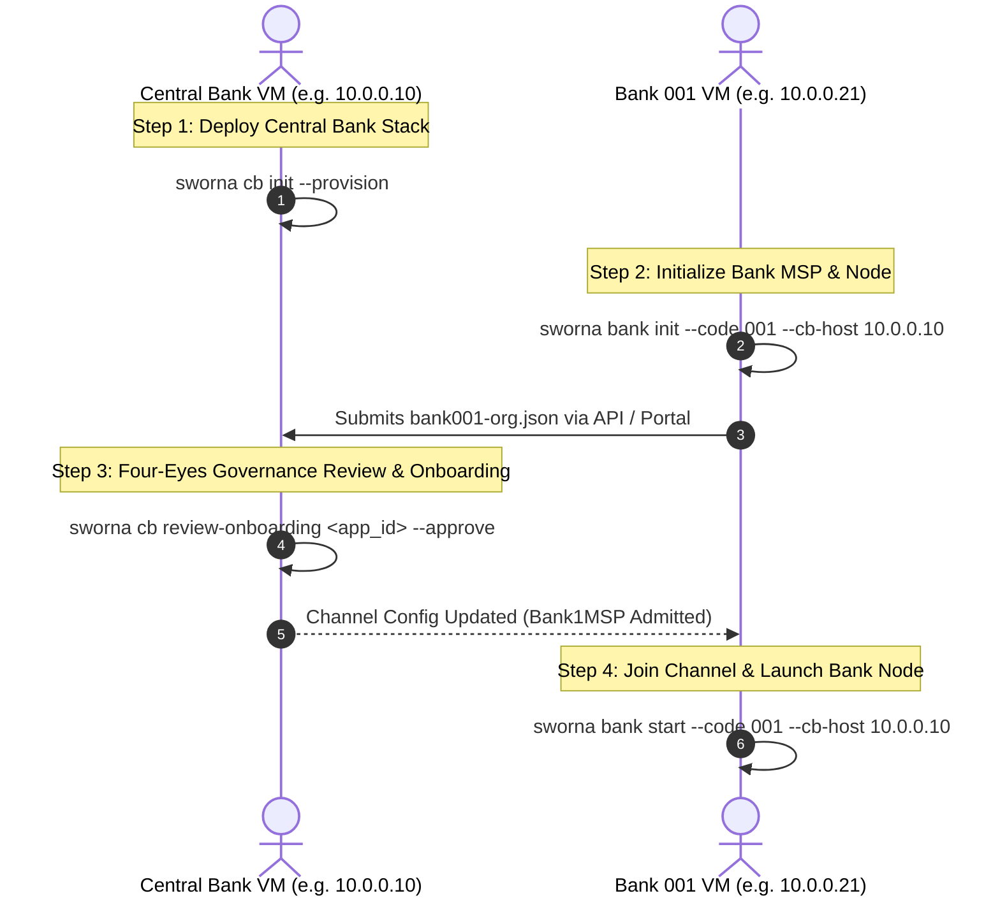

# Sworna CBDC Unified Deployment Architecture (`sworna-cli`)

## 1. Overview
The `sworna-cli` unifies 13 disparate shell scripts into a single, structured Python command-line utility with robust error handling, cryptographic security guarantees, and pure Docker container execution.

---

## 2. Multi-VM Distributed Deployment Runbook

Deploying Sworna CBDC across separate physical/virtual machines (Central Bank VM + Commercial Bank VMs) requires only 2 straightforward commands per machine:



### Detailed VM Instructions:

### A. On the Central Bank VM (`10.0.0.10`)
1. Clone repo and install CLI:
   ```bash
   pip install -e ./cli
   ```
2. Deploy the Central Bank infrastructure:
   ```bash
   sworna cb init --provision
   ```
   *What this does:*
   - Launches Orderer, Central Bank Peer (`peer0.centralbank`), CAs, Issuer FSC (`:9100`), Auditor FSC (`:9000`), Central Bank Backend (`:8100`), and Central Bank Web Portal (`:5273`) inside Docker.
   - Initializes the `settlement` channel and installs the Token Chaincode.

---

### B. On Each Commercial Bank VM (e.g., Bank 001 on `10.0.0.21`)
1. Clone repo and install CLI:
   ```bash
   pip install -e ./cli
   ```
2. Initialize Bank identity and Peer container:
   ```bash
   sworna bank init --code 001 --cb-host 10.0.0.10
   ```
   *What this does:*
   - Launches Bank 001's private CA and Peer (`peer0.bank1`).
   - Generates local MSP keys (private keys never leave the VM).
   - Produces the public onboarding package: `network/bank1-org.json`.

3. Submit onboarding package:
   - Upload via Web Portal at `http://10.0.0.10:5273/onboarding` or CLI.

4. Central Bank conducts 4-Eyes Review:
   ```bash
   # On the Central Bank VM:
   sworna cb review-onboarding <application_id> --approve
   ```

5. Launch Bank Services:
   ```bash
   # On the Bank 001 VM:
   sworna bank start --code 001 --cb-host 10.0.0.10
   ```
   *What this does:*
   - Joins `settlement` channel, installs/approves token chaincode.
   - Starts Bank FSC Owner Engine (`token-services-owner1`).
   - Connects to Central Bank Issuer and Auditor nodes.

---

### C. On a Single Machine (Development & All-in-One Testing)
To test the complete 5-bank deployment, onboarding, minting, and ZKP transfers on a single host:
```bash
sworna test e2e --banks 5
```
