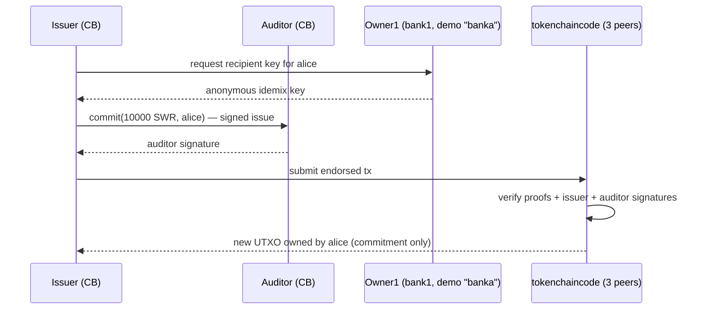
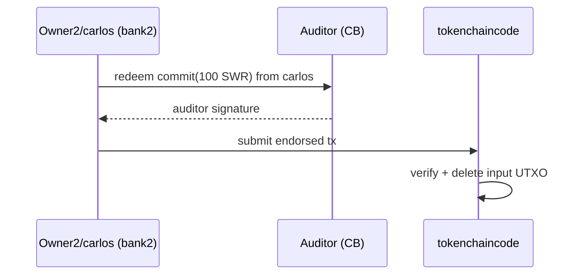

# Token network — transaction flows

## Issue (mint)



- Amount is a Pedersen commitment; the ledger stores `g0^H(SWR)·g1^v·g2^r`.
- Only the issuer and auditor know the opening (value + blinding factor).

## Transfer

```mermaid
sequenceDiagram
    participant S as Owner1/bob (bank1)
    participant A as Auditor (CB)
    participant R as Owner2/carlos (bank2)
    participant CC as tokenchaincode
    S->>R: request recipient key for carlos
    R-->>S: anonymous idemix key
    S->>S: inputs = bob's UTXOs; outputs = 500→carlos, change→bob
    S->>A: transfer request (commitments + range proofs)
    A-->>S: auditor signature
    S->>CC: submit endorsed tx
    CC->>CC: in == out (on commitments), proofs valid, inputs unspent
    CC-->>S: bob's input spent; two new UTXOs
```

- UTXO model: the spent input (5000 SWR) becomes two outputs (500 + 4500
  change) — **change-splitting**.
- Cross-bank works exactly like intra-bank: the settlement chaincode doesn't
  know (or care) which org an owner belongs to.

## Redeem (burn)



- Redeem reduces the outstanding supply; the issuer tracks burned totals.

## Where the ZK privacy lives

The peer and chaincode validate transactions using **zero-knowledge proofs**
(zkatdlog): the commitments' correctness and the sum-preservation are proven
without ever revealing values or owners to the ledger. The auditor holds the
authorized metadata that lets it open commitments, which is why only the
auditor (and the parties themselves) can see the real amounts.

Verification performed in M2: decoding blocks 3–13 of `settlement` found **zero**
plaintext amounts, messages, or party names — only encrypted payloads and
internal `ztoken` keys.